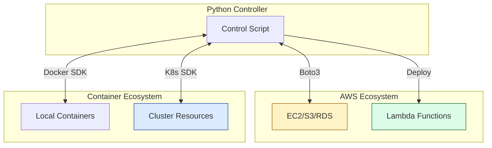

# 🧩 Part 3: The Building Blocks (Cloud Automation)

> **"Infrastructure is code. Python is the hammer. Boto3 is the nails. Stop clicking buttons and start building ecosystems."**

Welcome to **The Building Blocks**. In this section, we apply everything we've learned to the ultimate target: **The Cloud**. We move from general system management to orchestrating the complex, distributed world of AWS and Containers.

---

## 🧠 The Mental Model: The Lego Set

If **Part 1** was the blueprint and **Part 2** was the engine, **Part 3** is the Lego set. You now have the skills to:
- Connect to AWS (using Boto3).
- Build logic that lives in the cloud (Lambda).
- Control the container fleet (Docker/K8s SDKs).

Your job is no longer to "write a script"; it is to **construct infrastructure** from these powerful, modular blocks.

---

## 🎯 Why This Part Matters for Juniors

**Before this section**, you might:
- Use the AWS Console for 90% of your tasks.
- Manually restart pods when they misbehave.
- Struggle to automate complex multi-region resource cleanups.

**After this section**, you'll understand:
- **Boto3 Mastery**: How to manipulate EC2, S3, IAM, and VPCs programmatically.
- **Serverless Automation**: Writing Python functions that trigger automatically based on cloud events.
- **Container Orchestration**: Controlling Docker containers and Kubernetes objects using pure Python logic instead of just `kubectl`.

**The Difference**: You move from "Cloud User" to "**Cloud Architect**."

---

## 🎯 Learning Objectives

By the end of Part 3, you will:

- ✅ **Master Boto3**: Use Clients and Resources to automate AWS at scale.
- ✅ **Go Serverless**: Write, test, and deploy AWS Lambda functions in Python.
- ✅ **Control Containers**: Automate Docker images and K8s deployments via their respective SDKs.
- ✅ **Implement Idempotency**: Ensure your cloud scripts don't create duplicate resources when run twice.

---

## 🏗️ Architecture: The Cloud Control Plane

---

## 📂 What's Covered in Part 3

### 📖 Table of Contents

1. **[AWS Automation: Boto3](./01-AWS-Automation-Boto3/)**: The foundation of cloud automation.
2. **[Serverless and Lambda](./02-Serverless-and-Lambda/)**: Code that triggers on events.
3. **[Container and K8s SDKs](./03-Container-and-K8s-SDKs/)**: Python-native orchestration.

---

## 🎓 Junior's Reality Check

### "Should I use Terraform or Boto3?"
**The Choice**: Use **Terraform** to build the base infrastructure (VPCs, Clusters). Use **Boto3** for dynamic operations, audit scripts, and "event-driven" automation. If the task requires complex branching logic or real-time reaction to events, Boto3 is your best friend.

### The "Boto3 Client" vs. "Resource" Confusion
**Crucial Tip**: 
- **Client**: Low-level, maps 1:1 to the AWS API. Most powerful.
- **Resource**: Object-oriented, higher-level, easier to read.
- **Staff Choice**: Start with Resource for simplicity, move to Client when you need speed or access to obscure API features.

---

## ❓ Interview Preparation (Part 3)

### 🎯 Screening Questions

1. **Q: What is a "Paginator" in Boto3, and why do you need one?**
   * **Answer**: AWS APIs often limit the amount of data returned in one call (e.g., first 1,000 S3 objects). A Paginator automatically handles the "Next Token" and "Marker" logic so your script can iterate through *all* resources without you writing the loop manually.

2. **Q: How do you handle AWS credentials safely in a Lambda function?**
   * **Answer**: You don't! You assign an **IAM Role** to the Lambda. Boto3 will automatically pick up the temporary credentials from the execution environment. Never use access keys inside the code.

3. **Q: Can you manage Kubernetes resources without using YAML in Python?**
   * **Answer**: Yes. The `kubernetes` Python client allows you to create Python dictionaries (or use dedicated classes) to manifest resources, bypassing the need for `.yaml` files in certain automated workflows.

---

## 📝 Knowledge Check

1. **Which AWS SDK for Python is named after a pink dolphin?**
   - [ ] PythonAWS
   - [ ] PinkSDK
   - [x] Boto3
   - [ ] CloudHammer

2. **True or False: A Lambda function can be written entirely in Python.**
   - [x] True
   - [ ] False

3. **What is the primary library for automating Docker from Python?**
   - [ ] `docker-py`
   - [x] `docker` (the official SDK)
   - [ ] `docker-bash`
   - [ ] `container-king`

---

## 🔗 Next Steps

You can now build and control the cloud. But how do you know it's working properly?

**Proceed to**: [Part 4: The Safety Net (Testing & Reliability) →](../04-Part-4-The-Safety-Net/README.md)
