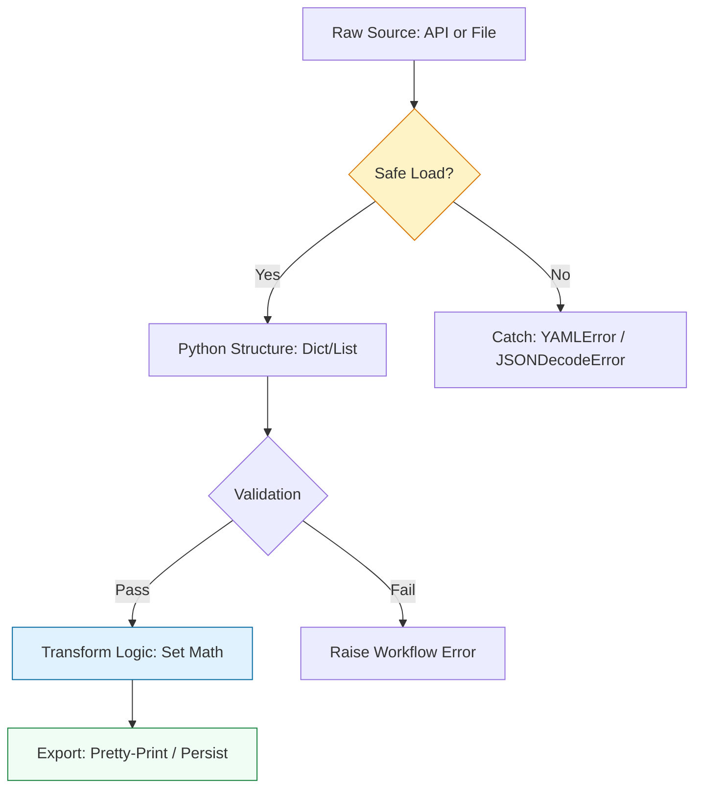

# 🏗️ Data Serialization: Mastering JSON & YAML

> **"Infrastructure is code, and code is data. If you can't parse, validate, and transform JSON and YAML, you aren't managing infrastructure—you're just guessing."**

Welcome to the **Data Serialization** module. In the DevOps ecosystem, YAML and JSON are the languages of truth for Kubernetes, Ansible, CloudFormation, and every modern SaaS API. This module covers the "Staff Standards" for manipulating complex nested data structures safely and efficiently.

---

## 🏗️ The Data Interaction Lifecycle

DevOps data management is about the **Safe-Parse-Transform** pattern. We move away from brittle index-based access to robust **Getters** and **Set Logic**.



---

## 🎭 Real-World DevOps Scenarios

### 🛡️ Scenario: The "Ghost Resource" Audit
**The Incident:** A financial audit discovered $50,000/year in "Ghost Volumes"—AWS EBS volumes that were detached from servers but were still accruing storage costs.
**The Failure:** Manual inspection of the AWS console failed to catch them because they were spread across 20 regions.
**The Fix:** A Python script pulled the "Active Inventory" (JSON) and the "Billing Tag Report" (CSV). By converting both lists into **Python Sets** and performing a set subtraction (`inventory - billing`), the team identified the orphan volumes in 10 seconds.

---

## 💻 DevOps Logic Snippets: "The Robust Parser"

Avoid `KeyError` crashes and use safe loading protocols.

```python
import json
import yaml
import logging

def process_cloud_config(config_str: str):
    try:
        # 🛡️ Standard: Always use safe_load for YAML to prevent RCE
        data = yaml.safe_load(config_str)
        
        # 🚀 Guard Clause: Access nested data without crashing
        # Instead of data['spec']['replicas'], use .get()
        replicas = data.get('spec', {}).get('replicas', 1)
        
        logging.info(f"✅ Configuration parsed. Replicas: {replicas}")
        
        # Return pretty-printed JSON for reporting
        return json.dumps(data, indent=2)

    except yaml.YAMLError as e:
        logging.error(f"❌ Invalid YAML format: {e}")
    except Exception as e:
        logging.error(f"💥 Unexpected mapping error: {e}")

if __name__ == "__main__":
    sample_yaml = "spec:\n  replicas: 3\n  template: nginx"
    print(process_cloud_config(sample_yaml))
```

---

## 🎙️ Interview Preparation (Data Serialization)

1.  **"What is the difference between `json.load()` and `json.loads()`?"**
    *   *Answer:* `load()` (no 's') consumes a **File-like object**. `loads()` (with 's') consumes a **String**. In DevOps, you use `load()` for config files and `loads()` for API response text.
2.  **"Why is `yaml.safe_load()` mandatory for any security-conscious script?"**
    *   *Answer:* The standard `yaml.load()` has the ability to call any Python function embedded in the YAML tags. An attacker could provide a malicious YAML file that triggers a reverse shell or deletes data. `safe_load()` limits parsing to simple Python types.
3.  **"How do you merge two configuration dictionaries where the second one should overwrite the first?"**
    *   *Answer:* In modern Python (3.9+), use the merge operator: `merged_config = base_config | overrides`. For older versions, use `base_config.update(overrides)`.
4.  **"What are Python Sets and why are they a 'Superpower' for DevOps engineers?"**
    *   *Answer:* Sets are unordered collections of unique elements. They allow for high-speed mathematical operations like **Intersection** (find what's in both) and **Difference** (find what's in A but not B). This is perfect for reconciling "Expected State" vs "Actual State" in infrastructure.
5.  **"Explain the benefit of using `json.dumps(data, indent=4, sort_keys=True)`."**
    *   *Answer:* It makes the data human-readable (indent) and predictable (sort_keys). Sorting keys is critical for **Change Auditing**—it ensures that two JSON files with the same data always look identical in a `git diff`.

---

## 🧠 Knowledge Check

1.  **Which library is the de-facto standard for parsing Kubernetes manifests in Python?**
    *   [ ] `json`
    *   [x] `PyYAML`
    *   [ ] `requests`
2.  **What does the `get()` method do for a dictionary?**
    *   [ ] It deletes a key.
    *   [x] It retrieves a value if it exists, otherwise it returns a default (preventing a KeyError).
    *   [ ] It adds a new key to the dict.
3.  **True or False: Python dictionaries preserve the order of elements in versions 3.7 and later.**
    *   [x] True
    *   [ ] False
4.  **How do you convert a Python dictionary to a JSON string?**
    *   [ ] `json.parse(dict)`
    *   [x] `json.dumps(dict)`
    *   [ ] `dict.to_json()`
5.  **Which data structure is best for finding unique items in a list of 1,000,000 server IDs?**
    *   [ ] `List`
    *   [ ] `Tuple`
    *   [x] `Set`

---

[⬅️ Back to Start](../README.md) | [Next: API Mastery](../04-API-Mastery-with-Requests/README.md) ➡️