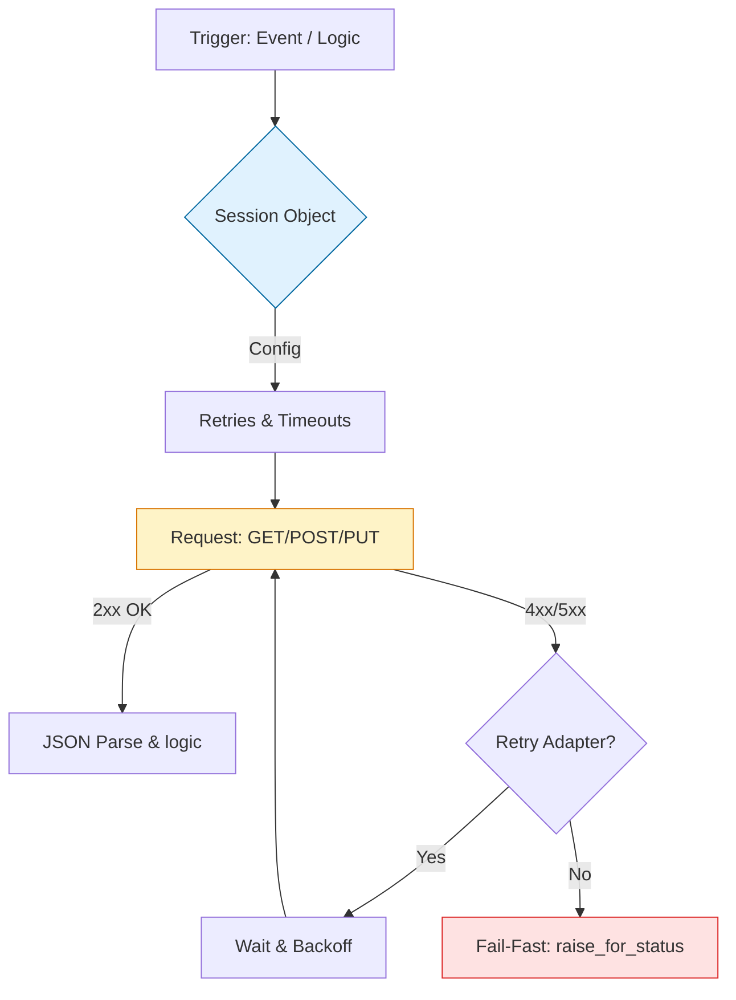

# 📡 API Mastery: The Engineer's Bridge with Requests

> **"A webpage is for humans. An API is for engineers. In the world of DevOps, if you can't talk to a REST API, you are isolated from the ecosystem."**

Welcome to the **API Mastery** module. In the cloud-native era, every piece of infrastructure—be it a firewall, a Kubernetes cluster, or an AWS region—is managed via a REST API. The `Requests` library is the industry standard for interacting with these services. This module covers the patterns of **Persistence**, **Retry-Ability**, and **Timeout Safety** required for production integration.

---

## 🏗️ The API Integration Lifecycle

Building robust API tools requires **Defensive Networking**. We move from simple "Fire-and-Forget" calls to **Stateful Sessions** and **Exponential Backoff**.



---

## 🎭 Real-World DevOps Scenarios

### 🛡️ Scenario: The "Zombie Request" Disaster
**The Incident:** A monitoring script was designed to check a legacy service's health. The code was simple: `requests.get(url)`. 
**The Failure:** The legacy service experienced a hardware freeze where it didn't crash, but it stopped responding to network packets. Because `requests` has no default timeout, 1,000 instances of the monitoring script sat "hanging" indefinitely. 
**The Catastrophe:** The monitoring server ran out of memory (OOM) because it was holding open 1,000 frozen Python processes, taking down the *entire* monitoring stack.
**The Fix:** Mandatory **HARD TIMEOUTS** on every single request. Never allow a network call to hang forever.

---

## 💻 DevOps Logic Snippets: "The Robust Session"

Leverage sessions and retry adapters to handle transient network flakiness.

```python
import requests
from requests.adapters import HTTPAdapter
from urllib3.util.retry import Retry
import logging

def get_production_session():
    # 🚀 Standard: Define a Retry Strategy (Total, Backoff, Status Codes)
    retry_strategy = Retry(
        total=3,
        backoff_factor=1, # Waits 1s, 2s, 4s...
        status_forcelist=[429, 500, 502, 503, 504],
        allowed_methods=["HEAD", "GET", "OPTIONS"]
    )
    
    # 🏗️ Act: Mount the adapter to a Session
    session = requests.Session()
    adapter = HTTPAdapter(max_retries=retry_strategy)
    session.mount("https://", adapter)
    
    return session

def fetch_resource(url: str):
    session = get_production_session()
    try:
        # 🛡️ Guard Clause: Always use a timeout!
        response = session.get(url, timeout=(5, 15)) # (Connect, Read)
        
        # 🧪 Fail-Fast: Raise exception for 4xx/5xx status codes
        response.raise_for_status()
        
        return response.json()
        
    except requests.exceptions.RequestException as e:
        logging.error(f"💥 API Pipeline Failed: {e}")

if __name__ == "__main__":
    data = fetch_resource("https://api.github.com/zen")
    print(data)
```

---

## 🎙️ Interview Preparation (API Engineering)

1.  **"What is the difference between `json.loads(response.text)` and `response.json()`?"**
    *   *Answer:* `response.json()` is a built-in helper that automatically detects the encoding and decodes the string for you. It's the "Pythonic" and safer way to handle JSON responses in the `Requests` library.
2.  **"Why should you use a `requests.Session()` instead of repeated `requests.get()` calls?"**
    *   *Answer:* A Session object provides **Connection Pooling**. It keeps the underlying TCP connection open (Keep-Alive), which avoids the expensive SSH/TLS handshake for subsequent requests to the same host, making your scripts up to 2x-3x faster.
3.  **"Explain the 'Backoff Factor' in Retry logic."**
    *   *Answer:* It implements **Exponential Backoff**. If a request fails, the script doesn't just "retry immediately" (which would hit the server again while it's struggling). It waits longer each time (e.g., 1s, then 2s, then 4s), giving the target service time to recover.
4.  **"How do you handle '429 Too Many Requests' errors in automation?"**
    *   *Answer:* You must check the `Retry-After` header if it exists. If using `Requests`, the `Retry` adapter can be configured to automatically respect 429 status codes and handle the wait time for you.
5.  **"When should you use `verify=False` in a `requests.get()` call?"**
    *   *Answer:* **Almost Never** in production. It disables SSL certificate verification, making your script vulnerable to Man-in-the-Middle (MITM) attacks. Only use it in local development with self-signed certificates, and always use a warning logger.

---

## 🧠 Knowledge Check

1.  **What is the default timeout for the Requests library?**
    *   [ ] 10 seconds
    *   [ ] 60 seconds
    *   [x] None (Infinite hang)
2.  **Which method is used to automatically raise an exception for 4xx or 5xx errors?**
    *   [ ] `response.check()`
    *   [x] `response.raise_for_status()`
    *   [ ] `response.validate()`
3.  **True or False: Using a Session object allows you to persist headers across multiple requests.**
    *   [x] True
    *   [ ] False
4.  **What does the '200' HTTP status code mean?**
    *   [x] Success (OK)
    *   [ ] Redirect
    *   [ ] Page Not Found
5.  **Which library is built into Python for low-level HTTP networking (the one Requests uses internally)?**
    *   [ ] ``
    *   [x] `urllib3`
    *   [ ] `httpx`

---

[⬅️ Back to Start](../README.md) | [Next: Cloud Automation ](../05-Cloud-Automation--Deep-Dive/README.md) ➡️