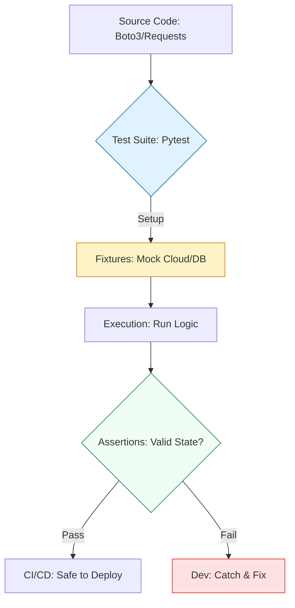

# 🧪 Testing Automation: Fail-Fast Engineering

> **"Untested infrastructure code is just a legacy outage waiting to happen. If you aren't testing your automation, you aren't an engineer—you're a gambler."**

Welcome to the **Testing & Verification** module. In the high-stakes world of DevOps, a single script error can delete a production database or partition a network. `Pytest` is the industry-standard framework that allows you to verify your logic, mock cloud providers, and catch errors *before* they hit your servers.

**Why This Matters for Junior DevOps Engineers:**
- 🛡️ **Safety**: You can run `delete_resources.py` with confidence because you tested it logic.
- ⚡ **Speed**: Debugging a test locally takes seconds. Debugging a failed deployment takes hours.
- 🎯 **Career**: "How do you test your code?" is a Senior DevOps Interview differentiator.
- 🔧 **CI/CD**: Your pipeline *is* a series of tests. If tests fail, bad code never deploys.

---

## 📚 Table of Contents

1. [The Testing Lifecycle](#-the-testing-lifecycle)
2. [Pytest Fundamentals](#-pytest-fundamentals)
3. [The Power of Fixtures](#-the-power-of-fixtures)
4. [Mocking & Patching](#-mocking--patching)
5. [Cloud Testing with Moto](#-cloud-testing-with-moto)
6. [Real-World DevOps Scenarios](#-real-world-devops-scenarios)
7. [Security Best Practices](#-security-best-practices)
8. [Common Pitfalls & Solutions](#-common-pitfalls--solutions)
9. [Hands-On Exercises](#-hands-on-exercises)
10. [Interview Preparation](#-interview-preparation)
11. [Knowledge Check](#-knowledge-check)

---

## 🏗️ The Testing Lifecycle

Testing for DevOps is about the **Mock-Execute-Verify** pattern. We move from "Test-on-Prod" to **Isolated Unit Testing**.



### 🔍 Lifecycle Breakdown

**Stage 1: Setup (Fixtures)**
- **What**: Preparing the environment (creating fake S3 buckets, setting env vars).
- **Why**: Tests must be reproducible and isolated.
- **How**: `@pytest.fixture`.

**Stage 2: Execution (Mocking)**
- **What**: Replacing real external calls (AWS, APIs) with fake ones.
- **Why**: So you don't delete real data or need internet access.
- **How**: `unittest.mock` or `moto`.

**Stage 3: Verification (Assertions)**
- **What**: Checking if the result matches expectation.
- **Why**: To prove the code works.
- **How**: `assert result == expected`.

---

## 🧪 Pytest Fundamentals

Pytest is simple. It auto-discovers any file starting with `test_` or ending with `_test.py`.

### A Simple Test
```python
# logic.py
def add_tags(tags, new_tag):
    if new_tag['Key'] in [t['Key'] for t in tags]:
        raise ValueError("Duplicate Tag")
    tags.append(new_tag)
    return tags

# test_logic.py
import pytest
from logic import add_tags

def test_add_tags_success():
    current = [{'Key': 'Env', 'Value': 'Prod'}]
    new = {'Key': 'Owner', 'Value': 'DevOps'}
    result = add_tags(current, new)
    assert len(result) == 2
    assert result[1]['Key'] == 'Owner'

def test_add_tags_duplicate():
    current = [{'Key': 'Env', 'Value': 'Prod'}]
    new = {'Key': 'Env', 'Value': 'Dev'}
    
    # Assert that an exception IS raised
    with pytest.raises(ValueError):
        add_tags(current, new)
```

**Running Tests**:
```bash
$ pytest
================ test session starts ================
collected 2 items
test_logic.py ..                                [100%]
================ 2 passed in 0.01s ================
```

---

## 🔌 The Power of Fixtures

Fixtures are reusable components that "fix" your environment into a known state.

**Why use them?**
- Avoid code duplication.
- Handle Setup and Teardown (cleanup) automatically.

```python
import pytest

@pytest.fixture
def sample_config():
    """Provides a standard config dict for tests."""
    return {
        "region": "us-east-1",
        "instance_type": "t3.micro",
        "tags": {"Env": "Test"}
    }

def test_deploy_logic(sample_config):
    # Pytest automatically "injects" the fixture return value
    assert sample_config['region'] == 'us-east-1'
```

---

## 🎭 Mocking & Patching

Your scripts talk to the outside world (APIs, Files). In tests, we must **FAKE** this.
We use `unittest.mock.patch` to replace the real function with a mock.

**Scenario**: Testing a function that deletes a file. We don't want to actually delete anything!

```python
from unittest.mock import patch
import os

def cleanup_files(path):
    os.remove(path)
    return "Deleted"

# The Test
@patch('os.remove') # Replaces os.remove with a Mock object
def test_cleanup(mock_remove):
    result = cleanup_files('/tmp/test.txt')
    
    # 1. Verify function return
    assert result == "Deleted"
    
    # 2. Verify os.remove was CALLED with correct arguments
    mock_remove.assert_called_once_with('/tmp/test.txt')
```

---

## ☁️ Cloud Testing with Moto

For AWS, `unittest.mock` is tedious ("Mock the client, then the response...").
**Moto** is a library that Mocks the entire AWS Infrastructure in memory.

**Installation**: `pip install moto`

```python
import boto3
from moto import mock_aws

@mock_aws
def test_s3_logic():
    # 1. Setup: Create a fake S3 bucket in memory
    s3 = boto3.client('s3', region_name='us-east-1')
    s3.create_bucket(Bucket='my-test-bucket')
    
    # 2. Execute: Run your actual code
    # (Let's say your function lists buckets)
    response = s3.list_buckets()
    
    # 3. Verify: Check results
    assert len(response['Buckets']) == 1
    assert response['Buckets'][0]['Name'] == 'my-test-bucket'
    
    # When test ends, the bucket disappears!
```

---

## 🎭 Real-World DevOps Scenarios

### 🛡️ Scenario 1: The "Production Deleter" Bug

**The Incident:** An engineer wrote a script to delete snapshots older than 30 days. Logic: `if snap_date > 30`. They accidentally compared Strings ("9" > "30"), so it deleted RECENT snapshots (9 days old).

**The Fix:** A Unit Test with **Moto**.

```python
@mock_aws
def test_snapshot_cleanup():
    ec2 = boto3.client('ec2', region_name='us-east-1')
    
    # Create 2 snapshots: One old (40 days), One new (10 days)
    old_snap = create_fake_snap(days_ago=40) 
    new_snap = create_fake_snap(days_ago=10)
    
    # Run Cleanup Logic
    cleanup_snapshots()
    
    # Verify: Old is gone, New remains
    snaps = ec2.describe_snapshots()['Snapshots']
    ids = [s['SnapshotId'] for s in snaps]
    
    assert old_snap not in ids
    assert new_snap in ids
```

### 🔥 Scenario 2: The API Rate Limit Crash

**The Incident:** A script crashed when the API returned a 500 error. It had no error handling.

**The Fix:** Test for failure modes!

```python
@patch('requests.get')
def test_api_failure(mock_get):
    # Simulate a 500 Error
    mock_get.return_value.status_code = 500
    mock_get.side_effect = Exception("Server Down")
    
    # Verify your code handles it gracefully (e.g. returns None, doesn't crash)
    result = my_api_wrapper()
    assert result is None
```

---

## 🔒 Security Best Practices

### 1. Don't Commit Credentials
Tests need AWS credentials to initialize Boto3 (even using Moto).
**Solution**: Use a fixture to set fake Env Vars for tests.

```python
@pytest.fixture(autouse=True)
def aws_credentials():
    """Mocked AWS Credentials for moto."""
    os.environ["AWS_ACCESS_KEY_ID"] = "testing"
    os.environ["AWS_SECRET_ACCESS_KEY"] = "testing"
    os.environ["AWS_SECURITY_TOKEN"] = "testing"
    os.environ["AWS_SESSION_TOKEN"] = "testing"
```

### 2. Don't Test External Sites
Never write a test that hits `google.com` or `github.com`.
**Why?**
1. It's slow.
2. It fails if offline.
3. It's rude (DoS).
**Fix**: Always Mock network calls.

---

## ⚠️ Common Pitfalls & Solutions

### Pitfall 1: Testing Implementation details
**Bad**: `assert internal_variable == 5`
**Good**: `assert function_return == 5`
**Why**: You want to be able to refactor internal code without breaking tests.

### Pitfall 2: Logic in Tests
**Bad**: Writing `if/for` loops inside your test function.
**Good**: Flat, linear assertions.
**Why**: If your test has logic, who tests the test?

---

## 🎯 Hands-On Exercises

### Exercise 1: The Config Validator
**Objective**: Write a test for a function that validates config files.
**Requirements**:
1. Function `validate_config(dict)` raises `KeyError` if "Env" is missing.
2. Write `test_validate_success` (valid data).
3. Write `test_validate_failure` (missing key) using `pytest.raises`.

**Starter Code**:
```python
def validate_config(cfg):
    if 'Env' not in cfg:
        raise KeyError("Missing Env")
    return True

# TODO: Write tests
```

### Exercise 2: Mocking S3
**Objective**: Test a function that uploads a file to S3.
**Requirements**:
1. Use `moto`.
2. Setup: Create bucket.
3. Act: Call your upload function.
4. Verify: Check if object exists in bucket.

---

## 🎙️ Interview Preparation

### Foundation Questions

**1. "Unit Test vs Integration Test?"**
- **Answer**: 
    - **Unit**: Tests one function in isolation. Mocks everything (AWS, DB). Fast.
    - **Integration**: Tests how components work together. May use real DB or LocalStack. Slower.

**2. "What is coverage?"**
- **Answer**: The percentage of your code lines executed during tests. 100% doesn't mean no bugs, but 10% is definitely bad. (Tool: `pytest-cov`).

### Advanced Scenario Questions

**3. "How do you test time-dependent code (e.g. Delete if > 30 days)?"**
- **Answer**: You cannot wait 30 days. You must **Freeze Time**.
- Tool: `freezegun`.
```python
@freeze_time("2023-01-01")
def test_january_logic():
    # Code thinks it is Jan 1st
```

---

## 🧠 Knowledge Check

**1. Which command runs tests?**
- [ ] `python test.py`
- [x] `pytest`

**2. What is @mock_aws used for?**
- [ ] Connecting to real AWS
- [x] Creating a fake AWS environment
- [ ] Logging to CloudWatch

**3. If a test fails in CI/CD, what happens?**
- [ ] Deployment continues
- [x] Pipeline stops/fails
- [ ] It retries automatically

---

## 🎓 Self-Assessment Checklist

Before moving to the next module, ensure you can:
- [ ] Write a basic test function.
- [ ] Use `pytest.raises` to check for exceptions.
- [ ] Create a Fixture for setup data.
- [ ] Use `patch` to mock a simple function.
- [ ] Use `moto` to mock an S3 bucket.

**Score yourself**: 5+/5 = Ready to advance | <5 = Review exercises

[⬅️ Back to Serverless](../06-Serverless-Boto3-Lambda/README.md) | [Next: Shell Scripting](../../01-Shell-Scripting-Mastery/README.md) ➡️
