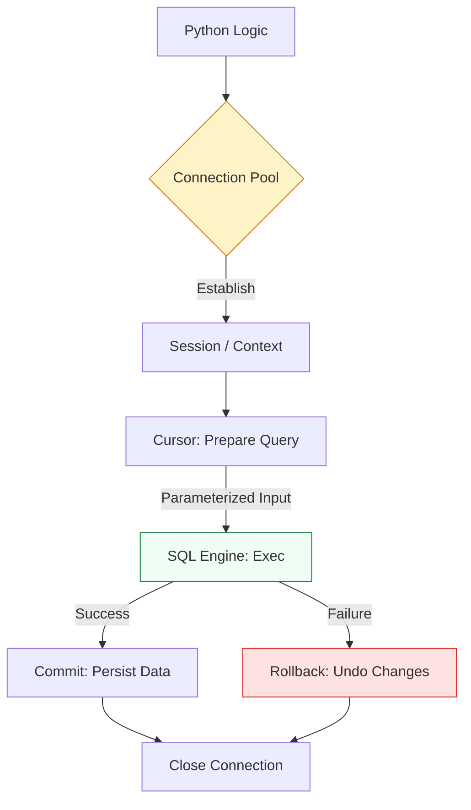

# 🗄️ Database Operations: Managing State with SQL

> **"Infrastructure is code, but business is data. A DevOps engineer who can't safely manipulate a database is just a script-runner; one who can is a Platform Engineer."**

Welcome to the **Database Operations** module. In automated environments, we use databases to track inventory, log deployment metadata, and manage global configuration state. This module focuses on the **Python DB-API 2.0** and **SQLAlchemy**—the industry standards for interacting with SQL engines safely and at scale.

**Why This Matters for Junior DevOps Engineers:**
- 🛡️ **Safety**: Understanding transactions (`commit`/`rollback`) prevents partial data corruption during failed deployments.
- ⚡ **Performance**: Using Connection Pooling to handle 1000s of requests without crashing the DB.
- 🎯 **Interview**: "How do you prevent SQL Injection in a Python automation script?"
- 🔧 **State Management**: Using SQLite instead of a fragile `state.json` file for local tools.

---

## 📚 Table of Contents

1. [The Transaction Lifecycle](#-the-transaction-lifecycle)
2. [Raw SQL vs ORM (SQLAlchemy)](#-raw-sql-vs-orm-sqlalchemy)
3. [Connection Pooling](#-connection-pooling)
4. [Real-World DevOps Scenarios](#-real-world-devops-scenarios)
5. [Security Best Practices](#-security-best-practices)
6. [Common Pitfalls & Solutions](#-common-pitfalls--solutions)
7. [Hands-On Exercises](#-hands-on-exercises)
8. [Interview Preparation](#-interview-preparation)
9. [Knowledge Check](#-knowledge-check)

---

## 🏗️ The Transaction Lifecycle

Interacting with databases requires a strict lifecycle. We move from raw string commands to **Parameterized Queries** and **Atomic Transactions**.



### 🔍 Concept Breakdown
1.  **Cursor**: The "pointer" that traverses records.
2.  **Transaction**: A group of changes. They happen all at once (Commit) or not at all (Rollback).
3.  **Parameterization**: Sending data separately from code to prevent SQL Injection.

---

## 🐍 Raw SQL vs ORM (SQLAlchemy)

### 1. Raw SQL (`sqlite3`, `psycopg2`)
Best for: Simple scripts, high-performance bulk inserts, and data migration.

```python
import sqlite3

def run_migration():
    with sqlite3.connect('inventory.db') as conn:
        cursor = conn.cursor()
        # 🛡️ Parameterized Query (Safe)
        cursor.execute("INSERT INTO servers (ip, role) VALUES (?, ?)", ('10.0.0.1', 'web'))
        conn.commit()
```

### 2. SQLAlchemy (The ORM)
Best for: Complex applications, managing relationships, and database-agnostic code (Works on MySQL, Postgres, and SQLite without changing code).

```python
from sqlalchemy import create_engine, Column, Integer, String
from sqlalchemy.orm import declarative_base, sessionmaker

Base = declarative_base()
engine = create_engine('sqlite:///inventory.db')

class Server(Base):
    __tablename__ = 'servers'
    id = Column(Integer, primary_key=True)
    hostname = Column(String)

# Create tables
Base.metadata.create_all(engine)

# Add a record
Session = sessionmaker(bind=engine)
session = Session()
new_server = Server(hostname="web-01")
session.add(new_server)
session.commit()
```

---

## ⚡ Connection Pooling

Creating a connection takes time (TCP handshake, Auth).
**Pooling** keeps connections open.

```python
# PostgreSQL Connection Pool (using psycopg2)
from psycopg2 import pool

# Create a pool of 5-20 connections
db_pool = pool.SimpleConnectionPool(5, 20, user="admin", password="pw", host="db", port="5432")

def get_user_data(user_id):
    conn = db_pool.getconn() # Get existing connection
    try:
        cur = conn.cursor()
        cur.execute("SELECT * FROM users WHERE id = %s", (user_id,))
        return cur.fetchone()
    finally:
        db_pool.putconn(conn) # Return to pool (don't close!)
```

---

## 🎭 Real-World DevOps Scenarios

### 🧱 Scenario 1: The "Little Bobby Tables" Incident (SQL Injection)

**The Incident:** An internal tool allowed engineers to query server owners. The script used an f-string: `f"SELECT * FROM inventory WHERE host='{input}'"`.
**The Failure:** A user entered `web-01'; DROP TABLE inventory; --`. The database deleted the entire table.
**The Fix:** **Never use f-strings for SQL**. Always use bind parameters (`?` or `%s`).

### 🔥 Scenario 2: The "Hanging Transaction"

**The Incident:** A deployment script updated the DB but crashed before calling `commit()`.
**The Failure:** The locks on the table remained held by the crashed connection, preventing ANY other deployments for 3 hours.
**The Fix:** Use `try/except/finally` blocks or Context Managers (`with`) to ensure `rollback()` happens on error.

### ☁️ Scenario 3: The SQLite State File

**The Task:** A local CLI tool needs to track which AWS instances it has stopped today to avoid stopping them twice.
**Solution:** Don't use JSON (prone to corruption). Use SQLite.
- It supports concurrent reads.
- It is atomic (no half-written files).

---

## 🔒 Security Best Practices

### 1. Credentials Management
Never hardcode passwords. Use Environment Variables.
```python
import os
password = os.getenv('DB_PASSWORD')
if not password:
    raise ValueError("DB_PASSWORD not set!")
```

### 2. Least Privilege
The DB User your script uses should usually NOT be `postgres` or `root`.
- Create a specific user: `automation_user`.
- Grant specific permissions: `GRANT SELECT, INSERT ON inventory TO automation_user;`.

---

## ⚠️ Common Pitfalls

### Pitfall 1: Committing in Loops
**Bad**: Calling `commit()` 10,000 times in a loop.
**Impact**: Extremely slow. Each commit forces a disk sync.
**Fix**: Commit once at the end (Batch Transaction).

### Pitfall 2: Memory Leaks in ORMs
**Bad**: Fetching 1 million records (`query.all()`).
**Impact**: OOM Kill.
**Fix**: Use `.yield_per(100)` in SQLAlchemy to stream results.

---

## 🎯 Hands-On Exercises

### Exercise 1: The Safe Inserter (SQLite)
**Objective**: Create a script to track deployment logs.
**Requirements**:
1. Create a table `deployments (id, timestamp, status)`.
2. Function `log_deploy(status)` that inserts extraction safely.
3. Use a Context Manager.

### Exercise 2: The Migration Script (Raw SQL)
**Objective**: Bulk update.
**Task**: Write a script that finds all users with `status='expired'` and sets `active=0`. Use `rowcount` to print how many were updated.

---

## 🎙️ Interview Preparation

### Foundation Questions

**1. "What is SQL Injection?"**
- **Answer**: When untrusted input alters the logic of a database query (e.g., bypassing login checks). Prevented by using Parameterized Queries.

**2. "Difference between `DELETE` and `TRUNCATE`?"**
- **Answer**: `DELETE` scans headers and deletes row-by-row (slow, transaction-safe). `TRUNCATE` drops the data pages (fast, cannot be rolled back in some engines).

### Advanced Scenario Questions

**3. "How do you handle database schema changes (migrations) in a CI/CD pipeline?"**
- **Answer**: Use tools like **Alembic** (Python) or **Flyway**.
    - The pipeline runs `alembic upgrade head`.
    - If it fails, the pipeline stops.
    - Backward compatibility is key (don't rename columns while code is still using the old name).

---

## 🧠 Knowledge Check

**1. Which character acts as a placeholder in SQLite?**
- [ ] `%s`
- [x] `?`
- [ ] `$`

**2. What method saves changes to the DB?**
- [ ] `save()`
- [x] `commit()`
- [ ] `push()`

**3. Why use an ORM?**
- [ ] It's faster than raw SQL.
- [x] It allows switching DB engines easily (Abstraction).
- [ ] It prevents all errors.

---

## 🎓 Self-Assessment Checklist

Before moving to the next module, ensure you can:
- [ ] Create a SQLite database in Python.
- [ ] Perform a `SELECT` and `INSERT` using parameters.
- [ ] Explain the layout of a `try/except/finally` block for DB connections.
- [ ] Use Environment Variables for passwords.

**Score yourself**: 5+/5 = Ready to advance | <5 = Review exercises

[⬅️ Back to Remote Exec](../09-Remote-Execution-and-SSH/README.md) | [Next: Docker SDK](../11-Docker-and-Kubernetes-SDKs/README.md) ➡️
