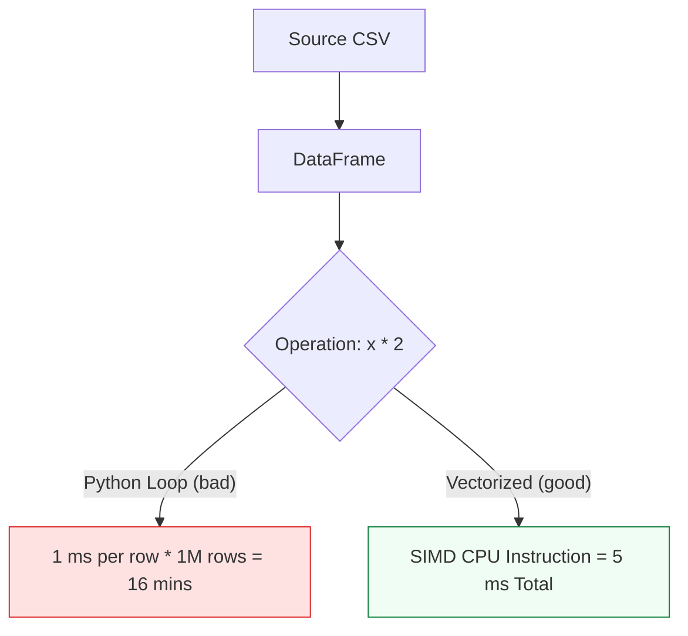

# 📊 Data Engineering for DevOps: Mastery with Pandas

> **"If a CSV is small, use `csv`. If it's complex, use `pandas`. If you're manually opening Excel to calculate monthly cloud spend, you've already failed the automation test."**

Welcome to the **Data Processing** module. In modern FinOps and Observability, we deal with multi-gigabyte exports from AWS Cost Explorer, Datadog logs, and multi-cloud billing. `Pandas` is the industry-standard "Data Engine" that transforms raw, messy CSVs into actionable engineering insights in milliseconds.

**Why This Matters for Junior DevOps Engineers:**
- 💰 **FinOps**: Aggregating AWS + Azure + GCP billing CSVs to find the top spender.
- 📈 **Performance**: Comparing Request Rate vs CPU Load over time (Time Series).
- 🎯 **Interview**: "How do you join two datasets (Users vs Permissions) efficiently?"
- 🔧 **Scale**: Processing a 10 million row log file without crashing your laptop.

---

## 📚 Table of Contents

1. [Pandas Architecture: Vectorization](#-pandas-architecture-vectorization)
2. [Data Loading & Cleaning](#-data-loading--cleaning)
3. [Grouping & Aggregation (FinOps)](#-grouping--aggregation-finops)
4. [Real-World DevOps Scenarios](#-real-world-devops-scenarios)
5. [Performance & Parquet](#-performance--parquet)
6. [Common Pitfalls & Solutions](#-common-pitfalls--solutions)
7. [Hands-On Exercises](#-hands-on-exercises)
8. [Interview Preparation](#-interview-preparation)
9. [Knowledge Check](#-knowledge-check)

---

## 🏗️ Pandas Architecture: Vectorization

Python loops are slow. C is fast.
Pandas pushes the loop into C. This is called **Vectorization**.



### 🔍 Concept Breakdown
1.  **DataFrame**: A table (Row/Col). Think "Excel in RAM".
2.  **Series**: A single column.
3.  **Index**: The "Primary Key" (Row Labels). Best used for Time Series.

---

## 📥 Data Loading & Cleaning

Data is never clean. It has missing values (`NaN`), wrong types (String instead of Int), and duplicates.

```python
import pandas as pd

def load_billing_data(file_path):
    # 1. Load Data
    df = pd.read_csv(file_path)
    
    # 2. Convert Date String to DateTime Objects (Crucial for sorting)
    df['Date'] = pd.to_datetime(df['Date'])
    
    # 3. Handle Missing Data (NaN)
    # Fill empty costs with 0.0
    df['Cost'] = df['Cost'].fillna(0.0)
    
    # 4. Enforce Types (Reduce Memory Usage)
    df['Service'] = df['Service'].astype('category')
    
    return df
```

---

## 💰 Grouping & Aggregation (FinOps)

The "Split-Apply-Combine" pattern. Essential for answering: "Who spent the most?"

```python
def analyze_departments(df):
    # GROUP BY 'Department', then SUM 'Cost'
    report = df.groupby('Department')['Cost'].sum()
    
    # Sort Descending
    return report.sort_values(ascending=False)
```

**Output**:
```text
Department
Engineering    50000.00
Marketing      12000.50
HR              500.00
```

---

## 🎭 Real-World DevOps Scenarios

### 🛡️ Scenario 1: The Multi-Cloud Merger

**The Task:** You have `aws_bill.csv` (Columns: `Service`, `USD`) and `azure_bill.csv` (Columns: `Meter`, `Cost`). Merge them into one report.
**Solution:**
```python
aws = pd.read_csv('aws.csv').rename(columns={'USD': 'Cost', 'Service': 'Type'})
azure = pd.read_csv('azure.csv').rename(columns={'Meter': 'Type'})

# Stack them vertically
total = pd.concat([aws, azure], ignore_index=True)

print(f"Total Spend: ${total['Cost'].sum()}")
```

### 🔥 Scenario 2: Log Analysis (Time Series)

**The Task:** Find the request rate per minute from raw access logs.
**Solution:** `resample()`.
```python
df = pd.read_csv('logs.csv')
df['Time'] = pd.to_datetime(df['Time'])
df.set_index('Time', inplace=True)

# Count lines per 1 Minute
rps = df.resample('1min').count()
```

### ☁️ Scenario 3: Comparing Inventories

**The Task:** You have a list of `active_users.csv` and `approved_users.csv`. Find out who is active but NOT approved.
**Solution:** Left Anti-Join.
```python
active = pd.read_csv('active.csv')
approved = pd.read_csv('approved.csv')

# Merge
merged = active.merge(approved, on='Username', how='left', indicator=True)

# Filter where match exists ONLY in Left (Active)
intruders = merged[merged['_merge'] == 'left_only']
```

---

## ⚡ Performance & Parquet

CSV is slow and takes up space.
**Parquet** is a columnar binary format used by Big Data tools (Spark/AWS Athena).

- **CSV**: 1GB file, 10s load time.
- **Parquet**: 200MB file, 1s load time.

```python
# Save
df.to_parquet('data.parquet')

# Load (Only needed columns)
df = pd.read_parquet('data.parquet', columns=['Cost', 'Date'])
```

---

## ⚠️ Common Pitfalls

### Pitfall 1: Iterating Rows
**Bad**: `for index, row in df.iterrows(): ...`
**Why**: It converts the DataFrame to a slow Python object for each row.
**Fix**: Use Vectorized functions.
- Bad: `df['Total'] = df['A'] + df['B']` inside loop.
- Good: `df['Total'] = df['A'] + df['B']` (Directly).

### Pitfall 2: Memory Leaks
Loading a 10GB file on 8GB RAM.
**Fix**: Use `chunksize`.
```python
for chunk in pd.read_csv('huge.csv', chunksize=1000):
    process(chunk)
```

---

## 🎯 Hands-On Exercises

### Exercise 1: The Cost Cutter
**Objective**: Identify waste.
**Input**: CSV with `InstanceID`, `CPU_Utilization`, `Cost`.
**Task**: Filter rows where `CPU_Utilization < 5%` AND `Cost > $100`.

### Exercise 2: Time Travel
**Objective**: Resample logs.
**Task**: Create a DataFrame with 1000 timestamps. Group them by "Hour" and count events.

---

## 🎙️ Interview Preparation

### Foundation Questions

**1. "Series vs DataFrame?"**
- **Answer**: Series is 1D (Column). DataFrame is 2D (Table).

**2. "How to handle missing data?"**
- **Answer**: Drop it (`dropna()`) or Fill it (`fillna(0)` or `fillna(method='ffill')`).

### Advanced Scenario Questions

**3. "How would you optimize a Pandas script that runs out of memory?"**
- **Answer**:
    1. Define data types on load (`dtype={'cost': 'float32'}`).
    2. Read in **Chunks**.
    3. Use **Dask** (Parallel Pandas) if logical optimization fails.

---

## 🧠 Knowledge Check

**1. Which method aligns data by time frequency (e.g., hourly)?**
- [ ] `groupby()`
- [x] `resample()`
- [ ] `align()`

**2. What is the binary format optimized for Pandas?**
- [ ] JSON
- [ ] XML
- [x] Parquet

**3. What does `merge(how='left')` do?**
- [ ] Keeps only matching rows.
- [x] Keeps all rows from the Left table, adds matches from Right.
- [ ] Keeps nothing.

---

## 🎓 Self-Assessment Checklist

Before moving to the next module, ensure you can:
- [ ] Load a CSV and clean column names.
- [ ] Perform a `groupby().sum()`.
- [ ] Filter data using Boolean Indexing (`df[df['cost'] > 100]`).
- [ ] Explain why Loops are bad in Pandas.

**Score yourself**: 5+/5 = Ready to advance | <5 = Review exercises

[⬅️ Back to Web Scraping](../12-Web-Scraping-for-Monitoring/README.md) | [Next: Capstone Project](../14-Capstone-Project-S3-Auditor/README.md) ➡️
