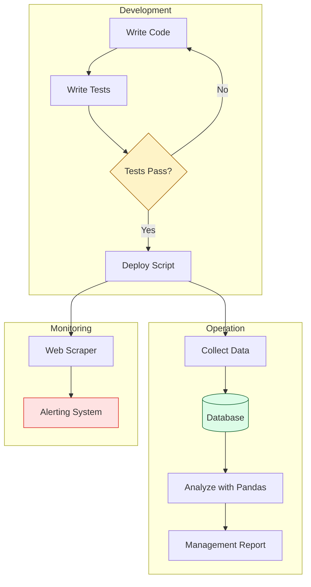

# 🛡️ Part 4: The Safety Net (Testing & Reliability)

> **"Un-tested automation is just a faster way to create an outage. Real power comes from scripts you can trust to run while you sleep."**

Welcome to **The Safety Net**. This is where we move from "scripts that work" to "engineering that lasts." As a DevOps Engineer, your reputation is built on the reliability of your automation.

---

## 🧠 The Mental Model: The High-Wire Act

In the early stages, writing Python is like walking a tightrope. You're focused on getting from point A to point B. **The Safety Net** is what allows you to perform complex maneuvers with confidence. 

- **Testing**: Ensures your logic is sound.
- **Databases**: Provides persistent memory.
- **Data Processing**: Turns raw metrics into actionable intelligence.
- **Monitoring**: Alerts you when the net is compromised.

---

## 🎯 Why This Part Matters for Juniors

**Before this section**, you might:
- Run a script and hope it doesn't crash halfway through.
- Manual check outputs to see if they're "correct."
- Fear editing your own code because you don't know what might break.

**After this section**, you'll understand:
- **Test-Driven Development (basic)**: Writing tests that prove your script works.
- **Persistent State**: Storing automation data in databases (SQL) instead of just `.txt` files.
- **Advanced Diagnostics**: Scraping web interfaces for monitoring data when APIs aren't available.
- **Data Engineering**: Using Pandas to generate reports for management.

**The Difference**: You stop being a "scripter" and start being an **Automation Engineer**.

---

## 🎯 Learning Objectives

By the end of Part 4, you will:

- ✅ **Validate Your Logic**: Master `pytest` for unit and integration testing.
- ✅ **Manage Persistent Data**: Interface with databases (SQLite/PostgreSQL) from Python.
- ✅ **Automate Monitoring**: Use Web Scraping as a last-resort monitoring tool.
- ✅ **Analyze Performance**: Process large infrastructure datasets with Pandas.
- ✅ **Build the Capstone**: Create a production-ready S3 Auditor from scratch.

---

## 🏗️ Architecture: The Reliable Pipeline

---

## 📂 What's Covered in Part 4

### 📖 Table of Contents

1. **[Testing Automation with Pytest](./01-Testing-Automation-with-Pytest/)**: Ensuring your code is bug-free.
2. **[Database Operations](./02-Database-Operations/)**: Moving beyond flat files to structured data.
3. **[Web Scraping for Monitoring](./03-Web-Scraping-for-Monitoring/)**: Extracting data from legacy dashboards.
4. **[Data Processing with Pandas](./04-Data-Processing-with-Pandas/)**: Turning logs into infrastructure insights.
5. **[Capstone: S3 Auditor](./05-Capstone-Project-S3-Auditor/)**: Your final production-grade challenge.

---

## 🎓 Junior's Reality Check

### "Testing is too slow..."
**The Myth**: Writing tests takes more time than just writing the code.
**The Reality**: In production, "broken automation" is the #1 cause of Sev-1 incidents. Spending 1 hour on tests saves 10 hours of panic-fixing at 3:00 AM.

### Why Databases?
**Crucial Tip**: Don't use Python lists to store thousands of server records. Use a database. It handles the memory management, querying, and persistence automatically. If your script crashes, your data is safe.

---

## ❓ Interview Preparation (Part 4)

### 🎯 Screening Questions

1. **Q: Why should you use `pytest` instead of just printing "Success" at the end of a script?**
   * **Answer**: `pytest` allows for repeatable, automated verification. It checks specific edge cases, handles exceptions, and provides clear reports on exactly *where* a failure occurred. Prints are manual and easily missed.

2. **Q: What is the benefit of using a Context Manager (`with` statement) for Database connections?**
   * **Answer**: It ensures that the connection is automatically closed, even if an error occurs. This prevents connection leaks and database lockups.

3. **Q: How does Pandas help an SRE?**
   * **Answer**: SREs deal with massive amounts of data (logs, metrics, costs). Pandas allows you to filter, aggregate, and visualize this data in seconds, identifying trends (like memory leaks over time) that are invisible in raw text.

---

## 📝 Knowledge Check

1. **Which `pytest` command runs all tests in the current directory?**
   - [x] `pytest`
   - [ ] `run-tests`
   - [ ] `python verify.py`
   - [ ] `check-code`

2. **Where should you store a database password for a script?**
   - [ ] Hardcoded in the script.
   - [ ] In a `.txt` file in the same directory.
   - [x] As an Environment Variable.
   - [ ] In the commit message.

3. **True or False: Web Scraping should be your first choice for data collection.**
   - [ ] True
   - [x] False (APIs are always preferred; Scraping is the safety net/fallback).

---

## 🔗 Next Steps

You have mastered the language, the engine, and the building blocks. Now, complete the **Capstone Project** to prove you are ready for a production environment.

**Go to**: [05-Capstone-Project-S3-Auditor/README.md](./05-Capstone-Project-S3-Auditor/README.md)
