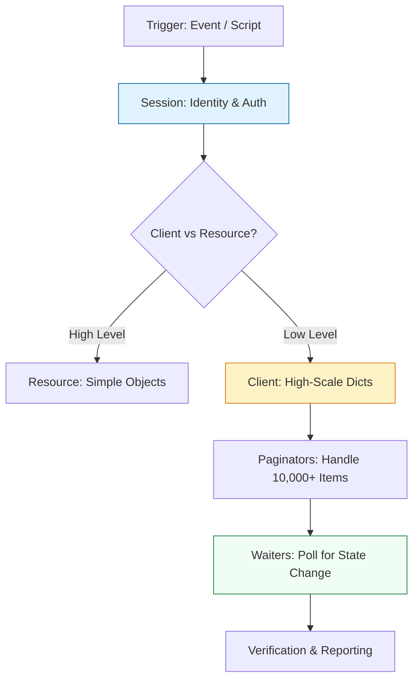

# ☁️ Cloud Automation: Boto3 Deep Dive

> **"If you are clicking buttons in the AWS Console, you are a guest. If you are using Boto3, you are the architect."**

Welcome to the **Boto3 Mastery** module. Boto3 is the official AWS SDK for Python and the heartbeat of modern Cloud Engineering. Whether you are building self-healing infrastructure, auditing security drift, or managing multi-region server fleets, Boto3 is the tool that transforms Python code into cloud actions.

---

## 🏗️ The Cloud Automation Lifecycle

Building for the cloud requires **State Awareness** and **Scalability**. We move beyond simple API calls to **Resource Paginators** and **State Waiters**.



---

## 🎭 Real-World DevOps Scenarios

### 🛡️ Scenario: The "1,000 Bucket" Audit
**The Incident:** An engineer needed to list every file in an S3 account for a security audit. They used `client.list_objects_v2()`. 
**The Failure:** The S3 bucket had 500,000 files. The standard API call only returns the first 1,000 items. The audit reported the bucket was "secure" when 499,000 sensitive files actually existed that weren't being checked.
**The Fix:** Mandatory transition to **Boto3 Paginators**. Never assume an AWS list call is complete unless you are using a paginator loop or checking the `NextToken`.

---

## 💻 DevOps Logic Snippets: "The Resilient Waiter"

Don't use `time.sleep()`. Use the built-in AWS polling mechanisms.

```python
import boto3
import logging

def cycle_ec2_instance(instance_id: str):
    ec2_client = boto3.client('ec2')
    
    try:
        logging.info(f"🚀 Stopping instance {instance_id}...")
        ec2_client.stop_instances(InstanceIds=[instance_id])
        
        # 🛡️ Standard: Use a Waiter to block until the state is reached
        # This replaces messy 'while/sleep' loops
        stop_waiter = ec2_client.get_waiter('instance_stopped')
        stop_waiter.wait(InstanceIds=[instance_id])
        logging.info(f"✅ Instance {instance_id} is now stopped.")

        # 🚀 Act: Restart
        logging.info(f"🔄 Restarting instance {instance_id}...")
        ec2_client.start_instances(InstanceIds=[instance_id])
        
        start_waiter = ec2_client.get_waiter('instance_running')
        start_waiter.wait(InstanceIds=[instance_id])
        logging.info(f"🎉 Instance {instance_id} is back online!")

    except Exception as e:
        logging.error(f"💥 Cloud Operation Failed: {e}")

if __name__ == "__main__":
    cycle_ec2_instance("i-0abcd1234")
```

---

## 🎙️ Interview Preparation (Cloud Engineering)

1.  **"What is the difference between a Boto3 'Client' and a 'Resource'?"**
    *   *Answer:* A **Client** is a low-level service representation that maps 1:1 with the AWS API. It returns dictionaries and is faster for high-scale tasks. A **Resource** is a high-level, object-oriented abstraction that is more "Pythonic" but is being phased out for some newer AWS services.
2.  **"How does Boto3 resolve credentials by default?"**
    *   *Answer:* It follows a strict priority: 1. Explicit credentials in `Session()`. 2. Environment Variables (`AWS_ACCESS_KEY_ID`). 3. Shared config files (`~/.aws/credentials`). 4. IAM Instance Profile (if running on EC2/Lambda). It stops as soon as it finds a valid identity.
3.  **"Why should you use a Paginator instead of a normal list method?"**
    *   *Answer:* Most AWS APIs have a limit (usually 100 to 1,000) on how many items they return in a single call. Paginators provide a simple iterator that handles the `NextToken` behind the scenes, allowing you to process 100,000+ items without complex manual loops.
4.  **"What is a 'Presigned URL' and why is it used for secure automation?"**
    *   *Answer:* It is a URL generated by Boto3 that gives someone temporary access to a private S3 object without requiring them to have AWS credentials. This is used in DevOps to give a CI/CD runner temporary access to a build artifact.
5.  **"When would you use a Boto3 'Waiter'?"**
    *   *Answer:* Use a waiter when your script needs to block execution until a resource reaches a specific state (e.g., waiting for an RDS instance to be `available` after a backup restore). Waiters are more efficient than `time.sleep()` because they poll at optimized intervals.

---

## 🧠 Knowledge Check

1.  **Which library is the heart of AWS automation in Python?**
    *   [ ] `requests`
    *   [x] `boto3`
    *   [ ] `shutil`
2.  **To handle an S3 bucket with 1 million files, what should you use?**
    *   [ ] `client.list_objects()`
    *   [x] `client.get_paginator()`
    *   [ ] `for` loop with a counter.
3.  **True or False: boto3.Session() is where you can specify specific AWS profiles.**
    *   [x] True
    *   [ ] False
4.  **What does a Waiter do?**
    *   [ ] It creates a new resource.
    *   [x] It polls an AWS resource until it reaches a desired state.
    *   [ ] It deletes old logs.
5.  **Which data format do Boto3 'Clients' return?**
    *   [ ] XML
    *   [x] JSON/Dictionary
    *   [ ] CSV

---

[⬅️ Back to Start](../README.md) | [Next: Serverless Boto3](../06-Serverless-Boto3-Lambda/README.md) ➡️