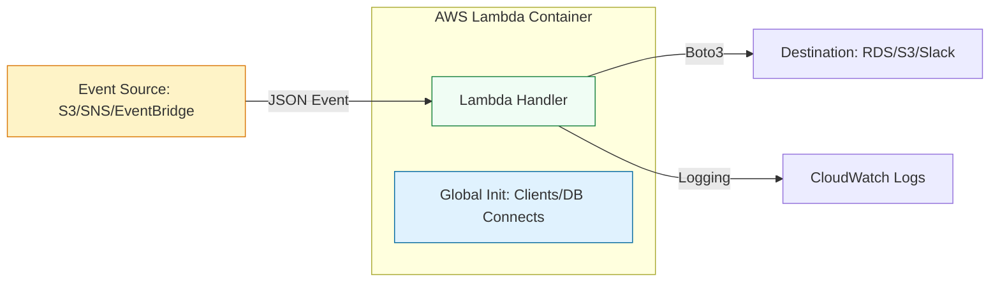

# ⚡ Serverless Mastery: Python & AWS Lambda

> **"Infrastructure is a cost. Servers are a burden. Code should only exist when it's solving a problem. That is the philosophy of Serverless."**

Welcome to the **Serverless Automation** module. In modern DevOps, we move away from "Management Servers" toward event-driven logic. AWS Lambda allows your Python code to react instantly to system events—a file upload, a cloudtrail alert, or a scheduled cron—without a single server to patch.

---

## 🏗️ The Event-Driven Architecture

Serverless engineering is about building **Reactive Systems**. We focus on the "Gold Standard" of Lambda design: The Stateless Handler.



---

## 🎭 Real-World DevOps Scenarios

### 🛡️ Scenario: The "S3 Recursive loop" Catastrophe
**The Incident:** An engineer created a Lambda to watermark images uploaded to an S3 bucket. The script saved the watermarked image back to the *same* bucket.
**The Failure:** The second upload triggered the Lambda again. This created an infinite loop. Within 2 hours, the AWS bill hit $5,000 and the company S3 account was throttled, taking down the main website's image assets.
**The Fix:** Mandatory **Source/Destination separation**. Automation must never trigger the same event that starts it unless explicit guard clauses (like metadata binary checks) are in place.

---

## 💻 DevOps Logic Snippets: "The Warm Start Pattern"

Optimize performance by placing heavy initializations outside the handler function.

```python
import boto3
import json
import logging

# 🚀 Global Init: Only runs ONCE per container lifecycle (Warm Start)
# Used for clients, database connections, or loading large files
s3_client = boto3.client('s3')
logger = logging.getLogger()
logger.setLevel(logging.INFO)

def lambda_handler(event, context):
    """
    Standard Serverless Entry Point.
    event: Contains the 'What' (Trigger data)
    context: Contains the 'Where' (Runtime environment, time remaining)
    """
    try:
        # 🔍 Check: Is there an event?
        bucket = event['Records'][0]['s3']['bucket']['name']
        key = event['Records'][0]['s3']['object']['key']
        
        logger.info(f"📁 New file detected in {bucket}: {key}")
        
        # 🚀 Act: Perform automation logic
        # ... logic goes here ...
        
        return {
            'statusCode': 200,
            'body': json.dumps('Automation Success')
        }
    except Exception as e:
        logger.error(f"💥 Lambda Failure: {str(e)}")
        raise e # Re-throw to trigger Lambda retry mechanisms
```

---

## 🎙️ Interview Preparation (Serverless)

1.  **"What is a 'Cold Start' and how do you mitigate it in SRE tools?"**
    *   *Answer:* A cold start is the latency when AWS spins up a new container for your code. Mitigation includes keeping functions small, avoiding heavy libraries if possible, and using "Provisioned Concurrency" for high-priority automation.
2.  **"Why should you never initialize a database connection inside the lambda_handler?"**
    *   *Answer:* If the Lambda is called 100 times concurrently, it will open 100 separate DB connections, potentially crashing the database. Initializing in the global scope allows the container to reuse the same connection across multiple invocations.
3.  **"How do you pass secrets (like API keys) to a Lambda safely?"**
    *   *Answer:* Use Environment Variables encrypted with KMS, or pull them dynamically from **AWS Secrets Manager** using Boto3 within the global initialization.
4.  **"What is the maximum execution time for a Lambda, and why is this a risk for automation?"**
    *   *Answer:* The limit is 15 minutes. Long-running tasks (like large DB migrations or massive S3 audits) will time out. For these, use Lambda to trigger an **ECS Task** or **AWS Step Functions**.
5.  **"Explain the difference between synchronous and asynchronous Lambda invocations."**
    *   *Answer:* Synchronous (e.g., API Gateway) waits for a response. Asynchronous (e.g., S3/SNS) launches the Lambda and continues. For DevOps, Async is preferred for "fire and forget" tasks like log rotation or alert remediation.

---

## 🧠 Knowledge Check

1.  **Which object contains the runtime information like 'time remaining'?**
    *   [ ] `event`
    *   [x] `context`
    *   [ ] `environ`
2.  **What is the default timeout for a new Lambda function?**
    *   [x] 3 seconds
    *   [ ] 15 minutes
    *   [ ] 1 hour
3.  **True or False: Lambda can directly access resources in a private VPC by default.**
    *   [ ] True
    *   [x] False (Needs VPC configuration and Subnets/Security Groups).
4.  **How do you handle large Python dependencies (like Pandas) in Lambda?**
    *   [x] Lambda Layers
    *   [ ] Installing them via `pip` inside the handler
    *   [ ] Manually uploading the `__pycache__`
5.  **What happens if a Lambda triggered by S3 fails?**
    *   [ ] It stops forever.
    *   [x] AWS retries the invocation (usually 2 more times for Async events).
    *   [ ] It deletes the S3 file.

---

[⬅️ Back to Python for DevOps](../README.md) | [Next: Cloud Automation Boto3](../05-Cloud-Automation-Boto3-Deep-Dive/README.md) ➡️
