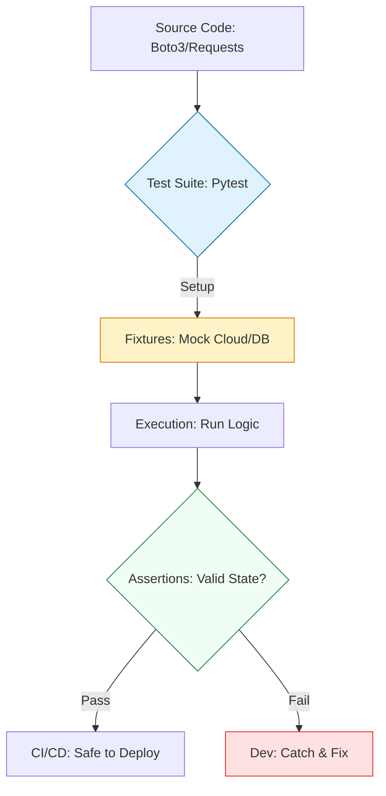

# 🧪 Testing Automation: Fail-Fast Engineering with Pytest

> **"Untested infrastructure code is just a legacy outage waiting to happen. If you aren't testing your automation, you aren't an engineer—you're a gambler."**

Welcome to the **Testing & Verification** module. In the high-stakes world of DevOps, a single script error can delete a production database or partition a network. `Pytest` is the industry-standard framework that allows you to verify your logic, mock cloud providers, and catch errors *before* they hit your servers.

---

## 🏗️ The Verification Lifecycle

Testing for DevOps is about the **Mock-Execute-Verify** pattern. We move from "Test-on-Prod" to **Isolated Unit Testing**.



---

## 🎭 Real-World DevOps Scenarios

### 🛡️ Scenario: The "Boto3 Snapshot" Disaster
**The Incident:** An engineer wrote a script to clean up EBS snapshots older than 30 days. They used a simple comparison: `if snap_age > 30: delete()`. 
**The Failure:** Due to a logic error (comparing strings instead of integers), the script interpreted "9 days" as being greater than "30 days" (alphabetical sort).
**The Catastrophe:** The script was executed on production and immediately began deleting the most recent snapshots—the ones they actually needed for disaster recovery.
**The Fix:** Mandatory **Pytest with Moto**. By using a mock AWS environment, the team verified that for a list of [5, 45, 10] days, only one snapshot was deleted. The test failed, the bug was caught, and production was saved.

---

## 💻 DevOps Logic Snippets: "The Robust Test"

Use fixtures to set up state and `@patch` to fake external API calls.

```python
import pytest
from unittest.mock import patch

# 🚀 The Function we want to test
def get_service_status(url: str):
    import requests
    resp = requests.get(url)
    return resp.json()['status']

# 🧪 The Test Suite
@patch('requests.get')
def test_get_service_status_healthy(mock_get):
    # 🏗️ Setup: Mock a successful API response
    mock_get.return_value.status_code = 200
    mock_get.return_value.json.return_value = {'status': 'UP'}
    
    # 🚀 Act: Run the logic
    result = get_service_status("https://fake-api.com")
    
    # 🔍 Verify: Assertion
    assert result == 'UP'
    assert mock_get.called

def test_logic_boundary():
    # Example of a mathematical boundary check
    assert 2 + 2 == 4
```

---

## 🎙️ Interview Preparation (Testing & QA)

1.  **"What is the difference between a Unit Test and an Integration Test in a DevOps context?"**
    *   *Answer:* A Unit Test isolates a single function and mocks all external dependencies (like AWS or a DB). An Integration Test checks how your script interacts with real (or containerized) services like a local Postgres instance or a S3 simulator.
2.  **"What is a 'Fixture' in Pytest and why is it better than a global object?"**
    *   *Answer:* A Fixture is a modular function that prepares data or environment for a test. It's better than globals because it can be "injected" only where needed, has specific scopes (e.g., once per session or once per test), and handles its own cleanup (teardown) automatically.
3.  **"How do you test a script that interacts with AWS without spending money or needing an internet connection?"**
    *   *Answer:* Use the **Moto** library. Moto mocks the entire AWS SDK (`boto3`), allowing you to "create" buckets or "launch" instances in a virtual memory space that disappears when the test finishes.
4.  **"Explain 'Mocking' vs. 'Patching'."**
    *   *Answer:* Mocking is the act of creating a fake object that looks like the real thing. Patching is the mechanism (using `unittest.mock.patch`) that replaces the real library in your code with that mock during the test execution.
5.  **"What does `conftest.py` do?"**
    *   *Answer:* It's a special file in Pytest that stores shared fixtures and configuration for an entire directory. Any test file in that folder can access the fixtures in `conftest.py` without importing them.

---

## 🧠 Knowledge Check

1.  **Which decorator is used to define a setup function in Pytest?**
    *   [ ] `@pytest.setup`
    *   [x] `@pytest.fixture`
    *   [ ] `@pytest.mock`
2.  **True or False: An 'Assertion' is a statement that must be true for the test to pass.**
    *   [x] True
    *   [ ] False
3.  **Which library is the industry standard for mocking AWS services?**
    *   [ ] `requests`
    *   [x] `moto`
    *   [ ] `boto_test`
4.  **How do you run your tests from the terminal?**
    *   [ ] `python run tests`
    *   [ ] `run-pytest`
    *   [x] `pytest`
5.  **What happens if a test script with a failing assertion is run in a CI/CD pipeline?**
    *   [ ] It ignores the error and continues.
    *   [x] It returns a non-zero exit code and stops the pipeline.
    *   [ ] It deletes the code.

---

[⬅️ Back to Start](../README.md) | [Next: Log Parsing](../08-Log-Parsing-and-Regex/README.md) ➡️
