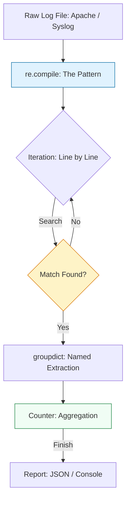

# 🔍 Log Parsing & Regex: Extracting Truth from Chaos

> **"A log file is just a novel where the protagonist is a server having a very bad day. Your job as a DevOps engineer is to find the villain."**

Welcome to the **Log Parsing & Regex** module. In large-scale systems, truth is hidden in millions of lines of unstructured text. Regular Expressions (Regex) are the "scalpel" you use to slice through this chaos and extract structured metrics. Mastering Python's `re` module and the `collections` library allows you to build high-performance analysis tools that reveal infrastructure trends in real-time.

---

## 🏗️ The Analysis Architecture

Log analysis is about the **Compile-Filter-Count** strategy. We move from raw text to structured **Group Objects**.



---

## 🎭 Real-World DevOps Scenarios

### 🛡️ Scenario: The "Kibana is Down" Crisis
**The Incident:** During a massive traffic spike, the Elasticsearch/Kibana stack crashed due to ingest overload. Management needed to know immediately: "Is the surge an attack (403/401 errors) or just a successful marketing campaign (200 OK)?"
**The Failure:** Without the GUI dashboard, the team was blind. They were looking at raw logs scrolling at 10,000 lines per second.
**The Fix:** A Python **Log Parser**. Using a pre-compiled Regex, the script scanned the raw Nginx access logs on the load balancer, counted the status codes using `collections.Counter`, and output a summary every 5 seconds.
**The Result:** Identified a 400% spike in successful `GET /` requests—it was a viral social media post, not an attack.

---

## 💻 DevOps Logic Snippets: "The Pattern Master"

Always use `re.compile()` for performance and named groups for readability.

```python
import re
from collections import Counter
import logging

# 🚀 Professional Standard: Pre-compile with Named Groups
# (?P<name>...) allows you to access data by name instead of index
LOG_PATTERN = re.compile(r'\[(?P<level>ERROR|WARN|INFO)\] (?P<msg>.*)')

def parse_application_logs(lines: list):
    stats = Counter()
    
    for line in lines:
        # 🚀 Act: Search for the pattern
        match = LOG_PATTERN.search(line)
        
        if match:
            # 🛡️ Guard Clause: Access data by name
            level = match.group('level')
            stats[level] += 1
            
    return dict(stats)

if __name__ == "__main__":
    sample = ["[INFO] Startup", "[ERROR] DB Timeout", "[ERROR] Connection Refused"]
    print(f"📊 Summary: {parse_application_logs(sample)}")
```

---

## 🎙️ Interview Preparation (Log Analysis)

1.  **"What is the difference between `re.match()` and `re.search()`?"**
    *   *Answer:* `re.match()` only looks at the very beginning of the string. `re.search()` scans the entire string for the first occurrence. In log parsing, `re.search()` or `re.findall()` is almost always what you want.
2.  **"Why should you call `re.compile()` outside of a loop?"**
    *   *Answer:* Compiling a Regex pattern is an expensive operation. If you do it inside a loop that runs 1 million times, you are wasting CPU cycles. Compiling once converts the pattern into a specialized state machine that the `re` engine can reuse instantly.
3.  **"Explain 'Greedy' vs. 'Non-Greedy' matching."**
    *   *Answer:* Greedy matching (`.*`) tries to match as much as possible. Non-greedy matching (`.*?`) matches as little as possible. For example, in a log like `[ERR] [ID-5]`, greedy would match `[ERR] [ID-5]`, while non-greedy would correctly match just `[ERR]`.
4.  **"What is a 'Capture Group' and why are named groups better?"**
    *   *Answer:* Capture groups `()` allow you to isolate parts of a match. Named groups `(?P<name>...)` are better for maintainability because they allow you to access data as a dictionary (`match.group('ip')`) rather than remembering an index (`match.group(1)`), which would break if the Regex pattern is updated.
5.  **"Why use the `collections.Counter` class instead of a standard dictionary?"**
    *   *Answer:* `Counter` is an optimized subclass of dictionary designed specifically for counting hashable objects. It handles "missing key" errors automatically (starting them at 0) and provides useful methods like `most_common()`.

---

## 🧠 Knowledge Check

1.  **Which character makes a quantifier (like `+` or `*`) non-greedy?**
    *   [ ] `!`
    *   [x] `?`
    *   [ ] `.`
2.  **To find ALL occurrences of a pattern in a string, which method do you use?**
    *   [ ] `re.search()`
    *   [ ] `re.match()`
    *   [x] `re.findall()`
3.  **True or False: `re.compile()` converts a regex string into a high-performance object.**
    *   [x] True
    *   [ ] False
4.  **Which library is best for quickly counting occurrences of items (like status codes)?**
    *   [ ] `json`
    *   [x] `collections`
    *   [ ] `math`
5.  **In regex, what does the sequence `\d+` represent?**
    *   [ ] One or more whitespace characters.
    *   [x] One or more digits.
    *   [ ] One or more word characters.

---

[⬅️ Back to Start](../README.md) | [Next: Remote Execution](../09-Remote-Execution-and-SSH/README.md) ➡️
