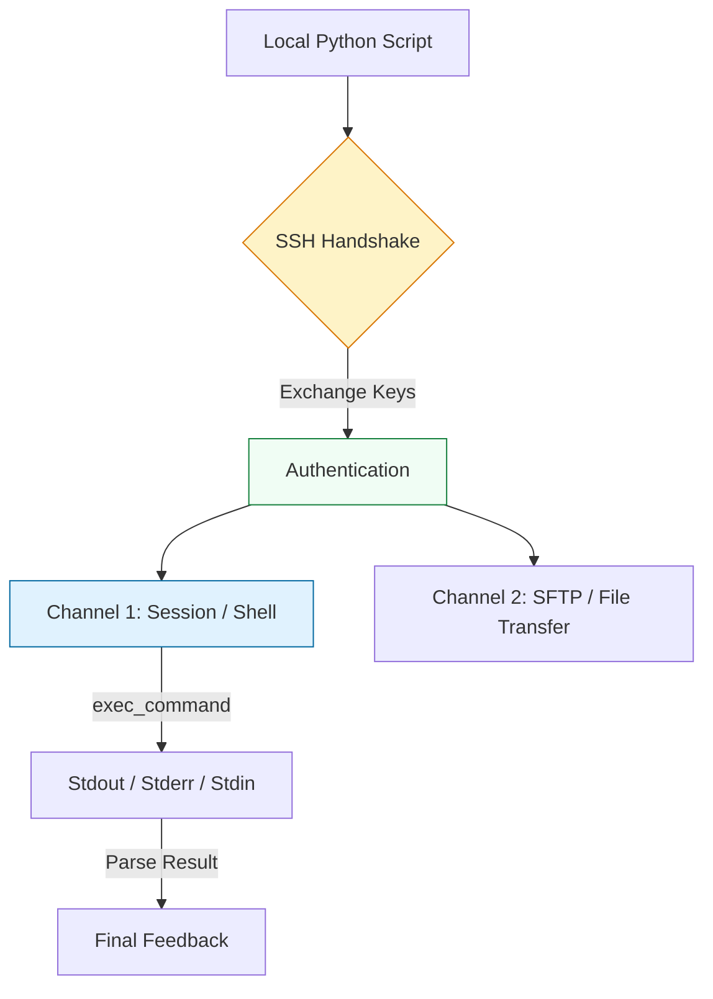

# 🌐 Remote Execution: Scripting the Fleet with SSH

> **"If you have to log in to more than one server manually, you aren't an engineer—you're a tourist. High-scale DevOps is the art of never leaving your own terminal."**

Welcome to the **Remote Execution** module. While modern tools like Ansible exist, Python's `Paramiko` and `Fabric` libraries allow you to build custom, high-speed remote automation for systems that don't support agents—think routers, legacy bare-metal, or specialized network appliances.

---

## 🏗️ Remote Architecture: The Handshake

Remote execution logic is about managing **Sessions** and **Transports**. We focus on the "Staff Standard": Secure, Timeout-Aware, and Parallelized connections.



---

## 🎭 Real-World DevOps Scenarios

### 🧱 Scenario: The "Keyboard Interactive" Prompt
**The Incident:** An automation script was designed to restart Nginx on 200 servers. One server had a misconfigured SSH config that required a secondary "Keyboard-Interactive" prompt for an MFA code.
**The Failure:** The script used a basic `ssh` command. It hung indefinitely on that one server, holding up the entire deployment pipeline for 2 hours while the team wondered why the site was still down.
**The Fix:** Mandatory use of **Timeouts** and programmatic SSH clients (Paramiko) that can detect prompts in the `stdin` stream and fail fast if unexpected interaction is required.

---

## 💻 DevOps Logic Snippets: "The Secure Paramiko Client"

Don't just "AutoAddPolicy". Manage your keys like a production engineer.

```python
import paramiko
import sys
import logging

# Professional Standard: Load system known_hosts
def run_remote_command(hostname: str, cmd: str, username: str = "deploy"):
    client = paramiko.SSHClient()
    
    # 🛡️ Guard Clause: Prevent MITM by rejecting unknown hosts in PROD
    # (Use AutoAddPolicy only in development!)
    client.load_system_host_keys()
    client.set_missing_host_key_policy(paramiko.RejectPolicy())

    try:
        # 🚀 Act: Connect with a strict timeout
        client.connect(hostname, username=username, timeout=10)
        
        # exec_command returns 3 file-like streams
        stdin, stdout, stderr = client.exec_command(cmd)
        
        exit_status = stdout.channel.recv_exit_status()
        
        if exit_status == 0:
            print(f"✅ Success on {hostname}:\n{stdout.read().decode()}")
        else:
            print(f"❌ Failure on {hostname}:\n{stderr.read().decode()}")
            
    except Exception as e:
        print(f"💥 SSH Error on {hostname}: {str(e)}")
    finally:
        client.close()

if __name__ == "__main__":
    run_remote_command("10.0.0.50", "uptime")
```

---

## 🎙️ Interview Preparation (Remote Execution)

1.  **"Why use Paramiko when you can just call `subprocess.run(['ssh', ...])`?"**
    *   *Answer:* `subprocess` is limited to string interaction. Paramiko gives you programmatic control over the SSH protocol itself, including SFTP sub-systems, handling multiple channels over one connection, and fine-grained authentication logic.
2.  **"What is a 'Thundering Herd' problem in SSH automation?"**
    *   *Answer:* It happens when a script tries to open 1,000 SSH connections simultaneously. The CPU overhead from 1,000 crypto handshakes can crash the Bastion host or the local machine. Solution: Use a **Worker Pool** or **Semaphore** to limit concurrency.
3.  **"How do you handle a command that requires `sudo` in an SSH script?"**
    *   *Answer:* You must use a terminal-capable channel (usually `get_pty=True`) and then monitor the `stdout` for a `[sudo] password:` prompt, writing the password to `stdin` followed by a newline.
4.  **"What is the difference between Paramiko and Fabric?"**
    *   *Answer:* Paramiko is the low-level library that implements the SSHv2 protocol. Fabric is a higher-level tool built on top of Paramiko that provides a more "DevOps-friendly" API for running tasks across multiple hosts.
5.  **"How do you securely handle SSH keys for a script running in CI/CD?"**
    *   *Answer:* Never store the private key in the repo. Use the CI/CD's Secret Manager to inject the key into an **SSH Agent** at runtime, or use a temporary file that is deleted via a `finally` block or `trap`.

---

## 🧠 Knowledge Check

1.  **Which policy is the MOST secure for handling unknown host keys in production?**
    *   [ ] `AutoAddPolicy`
    *   [ ] `WarningPolicy`
    *   [x] `RejectPolicy`
2.  **What does `stdout.channel.recv_exit_status()` do?**
    *   [ ] It closes the connection.
    *   [x] It waits for the remote command to finish and returns its exit code.
    *   [ ] It reads the first line of output.
3.  **True or False: Paramiko supports file transfers via the SFTP protocol.**
    *   [x] True
    *   [ ] False
4.  **Which keyword ensures the SSH connection is closed even if the command fails?**
    *   [ ] `except`
    *   [ ] `close`
    *   [x] `finally`
5.  **What is the default port for SSH?**
    *   [ ] 80
    *   [x] 22
    *   [ ] 443

---

[⬅️ Back to Python for DevOps](../README.md) | [Next: Database Operations](../10-Database-Operations/README.md) ➡️
