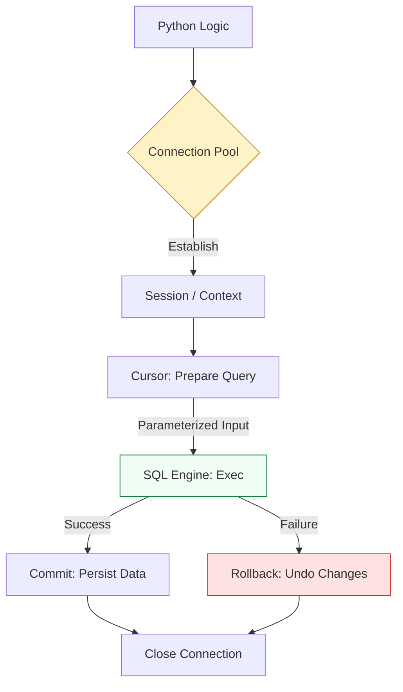

# 🗄️ Database Operations: Managing State with SQL

> **"Infrastructure is code, but business is data. A DevOps engineer who can't safely manipulate a database is just a script-runner; one who can is a Platform Engineer."**

Welcome to the **Database Operations** module. In automated environments, we use databases to track inventory, log deployment metadata, and manage global configuration state. This module focuses on the **Python DB-API 2.0**—the industry standard for interacting with SQL engines safely and at scale.

---

## 🏗️ The Data Architecture

Interacting with databases requires a strict **Transaction Lifecycle**. We move from raw string commands to **Parameterized Queries** and **Atomic Transactions**.



---

## 🎭 Real-World DevOps Scenarios

### 🧱 Scenario: The "Little Bobby Tables" Incident
**The Incident:** An internal tool allowed engineers to query server owner information by typing a hostname. The script used a simple f-string: `cursor.execute(f"SELECT * FROM inventory WHERE host='{input}'")`.
**The Failure:** A user accidentally pasted a value containing a semicolon: `web-01'; DROP TABLE inventory; --`.
**The Catastrophe:** The SQL engine interpreted this as two separate commands. It finished the select and then immediately deleted the entire server inventory table, losing 5 years of metadata.
**The Fix:** Mandatory transition to **Parameterized Queries**. Never use string formatting for SQL inputs.

---

## 💻 DevOps Logic Snippets: "The Safe Transaction"

Use context managers to handle connections and parameters to handle data.

```python
import sqlite3
import logging

# Professional Standard: Context-Aware Connection
def update_server_status(host: str, status: str):
    db_path = "inventory.db"
    
    try:
        # 'with' handles connection closing automatically
        with sqlite3.connect(db_path) as conn:
            cursor = conn.cursor()
            
            # 🛡️ Guard Clause: Parameterized Query (Prevents Injection)
            query = "UPDATE servers SET status = ? WHERE hostname = ?"
            params = (status, host) # Parameters as a tuple
            
            cursor.execute(query, params)
            
            # 🚀 Act: Commit changes
            conn.commit()
            print(f"✅ Updated {host} to {status}.")
            
    except sqlite3.Error as e:
        print(f"❌ DB Error: {e}")
        # Connection automatically rolls back if commit() wasn't called

if __name__ == "__main__":
    update_server_status("lb-01", "MAINTENANCE")
```

---

## 🎙️ Interview Preparation (DB Operations)

1.  **"What is the Python DB-API (PEP 249) and why does it matter?"**
    *   *Answer:* It is a standard specification that defines how Python libraries (like `psycopg2` for Postgres or `sqlite3`) should behave. It ensures that the same methods (`connect`, `cursor`, `execute`) work across different database engines with minimal code changes.
2.  **"Why is f-string query formatting considered a critical security vulnerability?"**
    *   *Answer:* It allows **SQL Injection**. An attacker can input malicious SQL (like `DROP TABLE`) which the engine will execute as a valid command. Parameterized queries send data separately from the command, so it's treated as a literal string, not code.
3.  **"What happens if a script crashes after a write operation but before calling `conn.commit()`?"**
    *   *Answer:* Most SQL engines will automatically **Rollback** the transaction. The changes will not be saved. This is a safety feature that prevents partial or corrupted data from being persisted.
4.  **"When should a DevOps engineer use an ORM (like SQLAlchemy) vs. Raw SQL?"**
    *   *Answer:* Use an ORM for complex applications where you need to track object relationships and state. Use Raw SQL (with parameters) for simple automation scripts, data migration tools, or performance-critical log parsing where ORM overhead is unnecessary.
5.  **"What is a Connection Pool and why is it used in high-concurrency scripts?"**
    *   *Answer:* Creating a DB connection is "expensive" in terms of CPU and memory. A pool keeps a set of connections open and reuses them. In a script handling 1,000 concurrent API requests, a pool prevents the database from being overwhelmed by 1,000 simultaneous handshake requests.

---

## 🧠 Knowledge Check

1.  **Which object is used to traverse results from a database query?**
    *   [ ] `Connection`
    *   [x] `Cursor`
    *   [ ] `Adapter`
2.  **True or False: Using '?' or '%s' in a query prevents SQL injection.**
    *   [x] True
    *   [ ] False
3.  **What does `conn.rollback()` do?**
    *   [ ] It deletes the database file.
    *   [x] It undoes all changes since the last `commit()`.
    *   [ ] It restarts the SQL service.
4.  **In most databases, what is the default behavior if you close a connection without committing?**
    *   [ ] It saves the data anyway.
    *   [x] It rolls back the transaction.
    *   [ ] It throws an error.
5.  **Which library is built-in to Python and doesn't require an external server?**
    *   [ ] PostgreSQL
    *   [ ] Redis
    *   [x] SQLite

---

[⬅️ Back to Python for DevOps](../README.md) | [Next: Docker & Kubernetes](../11-Docker-and-Kubernetes-SDKs/README.md) ➡️
