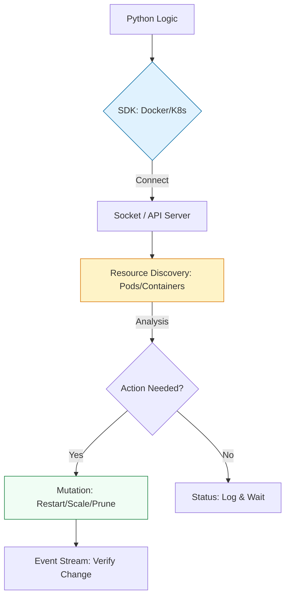

# 🎡 Orchestration: Docker & Kubernetes SDKs

> **"YAML is a static declaration of intent. Python is a dynamic execution of will. When your architecture needs to make decisions—wait for a DB, check a port, then scale—you need the SDK."**

Welcome to the **Container Orchestration** module. While YAML manifests are the standard for deployment, Python is the "Brain" of the control plane. Using the official Docker and Kubernetes SDKs, you can build custom controllers, automated image pruners, and self-healing infrastructure that reacts to real-time cluster state.

---

## 🏗️ The Cloud-Native Architecture

Interaction with container runtimes requires **Asynchronous Thinking**. We move from static files to **Event Stream Listeners** and **Stateful Controllers**.



---

## 🎭 Real-World DevOps Scenarios

### 🛡️ Scenario: The "Zombie Container" Healer
**The Incident:** A legacy Java application would occasionally experience "JVM Freezes." The container was still "Running" according to Docker, so the standard health check (which only checked if the process existed) reported it as Healthy.
**The Failure:** Users were hitting a dead service. The site was effectively down for 4 hours while the Load Balancer continued to route traffic to the "Zombie" pods.
**The Fix:** A Python **Healer Script** using the Docker SDK. Every 30 seconds, it executed a small command *inside* the container via `container.exec_run()`. If the command timed out (JMX check), the script immediately triggered a `container.restart()`.

---

## 💻 DevOps Logic Snippets: "The Image Pruner"

Manage your local or remote registry state with programmatic precision.

```python
import docker
import logging

def cleanup_old_images(tag_pattern: str):
    client = docker.from_env()
    
    try:
        logging.info("🔍 Auditing local Docker images...")
        images = client.images.list()
        
        for img in images:
            # 🛡️ Guard Clause: Check tags (Prevent deleting base images)
            tags = img.tags
            if any(tag_pattern in t for t in tags):
                logging.info(f"🧹 Pruning image: {tags}")
                # 🚀 Act: Remove the image
                client.images.remove(image=img.id, force=True)
                
    except Exception as e:
        logging.error(f"💥 Docker operation failed: {e}")

if __name__ == "__main__":
    # Remove all 'dev' images
    cleanup_old_images(":dev")
```

---

## 🎙️ Interview Preparation (Container Orchestration)

1.  **"How does the Docker Python SDK connect to the Docker service?"**
    *   *Answer:* By default, it connects via the Unix Socket located at `/var/run/docker.sock`. On Windows, it uses a named pipe. You can also connect to remote Docker daemons by providing a URL (e.g., `tcp://10.0.0.1:2375`).
2.  **"What is the difference between `containers.run` and `containers.create` in the Docker SDK?"**
    *   *Answer:* `create()` prepares the container configuration but remains in a `created` state. `run()` is a helper that performs a `create()` followed by a `start()`, and optionally waits for completion if `detach=False`.
3.  **"How do you authenticate with a Kubernetes cluster using the Python SDK?"**
    *   *Answer:* The standard way is using `config.load_kube_config()`, which looks for the `~/.kube/config` file. If running *inside* the cluster (like a CronJob or Controller), you use `config.load_incluster_config()`, which uses the ServiceAccount token injected by Kubernetes.
4.  **"Can the Kubernetes SDK manage Custom Resource Definitions (CRDs)?"**
    *   *Answer:* Yes. While there are typed APIs for Pods and Services, for CRDs you use the `CustomObjectsApi`. This allows you to list, create, and patch any custom resource (like a `CiliumNetworkPolicy` or a `PrometheusRule`).
5.  **"What is 'Stream Parsing' in the context of Docker/K8s events?"**
    *   *Answer:* Instead of periodic polling, you can open an active stream (e.g., `client.events()` in Docker). This allows your script to "listen" for specific events like `die` or `health_status: unhealthy` and react instantly to system failures.

---

## 🧠 Knowledge Check

1.  **To connect to Docker using the local socket, which method is used?**
    *   [ ] `docker.connect()`
    *   [x] `docker.from_env()`
    *   [ ] `docker.initialize()`
2.  **Which Kubernetes API is used for Pods and Services?**
    *   [x] `CoreV1Api`
    *   [ ] `AppsV1Api`
    *   [ ] `BatchV1Api`
3.  **True or False: Using the Docker SDK, you can listen to real-time events like 'container start'.**
    *   [x] True
    *   [ ] False
4.  **What does the `remove=True` flag do in `containers.run`?**
    *   [ ] It deletes the image.
    *   [x] It automatically deletes the container once it finished execution (perfect for ephemeral tasks).
    *   [ ] It deletes the host's `/tmp` directory.
5.  **Which function loads credentials when a script is running INSIDE a Kubernetes Pod?**
    *   [ ] `load_kube_config()`
    *   [x] `load_incluster_config()`
    *   [ ] `load_iam_role()`

---

[⬅️ Back to Start](../README.md) | [Next: Web Scraping](../12-Web-Scraping-for-Monitoring/README.md) ➡️
