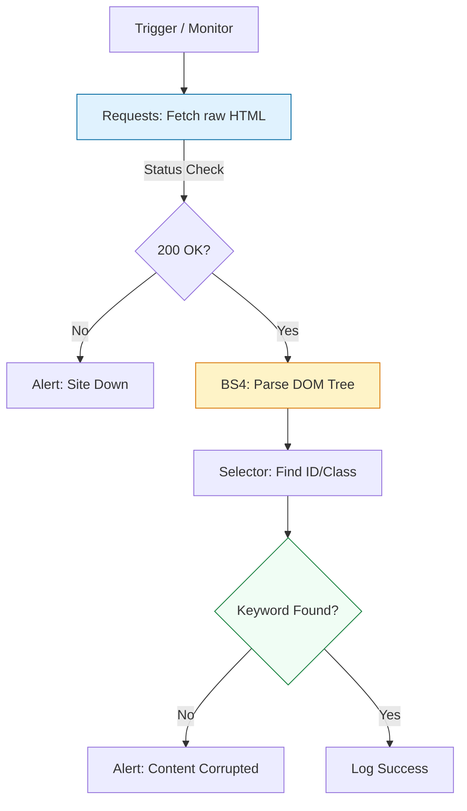

# 🕸️ Web Scraping: The Last Resort of Monitoring

> **"An API is a promise. A webpage is reality. When the promise fails, or was never made, scraping is the only way to verify the user experience."**

Welcome to the **Web Scraping & Synthetic Monitoring** module. In the DevOps world, we use scraping not just to "steal data," but to perform **Blackbox Monitoring**. If a legacy dashboard has no API, or you need to verify that your React app actually "renders" text on the screen (rather than just returning a 200 OK blank page), Python is your primary tool.

---

## 🏗️ The Scraping Pipeline

Scraping is an exercise in **DOM Traversal**. We move from raw byte streams to structured data objects using libraries like `BeautifulSoup` and `Requests`.



---

## 🎭 Real-World DevOps Scenarios

### 🛡️ Scenario: The "200 OK" White Screen
**The Incident:** A deployment of the main E-commerce frontend went out. The load balancer reported all nodes "Healthy" because they consistently returned `200 OK`.
**The Failure:** A JavaScript error caused the React app to crash instantly. Users saw nothing but a blank white screen. Since the Nginx server was still "up," standard monitoring tools didn't catch it.
**The Fix:** A Python **Synthetic Monitor**. Every 60 seconds, it scrapes the page and looks for the string `"Add to Cart"`. If the string is missing, it triggers an immediate rollback.

---

## 💻 DevOps Logic Snippets: "The Blackbox Checker"

A resilient scraper handles HTTP headers and specific DOM elements.

```python
import requests
from bs4 import BeautifulSoup
import logging

def check_site_integrity(url: str, required_text: str):
    # 🛡️ Standard: Pretend to be a real browser to avoid scraping blocks
    headers = {'User-Agent': 'DevOps-Health-Monitor/1.0 (Python/3.9)'}
    
    try:
        response = requests.get(url, headers=headers, timeout=5)
        response.raise_for_status()
        
        # 🚀 Act: Parse the HTML
        soup = BeautifulSoup(response.text, 'html.parser')
        
        # 🔍 Check: Search for specific ID or Keyword
        if required_text in soup.get_text():
            print(f"✅ Recovery success: Found '{required_text}' on {url}")
        else:
            print(f"🚨 ALERT: Critical text '{required_text}' missing from {url}!")
            
    except Exception as e:
        print(f"❌ Connection Failed: {str(e)}")

if __name__ == "__main__":
    check_site_integrity("https://example.com", "Example Domain")
```

---

## 🎙️ Interview Preparation (Synthetic Monitoring)

1.  **"When should you use BeautifulSoup vs. Selenium?"**
    *   *Answer:* Use BeautifulSoup for speed and simplicity on static HTML. Use Selenium (or Playwright) when the page is a **Single Page Application (SPA)** where content is rendered dynamically by JavaScript after the initial page load.
2.  **"What is the risk of scraping for monitoring in production?"**
    *   *Answer:* Fragility. If the developers change a CSS class name (e.g., from `.btn-red` to `.btn-blue`), your monitor might fail even though the site is healthy. Always prefer **ID selectors** (`#id`) or unique text strings over CSS classes.
3.  **"How do you ensure your scraper doesn't accidentally DDoS your own site?"**
    *   *Answer:* Implement strict **Timeouts** and **Rate Limiting**. Never run a scraper loop without a `time.sleep()` or a controlled scheduling window (like a 5-minute cron).
4.  **"Explain the purpose of the 'User-Agent' header in a scraping script."**
    *   *Answer:* It tells the server what browser/OS is making the request. Many CDNs (like Cloudflare) block requests with the default `python-requests` user-agent to prevent bot abuse. Setting it to a common browser string allows the request to pass.
5.  **"What is 'Headless' browser monitoring?"**
    *   *Answer:* It means running a browser tool (like Chrome or Firefox) without a graphical user interface. This is used in CI/CD to run full automated UI tests and scrape JS-heavy sites efficiently on headless Linux servers.

---

## 🧠 Knowledge Check

1.  **Which library is best for parsing static HTML?**
    *   [ ] `requests`
    *   [x] `BeautifulSoup`
    *   [ ] `Pandas`
2.  **True or False: Selenium is faster than BeautifulSoup.**
    *   [ ] True
    *   [x] False (Selenium launches a full browser engine, making it much slower).
3.  **To get only the text content of a page without HTML tags, what BS4 method do you use?**
    *   [x] `soup.get_text()`
    *   [ ] `soup.show_data()`
    *   [ ] `soup.parse()`
4.  **Which HTTP header do you modify to avoid being blocked by anti-bot filters?**
    *   [ ] `Content-Type`
    *   [x] `User-Agent`
    *   [ ] `Accept-Encoding`
5.  **What does 'Blackbox' monitoring mean?**
    *   [x] Testing the system from the outside (User's perspective) without knowing internal code.
    *   [ ] Testing the internal database code.
    *   [ ] A way to encrypt monitoring logs.

---

[⬅️ Back to Python for DevOps](../README.md) | [Next: Data Processing Pandas](../13-Data-Processing-with-Pandas/README.md) ➡️
