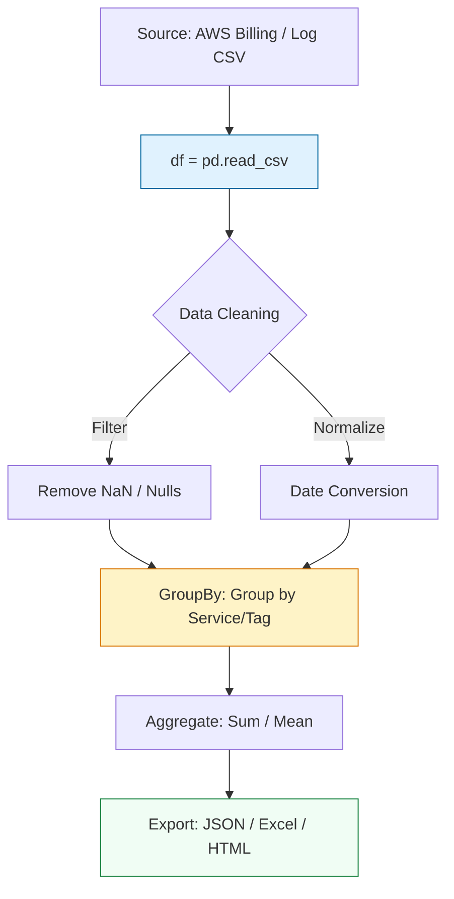

# 📊 Data Engineering for DevOps: Mastery with Pandas

> **"If a CSV is small, use `csv`. If it's complex, use `pandas`. If you're manually opening Excel to calculate monthly cloud spend, you've already failed the automation test."**

Welcome to the **Data Processing** module. In modern FinOps and Observability, we deal with multi-gigabyte exports from AWS Cost Explorer, Datadog logs, and multi-cloud billing. `Pandas` is the industry-standard "Data Engine" that transforms raw, messy CSVs into actionable engineering insights in milliseconds.

---

## 🏗️ The Data Transformation Pipeline

Data engineering is about the **Split-Apply-Combine** strategy. We move from raw unstructured text to a high-performance **DataFrame**.



---

## 🎭 Real-World DevOps Scenarios

### 🛡️ Scenario: The "Three-Day Spreadsheet"
**The Incident:** The Finance team spent the first three days of every month manually merging CSV exports from AWS, GCP, and Azure to calculate the company's total multi-cloud spend across 50 departments.
**The Failure:** Humans make mistakes. A copy-paste error in month 4 resulted in an over-reporting of $200,000 in spend, causing a halt on engineering hiring.
**The Fix:** A Python **Pandas Script**. It reads all CSVs from an S3 bucket, standardizes the column names (`ResourceID`, `Cost`, `Department`), and generates a pivot table in **5 seconds**.

---

## 💻 DevOps Logic Snippets: "The Cost Analyzer"

Don't use loops. Use vectorized operations.

```python
import pandas as pd
import logging

def generate_cost_report(csv_path: str):
    """🚀 Standard: High-speed CSV aggregation."""
    try:
        # Load data
        df = pd.read_csv(csv_path)
        
        # 🛡️ Guard Clause: Clean data (Treat 0 cost for missing data)
        df['Cost'] = df['Cost'].fillna(0)
        
        # 🚀 Act: Sum cost by Department
        # This is the "Pivot Table" of Python
        report = df.groupby('Department')['Cost'].sum().reset_index()
        
        # 📈 Transform: Calculate percentage of total spend
        total_spend = report['Cost'].sum()
        report['Percentage'] = (report['Cost'] / total_spend) * 100
        
        # Export to a production-ready format
        report.to_json('department_spend.json', orient='records')
        print("✅ Report generated: department_spend.json")
        print(report)

    except Exception as e:
        print(f"❌ Data Extraction Failed: {str(e)}")

if __name__ == "__main__":
    # Mock usage
    generate_cost_report("cloud_spend.csv")
```

---

## 🎙️ Interview Preparation (FinOps & Data)

1.  **"Why use Pandas instead of a standard Python `for` loop with the `csv` module?"**
    *   *Answer:* Performance and expressiveness. Pandas is built on top of NumPy (C-based), meaning it uses **Vectorized operations** that are orders of magnitude faster. It also handles data types, missing values (NaN), and complex merges that would take hundreds of lines of pure Python to implement.
2.  **"What is a 'DataFrame' and how does it differ from a 'Series'?"**
    *   *Answer:* A DataFrame is a 2-dimensional table (like a spreadsheet or SQL table) with rows and columns. A Series is a 1-dimensional array, effectively a single column of a DataFrame.
3.  **"How do you handle a CSV file that is larger than the available RAM?"**
    *   *Answer:* Use the `chunksize` parameter in `pd.read_csv()`. This allows you to process the file in smaller batches (e.g., 10,000 rows at a time) instead of loading the entire 10GB file into memory.
4.  **"What is the 'Split-Apply-Combine' pattern in Data Analysis?"**
    *   *Answer:* It's the logic behind `groupby()`. You **Split** the data by a key (e.g., Department), **Apply** a function (e.g., Sum), and **Combine** the results back into a new summary table.
5.  **"How does Pandas help with 'Date-Time' alignment in server logs?"**
    *   *Answer:* Pandas has powerful time-series support. It can take strings like "2024-01-01 10:00:00" and convert them into `datetime` objects, allowing you to easily resample logs from "per-second" to "per-hour" for trend analysis.

---

## 🧠 Knowledge Check

1.  **Which function is used to load a CSV file into a DataFrame?**
    *   [ ] `pd.open_csv()`
    *   [x] `pd.read_csv()`
    *   [ ] `pd.load_table()`
2.  **What does 'NaN' stand for in a Pandas DataFrame?**
    *   [ ] Now and Next
    *   [x] Not a Number (Missing Data)
    *   [ ] New and Null
3.  **True or False: Using `.iterrows()` is the fastest way to modify data in Pandas.**
    *   [ ] True
    *   [x] False (Vectorized operations like `df['col'] * 2` are vastly faster).
4.  **Which method is used to create a Pivot-Table style summary?**
    *   [ ] `df.filter()`
    *   [x] `df.groupby()`
    *   [ ] `df.sort_values()`
5.  **How do you export a DataFrame to an Excel file?**
    *   [x] `df.to_excel()`
    *   [ ] `df.save_as_xls()`
    *   [ ] `df.export(format='xlsx')`

---

[⬅️ Back to Python for DevOps](../README.md) | [Next: Capstone Project](../14-Capstone-Project-S3-Auditor/README.md) ➡️
