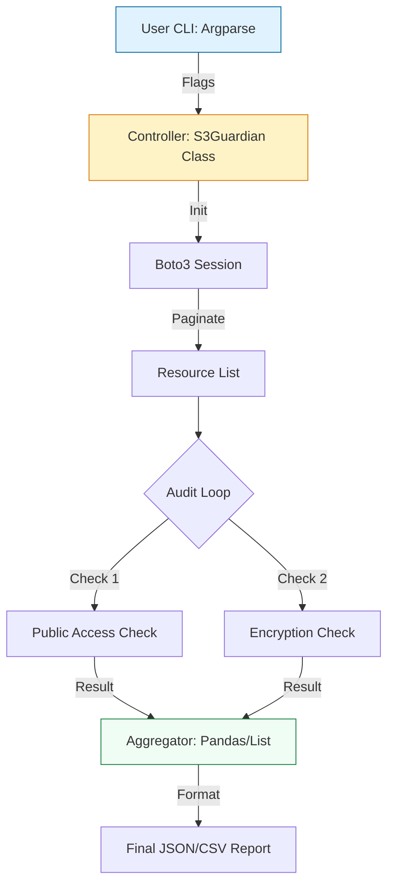

# 🏆 Capstone: S3 Guardian — Enterprise Security Auditor

> **"Code is your proxy. In the middle of the night, when a bucket is misconfigured, your script is the only thing standing between your company's data and a front-page headline."**

Congratulations on reaching the **Capstone Project**. This is the final proving ground where you synthesize everything you've learned—Boto3 mastery, Argparse CLI design, Exception handling, and Data Reporting—into a production-ready security tool.

---

## 🎯 The Mission: "S3 Guardian"

Your task is to build a CLI tool that audits an AWS account for S3 security risks. In the production world, this isn't just a script; it's a **Compliance Engine**.

### Core Deliverables
1.  **Discovery**: Identify all S3 buckets in the account using **Paginators**.
2.  **Audit**: Check for "Public Access Block" settings and "Bucket Encryption."
3.  **Remediation**: (Optional/Hard-mode) A `-f` or `--fix` flag that automatically enables encryption on non-compliant buckets.
4.  **Reporting**: Output the findings to a structured **JSON file** using Pandas or the `json` module.
5.  **CLI Interface**: Support flags for `--region`, `--bucket`, and `--output`.

---

## 🏗️ The Application Architecture

This project requires a **Modular, Object-Oriented** approach to maintain state and readability.

---

## 💻 The Engineering "Definition of Done"

To pass the Staff Engineer review, your code must hit these five benchmarks:

| Benchmark | Requirement | Why? |
| :--- | :--- | :--- |
| **Separation of Concerns** | Logic (Boto3) must be separate from the CLI (Argparse). | Allows you to import the logic into other tools without the CLI. |
| **Fail-Fast** | Use `raise_for_status` or explicit `boto3` Error Handling. | Prevents corrupted reports if the network or auth fails mid-audit. |
| **Instrumentation** | Zero `print()` statements in the core logic. Use `logging`. | Allows logs to be shipped to a ELK/Datadog stack in production. |
| **Type Integrity** | 100% Type Hint coverage for all functions. | Prevents silent `NoneType` bugs in production. |
| **Modularity** | Encapsulate logic within a Class or a set of Library functions. | Makes the tool unit-testable with `pytest`. |

---

## 🎭 Real-World Context: The "Leaky Bucket"
**The Incident:** A major capital bank left an S3 bucket with 100 million credit card applications open to the public. 
**The Cause:** Manual human error. Someone disabled a security group during a "quick test" and forgot to turn it back on.
**The Fix:** A tool exactly like **S3 Guardian**. Running as a Lambda or a scheduled job, it detects the drift from "Private" to "Public" and either alerts or automatically remediates the setting in seconds.

---

## 🎙️ Final Review (Interview Questions)

1.  **"Why did you choose a Class-based approach for the Auditor?"**
    *   *Answer:* It allows us to initialize the Boto3 session and the results list once, and share that state across multiple audit methods (checking encryption, checking ACLs) without passing them as arguments every time.
2.  **"How does your tool handle an AWS account with 10,000 buckets?"**
    *   *Answer:* By using **Boto3 Paginators**. Standard `list_buckets` can be slow or capped; paginators ensure we process every single resource systematically without hitting memory limits.
3.  **"How would you add unit tests for your S3 audit logic?"**
    *   *Answer:* Use `pytest` combined with the `moto` library. `moto` mocks the AWS entire S3 ecosystem, allowing us to "create" buckets and "test" our audit logic locally without spending a cent or needing an internet connection.
4.  **"Describe your error-handling strategy for the CLI part of the tool."**
    *   *Answer:* I used `try/except` blocks around the main execution to catch `NoCredentialsError` or `ConnectionError`, exiting with `sys.exit(1)` and a clear, user-friendly error message instead of a messy stack trace.
5.  **"If you had to run this tool on a 1-hour schedule, where would you host it?"**
    *   *Answer:* AWS Lambda for event-driven or small audits (cost-effective), or an ECS Fargate task if the audit is extremely large and might exceed Lambda's 15-minute timeout.

---

## 🧠 Final Knowledge Check

1.  **Which library is best for building the CLI part of S3 Guardian?**
    *   [x] `argparse` (Built-in) or `click`
    *   [ ] `requests`
    *   [ ] `math`
2.  **What is the 'Moto' library used for in this project?**
    *   [x] Mocking AWS services for local testing.
    *   [ ] Faster Python execution.
    *   [ ] Connecting to databases.
3.  **True or False: A production-grade tool should use `logger.info()` instead of `print()`.**
    *   [x] True
    *   [ ] False
4.  **What is the benefit of outputting a report in JSON format?**
    *   [x] It's easily consumed by other tools, APIs, and dashboards.
    *   [ ] It's smaller than a text file.
    *   [ ] It makes the script run faster.
5.  **What happens if your script encounters a 'NoCredentialsError'?**
    *   [ ] It tries to guess the password.
    *   [x] It should catch the error and exit gracefully with an instruction for the user.
    *   [ ] It crashes the server.

---

[⬅️ Back to Start](../README.md)
