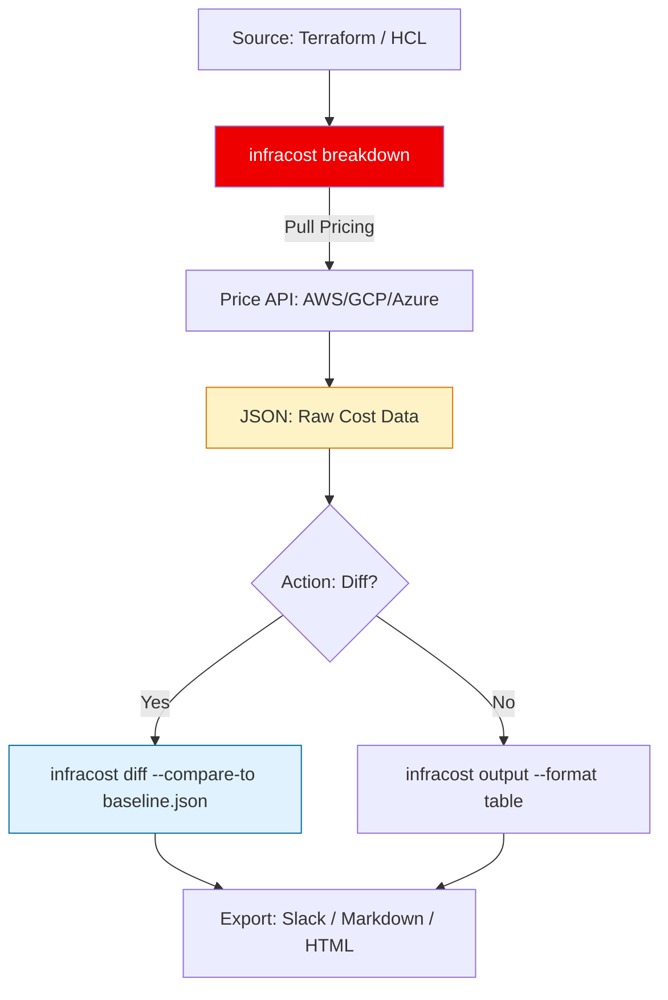

# 🏗️ CLI Automation & JSON Mastery: The Infracost Engine

> **"A GUI is for confirmation. The CLI is for automation. A true SRE never looks at a cost dashboard if they can build a script that does it for them."**

Welcome to the **Infracost CLI Automation** module. Before costs can be gated in CI/CD, you must master the fundamental binary. This module focuses on the **Breakdown-Diff-Export** pattern, enabling you to extract financial metrics from raw HCL and transform them into actionable data for governance scripts.

---

## 🏗️ The CLI Execution Lifecycle

Automated cost analysis follows a strict **Parse-Compare-Report** pipeline.



---

## 🎭 Real-World DevOps Scenarios

### 🛡️ Scenario: The "Zombie Resource" Discovery
**The Incident:** An infrastructure team managed 50 separate microservices. Over time, "test" resources were added but never removed.
**The Failure:** Monthly cloud costs were slowly creeping up at 5% per month, but no single change looked "expensive" in the billing console.
**The Fix:** A Python script using the **Infracost CLI**. Every Sunday at midnight, the script ran `infracost breakdown` on all 50 repositories, extracted the `totalMonthlyCost` from the JSON output, and logged it to a Prometheus metric.
**The Result:** The team visualized the cost trend in Grafana. They identified 12 repositories where the cost was static but high, discovered they were hosting abandoned resources, and saved **$4,000/month** by cleaning them up.

---

## 💻 DevOps Logic Snippets: "The Pipeline Blueprint"

Always use JSON for automation and Table/Markdown for human eyes.

```bash
# 1. 🚀 Breakdown: Get the full cost of the current directory
infracost breakdown --path . --format json --out-file report.json

# 2. 🧪 Diff: Compare current changes against a known baseline
# This is how you identify 'Cost Regression' in CI
infracost diff --path . --compare-to baseline.json --format json --out-file diff_report.json

# 3. 📈 Export: Create a human-readable Slack message
infracost output --path diff_report.json --format slack --out-file slack_msg.json

# 🛡️ Guard Clause: Check if the report exists before parsing
if [ ! -f "diff_report.json" ]; then
    echo "❌ Error: Cost report generation failed."
    exit 1
fi
```

---

## 🎙️ Interview Preparation (CLI Mastery)

1.  **"What is the difference between `breakdown` and `diff`?"**
    *   *Answer:* `breakdown` gives you the total cost of all resources in a project. `diff` only shows the **change** in cost (the delta) between your current code and a baseline JSON file or branch.
2.  **"How do you handle 'Elastic' resources like AWS Lambda or S3 storage in a CLI script?"**
    *   *Answer:* You must provide a **Usage File** (`--usage-file usage.yml`). Since these resources are priced by consumption (invocations, GBs stored), Infracost needs your expected usage metrics to calculate a price.
3.  **"Why is the JSON format preferred over Markdown for automation?"**
    *   *Answer:* JSON is structured and machine-readable. It allows tools like `jq` or Python to extract specific numbers (like `totalMonthlyCost`) to trigger logic, whereas Markdown is purely for human visualization.
4.  **"How can you automate Infracost to check multiple subdirectories in a mono-repo?"**
    *   *Answer:* Using the **Config File** (`infracost-config.yml`). This file allows you to define multiple "projects" (paths), allowing one CLI command to analyze an entire repository with diverse infrastructure components.
5.  **"Explain the benefit of the `infracost log` flag for troubleshooting."**
    *   *Answer:* It provides detailed output about how Infracost is parsing your HCL and communicating with the pricing API. It's essential for debugging when resources aren't being detected correctly or when credentials fail.

---

## 🧠 Knowledge Check

1.  **To get the lowest level of data (perfect for scripting), which format do you use?**
    *   [ ] Table
    *   [ ] Markdown
    *   [x] JSON
2.  **Which command helps identify 'The Delta' between two branches?**
    *   [ ] `infracost breakdown`
    *   [x] `infracost diff`
    *   [ ] `infracost status`
3.  **True or False: Infracost can analyze Terraform code without running `terraform plan`.**
    *   [x] True (It can parse HCL directly for most resources).
    *   [ ] False
4.  **What flag is used to save the CLI output to a specific file?**
    *   [ ] `--save`
    *   [x] `--out-file`
    *   [ ] `--export`
5.  **Which pricing source does the CLI contact to get the latest dollar amounts?**
    *   [ ] AWS Billing API
    *   [x] Infracost Cloud Pricing API
    *   [ ] Google Finance

---

[⬅️ Back to Infracost Index](../README.md) | [Next: GitHub Actions Integration](../02-GitHub-Actions-Integration/README.md) ➡️
