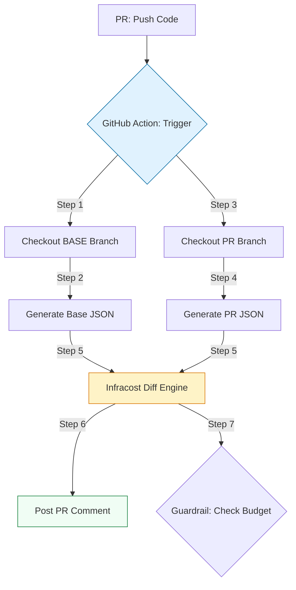

# 🤖 GitHub Actions Integration: Automating Cost Visibility

> **"Visibility is the first step toward efficiency. When every Pull Request includes a price tag, cloud cost becomes an engineering metric, not a finance problem."**

Welcome to the **GitHub Actions Integration** module. In the modern SRE workflow, cost visibility must be "frictionless." By integrating Infracost into the CI/CD pipeline, you provide developers with immediate feedback on the financial impact of their infrastructure changes, enabling them to catch expensive errors *before* the code is merged.

---

## 🏗️ The CI/CD FinOps Lifecycle

Cost analysis is a **First-Class Pipeline Citizen**, integrated directly alongside testing and security scanning.



---

## 🎭 Real-World DevOps Scenarios

### 🧱 Scenario: The "Scaling" Sticker Shock
**The Incident:** An infrastructure team was scaling up their EKS cluster to handle a new customer load. A developer increased the node count from 10 to 50 nodes.
**The Failure:** They chose `m5.4xlarge` instances for all nodes, unaware that `t3.xlarge` would have sufficed for the specific bursty workload.
**The Fix:** The **GitHub Actions Workflow** instantly detected a **+$18,000/month** increase and posted a detailed breakdown on the Pull Request.
**The Result:** The FinOps lead commented on the PR within 20 minutes. After discussion, the team switched to a mix of **Spot Instances** and smaller instance types, reducing the projected cost by **75%** before a single node was provisioned.

---

## 💻 DevOps Logic Snippets: "The Seamless Integration"

Use the official `infracost/actions` to keep your workflows clean and maintainable.

```yaml
# 🚀 Standard: Pull Request Cost Visibility
jobs:
  infracost:
    runs-on: ubuntu-latest
    steps:
      - name: Setup Infracost
        uses: infracost/actions/setup@v2
        with:
          api-key: ${{ secrets.INFRACOST_API_KEY }}

      - name: Generate Diff JSON
        run: |
          # 🧪 Pattern: Compare current branch vs main
          infracost diff --path . \
                        --compare-to main \
                        --format json \
                        --out-file /tmp/infracost.json

      - name: Post PR Comment
        uses: infracost/actions/comment@v2
        with:
          path: /tmp/infracost.json
          # 🛡️ Pattern: Update existing comment to keep PR thread clean
          behavior: update
```

---

## 🎙️ Interview Preparation (CI/CD FinOps)

1.  **"How does Infracost handle 'Base' vs 'Head' branch comparisons in GitHub Actions?"**
    *   *Answer:* The workflow typically checks out the "Base" branch (e.g., `main`), runs a breakdown to JSON, then checks out the "Head" branch (the PR), runs a breakdown, and finally uses the `infracost diff` command to compare the two JSON artifacts.
2.  **"What is the benefit of the `behavior: update` setting in the Infracost Action?"**
    *   *Answer:* It ensures that if a developer pushes multiple commits to the same PR, Infracost updates the existing comment rather than posting a new one every time. This prevents "Comment Spam" and keeps the PR discussion focused.
3.  **"How do you securely manage the `INFRACOST_API_KEY` for a large team?"**
    *   *Answer:* It should be stored as an **Organization Secret** in GitHub. This allows all repositories in the organization to access the key without each team having to manage it manually, ensuring centralized key rotation and management.
4.  **"Can Infracost estimate costs for resources defined in private Terraform modules?"**
    *   *Answer:* Yes, but the GitHub Action runner must have the necessary credentials (SSH keys or a Personal Access Token) to clone those private modules during the `infracost breakdown` phase.
5.  **"What happens if the Infracost API is down? Does it block the deployment?"**
    *   *Answer:* Unless specifically configured with a fail-fast policy, the Infracost step should generally be configured with `continue-on-error: true` for pure visibility steps, ensuring that a pricing API outage doesn't block critical production deployments.

---

## 🧠 Knowledge Check

1.  **Which GitHub Secret is mandatory for the Infracost Action to work?**
    *   [ ] `AWS_ACCESS_KEY`
    *   [x] `INFRACOST_API_KEY`
    *   [ ] `GITHUB_TOKEN`
2.  **To avoid 'Comment Spam', which `behavior` setting should you use?**
    *   [ ] `new`
    *   [x] `update`
    *   [ ] `delete`
3.  **True or False: The Infracost Action can post comments to private repositories.**
    *   [x] True (as long as the `GITHUB_TOKEN` has `pull-requests: write` permissions).
    *   [ ] False
4.  **In which CI phase is Infracost typically executed?**
    *   [ ] After `terraform apply`
    *   [x] During the Pull Request Check (before merge).
    *   [ ] After the code is deployed to Production.
5.  **What is the benefit of 'Shift-Left FinOps' visibility?**
    *   [x] Providing immediate feedback to developers on cost impact.
    *   [ ] Replacing the Finance team with a bot.
    *   [ ] Making the CI/CD pipeline run faster.

---

[⬅️ Back to Infracost Index](../README.md) | [Next: Policy as Code Gatekeeping](../03-Policy-as-Code-Guardrails/README.md) ➡️
