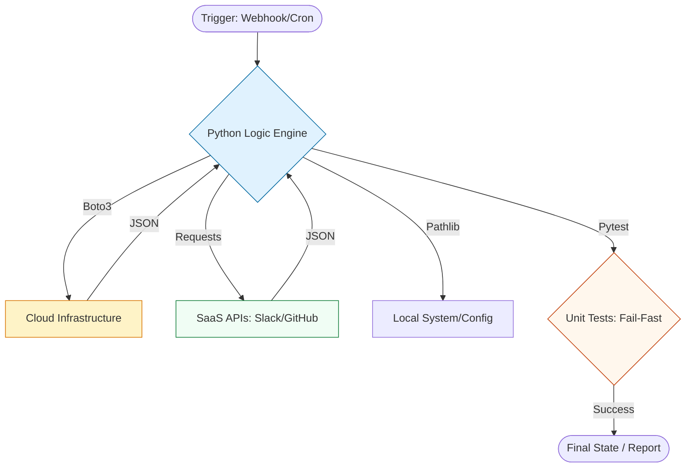

# 🐍 Python for DevOps: Industrial-Grade Automation

> **"If a shell script passes 100 lines, it's a candidate for Python. If it needs to talk to an API, manage state, or process complex data, Python is the requirement."**

Welcome to the **Python for DevOps** mastery track. In high-scale environments, Python is the "Bridge" between infrastructure and applications. This module transitions you from basic automation to building robust, SDK-driven engineering tools.

---

## 🏗️ The Python Automation Architecture

Python isn't just a language; it's a framework for **Reliable Operations**. We move from simple sequential commands to object-oriented, API-driven workflows.

---

## 🎭 Real-World DevOps Scenarios

### 🧱 Scenario 1: The "1,000-Line Bash" Nightmare
**The Incident:** An engineer maintained a massive bash script for tagging AWS resources. It used `aws` CLI calls and complex `sed/awk` to parse the output.
**The Failure:** When AWS updated its CLI output format, the regex broke. The script failed silently, leaving thousands of resources untagged. Fixing the regex took 3 days of manual log digging.
**The Pivot:** The team rewrote the tool in Python using **Boto3**. By using **Type Hinting** and **Pydantic** for validation, errors were caught at compile-time. The code became 70% shorter and 100% more reliable.

### 📡 Scenario 2: The "Silent API" Failure
**The Incident:** A deployment script hit a REST API to trigger a pipeline. It used `curl` and didn't check the HTTP status code.
**The Failure:** The API was down (503), but the script continued to the next step, assuming success. This caused a corrupted state where the code was merged but not deployed.
**The Fix:** Using the `requests` library with `response.raise_for_status()` and an **Exponential Backoff** retry adapter. The script now fails fast and notifies the team immediately.

---

## 🗺️ Module Roadmap

### 1. [🛠️ Core Environment](./01-Python-Environment-and-Basics/README.md)
Python setup, Virtual Environments (`venv`), and cross-platform path handling with `pathlib`.

### 2. [📊 Data & APIs](./03-Working-with-Data-JSON-YAML/README.md)
Mastering JSON/YAML serialization and professional API interaction with `requests`.

### 3. [☁️ Cloud Mastery (Boto3)](./05-Cloud-Automation-Boto3-Deep-Dive/README.md)
Deep-dive into the AWS SDK. Clients, Resources, Paginators, and Waiters for fleet-scale operations.

### 4. [🧪 Verification & Testing](./07-Testing-Automation-with-Pytest/README.md)
Fail-fast engineering using `pytest`, Mocking, and structured logging.

### 5. [📚 Keyword Encyclopedia](./REFERENCE/README.md)
The technical manual for every Python keyword, library component, and DevOps pattern.

---

## 🎙️ Staff Interview context (Python Engineering)

1.  **"What is the advantage of using a Boto3 Paginator over a standard list call?"**
    *   *Answer*: Standard calls have an upper limit (e.g., 1,000 items). Paginators automatically handle the `NextToken` logic, allowing you to process 100,000+ resources without manual looping.
2.  **"How do you handle secrets (like API keys) in a Python automation script?"**
    *   *Answer*: Never hardcode. Use Environment Variables (`os.getenv`), a `.env` file (excluded from Git), or pull them dynamically from a Secrets Manager (AWS/Vault) at runtime.
3.  **"Why use Type Hinting in DevOps scripts?"**
    *   *Answer*: Since DevOps code is often collaborative, type hints act as documentation. They allow tools like `mypy` to catch "NoneType" errors before the script hits production.
4.  **"Explain the 'Check-Act-Verify' pattern in Boto3."**
    *   *Answer*: Before performing an action (Act), check if it's needed (e.g., does the S3 bucket already exist?). After the action, verify the state change (e.g., use a Waiter to ensure the instance is running).
5.  **"What is the difference between `os.system()` and `subprocess.run()`?"**
    *   *Answer*: `os.system()` is legacy and provides no way to capture output. `subprocess.run()` is the modern standard, allowing you to capture stdout/stderr, handle timeouts, and raise exceptions on failure.

---

## 🧠 Knowledge Check

1.  **Which keyword is used to ensure a cleanup block runs even if an error occurs?**
    *   [ ] `except`
    *   [x] `finally`
    *   [ ] `catch`
2.  **To handle transient network errors in Requests, what should you use?**
    *   [ ] `while True` loop
    *   [x] HTTPAdapter with Retry logic
    *   [ ] `time.sleep()`
3.  **True or False: `boto3.resource` is generally better for high-performance, large-scale data processing than `boto3.client`.**
    *   [ ] True
    *   [x] False (Clients are lower-level and faster).
4.  **Which library is the modern standard for handling filesystem paths?**
    *   [ ] `os.path`
    *   [x] `pathlib`
    *   [ ] `sys`
5.  **What does `response.raise_for_status()` do?**
    *   [x] Raises an exception if the HTTP status code is 4xx or 5xx.
    *   [ ] Prints the status code to the console.
    *   [ ] Automatically retries the request.

---

[⬅️ Back to Scripting Automation](../README.md)
