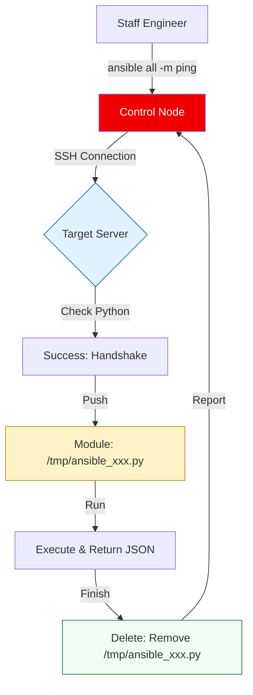

# 🏗️ Ansible Fundamentals: The Agentless Revolution

> **"Traditional configuration management requires you to manage the manager. Ansible requires you to manage the infrastructure."**

Welcome to the **Ansible Fundamentals** module. Here, we break down the shift from agent-based models (Chef/Puppet) to the "Push" model of execution. You will master the anatomy of the Control Node, the protocol of SSH/Python execution, and the power of Ad-Hoc commands.

---

## 🏗️ The Execution Architecture

The core of Ansible is the **SSH + Python Module** pipeline. It is temporary, secure, and self-cleaning.



---

## 🎭 Real-World DevOps Scenarios

### 🛡️ Scenario: The "Emergency Fleet Ping"
**The Incident:** A global service outage occurred. Engineers suspected a specific DNS update hadn't propagated to the entire fleet of 5,000 servers.
**The Failure:** Checking one-by-one with SSH would take 10+ hours. 
**The Fix:** An **Ad-Hoc** command. `ansible all -m shell -a "dig +short my-service.com"` allowed the engineer to see the DNS resolution for the entire fleet in 60 seconds.
**The Result:** The 12 servers with the stale IP were identified and fixed immediately.

---

## 💻 DevOps Logic Snippets: "The Ad-Hoc Toolkit"

Mastering Ad-Hoc commands is critical for real-time triage.

```bash
# 1. Connectivity Check (The 'Hello World' of Ansible)
ansible all -m ping

# 2. Package Management (Zero-State change if already installed)
ansible webservers -m apt -a "name=nginx state=latest" --become

# 3. System Status (Gather quick metrics)
ansible db -m shell -a "uptime && df -h"

# 4. Service Control (Restarting across the group)
ansible redis -m service -a "name=redis-server state=restarted" --become
```

---

## 🎙️ Interview Preparation (Fundamentals)

1.  **"Why does Ansible push modules to /tmp and then delete them?"**
    *   *Answer:* This ensures the target system stays clean. By executing a specialized Python script on the node and removing it immediately, Ansible avoids leaving "cruft" or scripts that could be exploited later.
2.  **"What is the difference between the `command` and `shell` modules?"**
    *   *Answer:* `command` is safer because it doesn't process through a shell, preventing shell injection vulnerabilities. `shell` allows you to use environment variables, pipes `|`, and redirections `>`.
3.  **"Can you use Ansible to manage local configurations?"**
    *   *Answer:* Yes, using the `connection: local` parameter or pointing the inventory to `localhost`. This is common for bootstrapping a developer workstation.
4.  **"How do you handle the first-time SSH fingerprint check in automated scripts?"**
    *   *Answer:* You can set `host_key_checking = False` in `ansible.cfg`, though this is a security risk. In production, you should pre-populate the `known_hosts` file.
5.  **"What are the minimal requirements for a target node to be 'Ansible-Ready'?"**
    *   *Answer:* An SSH server and a compatible Python version (usually Python 3.5+ for modern Ansible).

---

## 🧠 Knowledge Check

1.  **Which file is the default configuration for Ansible behavior?**
    *   [ ] `config.yaml`
    *   [x] `ansible.cfg`
    *   [ ] `.ansiblerc`
2.  **To run a command as root using the 'become' keyword via CLI, which flag do you add?**
    *   [ ] `-r`
    *   [ ] `--root`
    *   [x] `-b` (or `--become`)
3.  **True or False: Ansible can manage network switches and routers that don't have Python.**
    *   [x] True (Using specialized 'network' modules that run locally on the control node).
    *   [ ] False
4.  **Which ad-hoc module is best for checking if a file exists?**
    *   [ ] `ping`
    *   [x] `stat`
    *   [ ] `apt`
5.  **What is the 'Control Node'?**
    *   [x] The machine where Ansible is installed and runs commands.
    *   [ ] The master server in the cluster.
    *   [ ] A dedicated database for Ansible.

---

[⬅️ Back to Ansible Index](../README.md) | [Next: Inventory Management](../02-Inventory-Management/README.md) ➡️