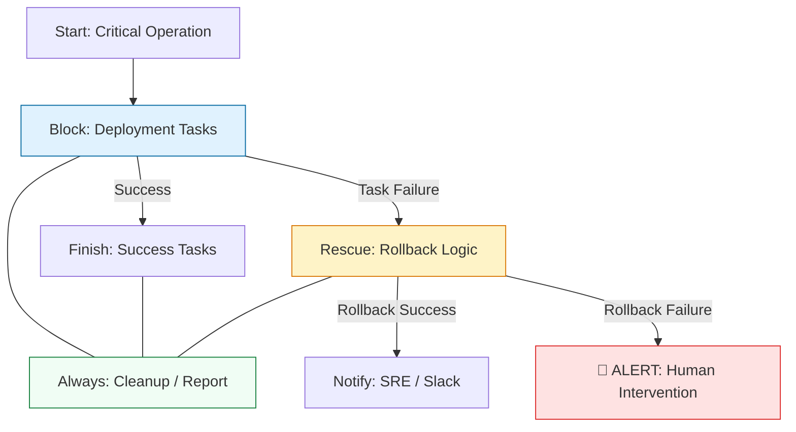

# 🛡️ Error Handling: Building Resilient Automation

> **"A junior engineer writes a script that works when everything is perfect. A staff engineer writes automation that works even when the network fails, the disk is full, and the services crash."**

Welcome to the **Resilient Engineering** module. In a production fleet of 1,000 servers, things *will* fail. Network timeouts, hardware errors, and corrupted repositories are facts of life. This module covers the **Defensive Orchestration** patterns required to build fail-safe playbooks that either complete successfully or perform an automatic rollback to a known-safe state.

---

## 🏗️ The Resiliency Lifecycle

Enterprise automation follows a **Try-Catch-Notify** pattern. We move from brittle linear execution to **Flow Controled Blocks**.



---

## 🎭 Real-World DevOps Scenarios

### 🛡️ Scenario: The "Split-Brain" Update
**The Incident:** A maintenance job was set to update the kernel across 500 nodes.
**The Failure:** Host #10 experienced a local repository corruption. Ansible stopped at Host #10 and aborted the entire job.
**The Catastrophe:** 9 nodes were updated, 491 were not. This created a "Split-Brain" state where the application behaved differently across the fleet, making it impossible for the Load Balancer to predict performance.
**The Fix:** Mandatory transition to **Failure Thresholds**. By using `any_errors_fatal: true` (to stop immediately on any error) or `max_fail_percentage: 10%`, the team regained control over fleet consistency.

---

## 💻 DevOps Logic Snippets: "The Fail-Safe Block"

Use blocks to group operations and catch errors precisely.

```yaml
# 🚀 Standard: Atomic Deployment with Rollback
- name: Database Core Update
  block:
    - name: 1. Backup existing data
      command: /usr/local/bin/db_backup.sh
      
    - name: 2. Attempt Schema Migration
      include_role:
        name: db_migration
      
  rescue:
    - name: 🚨 RECOVERY: Restore from Backup
      command: /usr/local/bin/db_restore.sh
      
    - name: Notify Team
      debug:
        msg: "Migration failed on {{ inventory_hostname }}. Rollback initiated."

  always:
    - name: 🧹 CLEANUP: Remove temp migration files
      file:
        path: /tmp/migration.sql
        state: absent
```

---

## 🎙️ Interview Preparation (Resiliency)

1.  **"What is the difference between `ignore_errors: true` and a `rescue` block?"**
    *   *Answer:* `ignore_errors` simply marks the task as failed but continues the play as if nothing happened. A `rescue` block allows you to run **corrective logic** (like a rollback) effectively turning a failure into a managed recovery.
2.  **"Explain the use case for `failed_when`."**
    *   *Answer:* It allows you to override Ansible's default failure logic. For example, a command might return exit code 1 because a user already exists—which we want to ignore. We can use `failed_when: "'already exists' not in result.stderr"`.
3.  **"What does `any_errors_fatal: true` do in a multi-node playbook?"**
    *   *Answer:* It implements a "Fail-Fast" strategy. If any host fails a task, the playbook instantly stops for every other host in the run. This prevents a bad configuration or bug from rolling out to the entire cluster.
4.  **"When should you use `changed_when: false`?"**
    *   *Answer:* Use it for "read-only" commands (like `ls` or `df`) that never actually modify the state of the target system. This keeps your Ansible output clean, showing purely informational tasks as "OK" rather than "Changed."
5.  **"How can you ensure a cleanup task runs even if the playbook crashes?"**
    *   *Answer:* By placing the cleanup task inside an **`always`** block. Regardless of whether the `block` succeeds or the `rescue` block runs, the tasks within `always` are guaranteed to execute.

---

## 🧠 Knowledge Check

1.  **Which block runs ONLY if the main 'block' fails?**
    *   [ ] `always`
    *   [x] `rescue`
    *   [ ] `fail`
2.  **True or False: `ignore_errors: yes` prevents handlers from running.**
    *   [ ] True
    *   [x] False (Handlers still run if their trigger task reported a change before failing).
3.  **Which keyword allows you to define a success threshold for a fleet?**
    *   [ ] `fail_limit`
    *   [x] `max_fail_percentage`
    *   [ ] `stop_at_count`
4.  **How do you check if a specific string is in a registered variable's output?**
    *   [x] `failed_when: "'Error' in my_var.stdout"`
    *   [ ] `if my_var == 'Error'`
    *   [ ] `when: my_var == 'Error'`
5.  **What is the 'Finally' equivalent in Ansible?**
    *   [ ] `end`
    *   [ ] `rescue`
    *   [x] `always`

---

[⬅️ Back to Ansible Index](../README.md) | [Next: Ansible Vault](../10-Ansible-Vault/README.md) ➡️