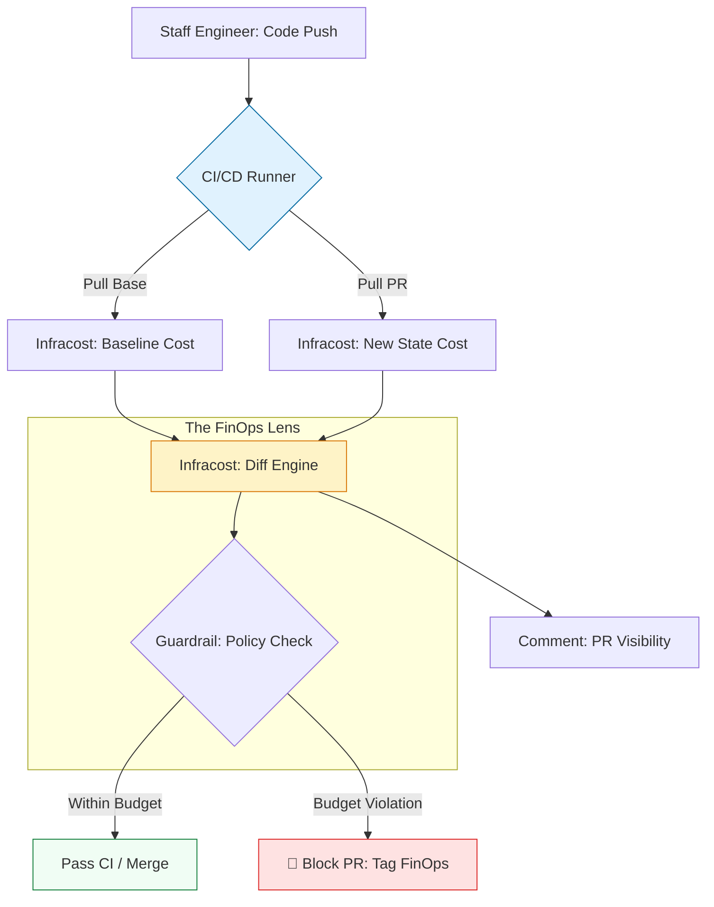

# 💰 Infracost Automation: The Architectural FinOps Portal

> **"Infrastructure is code, and code is money. In the cloud-native era, every line of HCL you merge is a financial transaction. Infracost turns your CI/CD pipeline into your most valuable financial analyst."**

Welcome to the **Infracost Automation** portal. Shift-Left FinOps is the practice of moving cost visibility from the monthly bill to the developer's Pull Request. By automating Infracost, you ensure that every architectural decision is informed by its financial impact, preventing "Sticker Shock" and eliminating waste *before* it is provisioned.

---

## 🏗️ The Cloud Economics Lifecycle

Building for the cloud requires **Economic State Awareness**. We move from "Monitoring Budgets" to **Preventative Cost Governance.**

---

## 🎭 Real-World DevOps Scenarios

### 🛡️ Scenario: The "Instance Type" Typo
**The Incident:** A developer was testing a high-performance DB migration and changed an instance type to `r5.24xlarge` ($18.48/hour).
**The Failure:** They accidentally committed the change to the production Terraform repository. If merged, this single typo would have cost the company **$13,300 per month.**
**The Fix:** Mandatory **Infracost PR Diffs**. The CI pipeline instantly detected a **+1,200% cost increase** and blocked the PR, tagging the SRE team for review. The typo was caught and corrected in 5 minutes.

---

## 🗺️ Module Roadmap

### 01. [CLI Automation & JSON Mastery](./01-CLI-Automation/README.md)
The bedrock of FinOps: Generating breakdowns and parsing JSON for custom logic.

### 02. [GitHub Actions Integration](./02-GitHub-Actions-Integration/README.md)
Automating visibility: The standardized PR Commenting and Diffing workflow.

### 03. [Policy-as-Code Guardrails](./03-Policy-as-Code-Guardrails/README.md)
Enforcing limits: Blocking expensive changes and requiring SRE sign-off via OPA/Rego.

### 04. [📚 Keyword Encyclopedia](./REFERENCE/README.md)
The technical manual for every Infracost component, from `diff` to `usage.yml`.

---

## 🎙️ Interview Preparation (FinOps)

1.  **"What is 'Shift-Left FinOps' and why is Infracost the primary tool for it?"**
    *   *Answer:* Shift-Left FinOps moves the cost conversation from the billing department (after the money is spent) to the engineering phase (before the code is merged). Infracost is the primary tool because it integrates directly with Terraform/HCL to provide cost estimates at the Pull Request level.
2.  **"How does Infracost estimate costs for resources it can't see, like network egress or S3 storage?"**
    *   *Answer:* It uses a `usage.yml` file. This allows engineers to provide "Assumed Usage" data (e.g., 500GB/mo) so that Infracost can include consumption-based costs in its total estimate.
3.  **"What is a 'Cost Guardrail' in a CI/CD pipeline?"**
    *   *Answer:* A guardrail is a policy-driven check that automatically fails a build or blocks a PR if the cost increase exceeds a specific threshold (e.g., more than $100/mo or more than 20% of the total budget).
4.  **"Why would an organization use the JSON output from Infracost instead of just looking at the console output?"**
    *   *Answer:* JSON is for **Automation**. It allows custom Python or Bash scripts to parse the costs, feed data into dashboards (like Grafana), or trigger sophisticated alerting logic that console output cannot support.
5.  **"How does Infracost handle different cloud provider regions?"**
    *   *Answer:* It automatically detects the region from your Terraform providers or variables and pulls the region-specific pricing from the Cloud Pricing API, ensuring that a server in `us-east-1` is priced differently than one in `ap-south-1`.

---

## 🧠 Knowledge Check

1.  **Which Infracost command is used to compare code changes between branches?**
    *   [ ] `infracost breakdown`
    *   [x] `infracost diff`
    *   [ ] `infracost check`
2.  **What does a `usage.yml` file help quantify?**
    *   [ ] Security vulnerabilities.
    *   [x] Consumption-based costs like data transfer and storage operations.
    *   [ ] The number of developers on a project.
3.  **True or False: Infracost requires your AWS/GCP Secret Keys to estimate cost.**
    *   [ ] True
    *   [x] False (It only needs the HCL code and its own API key).
4.  **Which output format is best for automated guardrail scripts?**
    *   [ ] HTML
    *   [ ] Table
    *   [x] JSON
5.  **What is the benefit of 'Shift-Left FinOps'?**
    *   [x] Identifying and preventing waste before it is provisioned.
    *   [ ] Paying cloud bills faster.
    *   [ ] Moving all engineers into the finance department.

---

[⬅️ Back to Infrastructure Automation](../README.md)
