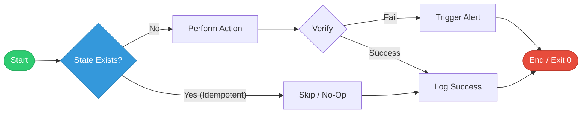

# 🤖 Automation & Scripting for DevOps

> **"If a computer can do it, a human shouldn't. Automation is the discipline of creating free time."**

## 📚 Overview

Automation is the multiplier that allows one DevOps engineer to manage thousands of servers. This module focuses on using scripting languages to eliminate toil and build intelligent workflows. We transition from simple command-line snippets to robust, production-grade automation suites.

## Core Concept: Idempotency & State
**[REFERENCE: Idempotency in Automation](./REFERENCE/Idempotency-in-Automation-Ref.md)**

High-quality automation is **deterministic**:
- **Desired vs Current**: Always calculate the difference before acting.
- **Self-Healing**: Scripts must be safely re-runnable without side effects.
- **Strict Mode**: Use `set -euo pipefail` in Bash to catch errors and unset variables instantly.

## Enterprise Governance: Secrets & Security
**[REFERENCE: Automation Security & Secrets](./REFERENCE/Automation-Security-Secrets-Ref.md)**

Automated tools often hold the "keys to the kingdom." We must protect them:
- **Zero Secrets in Code**: Never hardcode credentials. Use short-lived, dynamic secrets when possible.
- **Principle of Least Privilege**: Run automation with scoped service accounts, not root/admin.
- **Audit Trails**: Log exactly which identity performed which action to ensure accountability.
- **Dynamic Secrets**: Use tools like HashiCorp Vault to generate credentials on-the-fly.

## 🎓 Learning Objectives

By the end of this module, you will be able to:

1. **Script**: Write robust, production-grade Shell and Bash scripts with full error handling.
2. **Integrate**: Use Python and JQ to bridge the gap between legacy systems and modern cloud APIs.
3. **Scale**: Parallelize tasks to manage massive fleets and high-volume data processing.
4. **Protect**: Implement Idempotency and Secrets Management as core tenets of your automation logic.

## 🏗️ Module Roadmap

| # | Topic | Description | Key Tools |
| :--- | :--- | :--- | :--- |
| **01** | [**Intermediate Shell Scripting**](./01-Intermediate-Shell-Scripting/Intermediate%20Shell%20Scripting.md) | Foundation | Bash, Functions, Loops |
| **02** | [**Advanced Bash**](./02-Advanced-Bash-Automation/README.md) | Scaling Logic | jq, sed, awk, xargs |
| **03** | [**Python for DevOps**](./03-Python-for-DevOps/README.md) | API & SDKs | Boto3, Requests, venv |
| **04** | [**Best Practices**](./04-Automation-Best-Practices/README.md) | Standards | Idempotency, Secrets |
| **05** | [**Ansible Mastery**](./05-Ansible/README.md) | Config Management | Playbooks, Roles, Vault |

---

## 🏗️ Premium Features

- **[100+ Total Quiz Questions](./06-Interview-Questions-and-Quizzes/)**: Interactive mastery of Shell, Bash, and Python.
- **[24+ High-Stakes Interview Questions](./06-Interview-Questions-and-Quizzes/)**: Targeted prep for SRE and Platform roles.
- **[12+ Real-Life "War Stories"](./07-Real-Life-Scenarios/)**: Lessons learned from production-scale automation failures and successes.

---

## 🏗️ The Automation-First Mindset

If you have to do a task more than twice, automate it.

- **Toil Reduction**: Freeing up time from repetitive manual tasks.
- **Consistency**: Code doesn't make typos or forget steps.
- **Speed**: Automations run at CPU speed, not human speed.

---

## ✅ Knowledge Check

- [x] Understand exit codes and "Strict Mode" (`set -euo pipefail`)
- [x] Implement Idempotency in both Bash and Python
- [x] Parse complex API data using `jq` and `requests`
- [x] Automate AWS resource lifecycles using Boto3
- [x] Design professional, flag-based CLI tools with `getopts`

---

*Automation is the force multiplier of the DevOps engineer. Script once, deploy everywhere.*