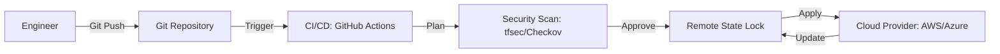

# Infrastructure as Code (IaC) Architecture Reference

**Doc Version:** 1.0.0
**Role:** Cloud Architect
**Scope:** State Management, Provisioning vs Configuration, and Modularity

---

## 1. Provisioning vs. Configuration

DevOps engineers often confuse these two layers.

| Aspect | Provisioning (IaC) | Configuration Management (CM) |
| :--- | :--- | :--- |
| **Purpose** | Creating the infrastructure (VPC, Subnet, VMs). | Preparing the software inside the VM (Packages, Config files). |
| **Tools** | Terraform, Pulumi, CloudFormation. | Ansible, Chef, Puppet, SaltStack. |
| **Lifecycle** | "Outside-In" management. | "Inside-Out" management. |
| **Philosophy** | Declarative (Desired state). | Often Procedural (Steps to take). |

---

## 2. The Infrastructure State

State is the "Source of Truth" for your infrastructure.

- **Local State**: State stored on the engineer's laptop (`terraform.tfstate`). **WARNING**: Never use in production. Leads to "State Locking" conflicts.
- **Remote State**: State stored in a shared, versioned backend (AWS S3, Azure Blob, Terraform Cloud).
- **State Locking**: Mandatory to prevent two people from applying changes simultaneously. Usually handled by DynamoDB (for S3) or natively by the backend.

---

## 3. Modularity & Reusability

Encapsulate infrastructure into reusable "bricks."

### The "Module" Pattern
Instead of writing 500 lines of VPC code, use a module:
```hcl
module "vpc" {
  source = "./modules/vpc"
  region = "us-east-1"
  cidr_block = "10.0.0.0/16"
}
```

### Benefits
- **Dry (Don't Repeat Yourself)**: Define once, use in Dev, Staging, and Prod.
- **Standardization**: Enforce company security tags and naming conventions.

---

## 4. Avoiding Configuration Drift

**Config Drift** occurs when someone manually changes a setting in the portal/CLI without updating the code.

### Remediation
1. **Periodic Scans**: `terraform plan` shows the delta.
2. **Auto-Remediation**: Use tools like `driftctl` or scheduled CI jobs that re-apply the IaC.
3. **IAM Controls**: Deny manual "Write" access in the portal. Force all changes through Git.

---

## 5. Visualizing the IaC Pipeline



> **Enterprise Pattern**: Use **Workspace Isolation**. Maintain separate state files for every environment (Dev, Stage, Prod) to ensure a mistake in Dev cannot accidentally delete production resources.
