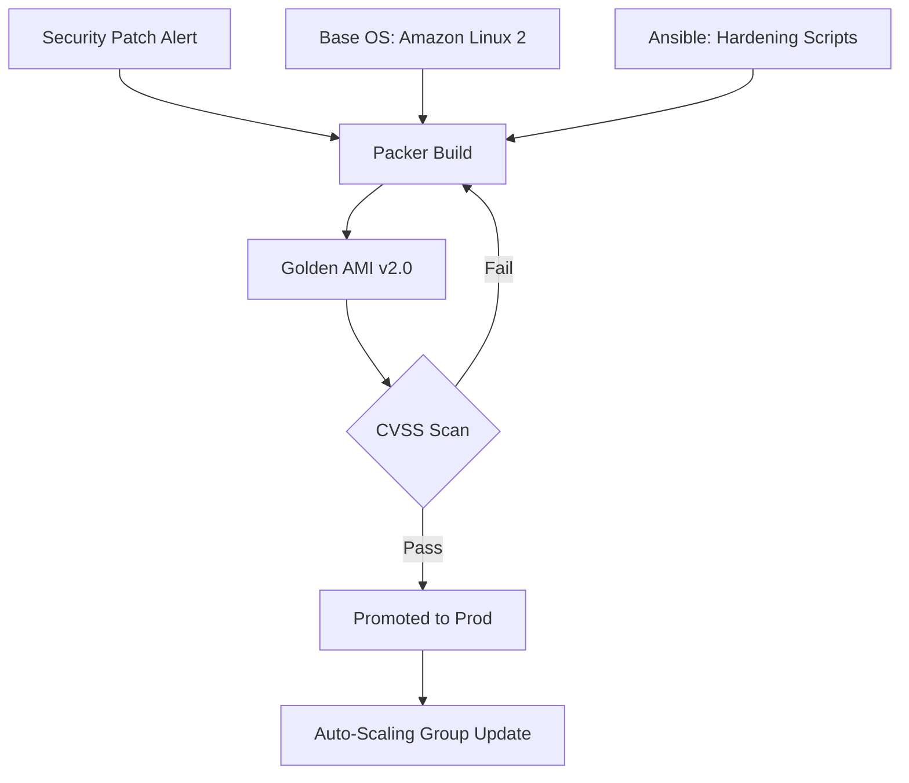

# Immutable Infrastructure & Baking Governance

**Doc Version:** 1.0.0
**Role:** Platform Engineer
**Scope:** Image Management, Baking vs Frying, and Reproducibility

---

## 1. Immutable vs. Mutable Infrastructure

### Mutable (The Snowflake Server)
- **Action**: Update servers in place (e.g., `ssh server; apt-get upgrade`).
- **Risk**: Over time, no two servers are the same. "It works on Server 1 but fails on Server 2."
- **Failure**: Hard to roll back. If an update breaks the kernel, you might lose the server.

### Immutable (The Baked Image)
- **Action**: Never update a running server. Destroy the old server and replace it with a new one from a fresh image.
- **Benefit**: 100% confidence that the server is in a known state.
- **Rollback**: Simply re-deploy the previous image version.

---

## 2. "Baking" vs. "Frying"

### Baking (Pre-Initialization)
- **Method**: Use **Packer** to install all packages, dependencies, and code into an AMI/Image at *build time*.
- **Boot Time**: Very fast (seconds).
- **Tool**: Packer + Ansible.

### Frying (Runtime Initialization)
- **Method**: Use **cloud-init** or Startup Scripts to install dependencies at *boot time*.
- **Boot Time**: Slow (minutes).
- **Risk**: If the repo (apt-get/npm) is down during boot, the server fails.

> **Enterprise Standard**: "Bake" everything you can. "Fry" only the machine-specific configurations (hostnames, IP assignments, environment tags).

---

## 3. The Image Lifecycle

1.  **Code Change**: Application code or security patch is committed.
2.  **Bake**: CI triggers Packer to create a new AMI.
3.  **Scan**: The AMI is scanned for vulnerabilities (e.g., AWS Inspector).
4.  **Promote**: The AMI is tagged for Production.
5.  **Cycle**: The Auto-Scaling Group (ASG) performs a Rolling Update to replace instances with the new AMI.

---

## 4. Visualizing the Golden Image Pipeline

---

## 5. Drift and Compliance

In an immutable world, any server running for more than 30 days is a security risk.

- **Mandatory Re-Cycling**: Enforce a policy that all EC2 instances must be replaced every 30 days to ensure they contain the latest security patches.
- **Configuration Verification**: Use tools like `InSpec` or `Goss` to verify the image meets security standards before it is promoted.

> **Enterprise Pattern**: Use **Shared Image Galleries**. Maintain a single "Base Hardened Image" that all teams must inherit from.
