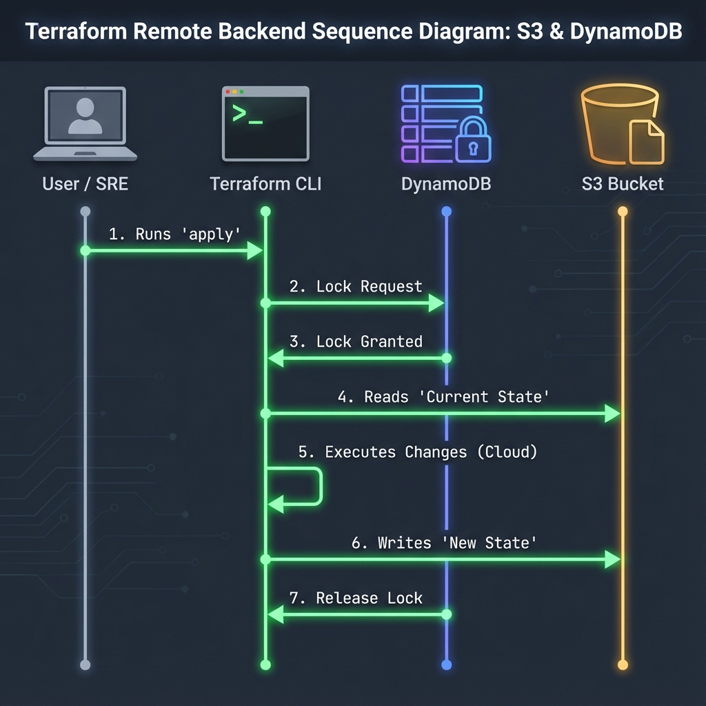

# The Foundation of Scale
A **Backend** in Terraform determines where the state file is stored and where operations are performed. <font color="#ffc000">Unlike the default local backend, remote backends allow teams to collaborate safely by storing state in the cloud</font>.

---
## 🛠️ Architecture Visualization (<font color="#ffc000">S3 + DynamoDB</font>)
For AWS, state storage and locking are handled by two different services to ensure high availability and data integrity.


---
## 📚 Types of Backends
Terraform supports two primary categories of backends:
### 1. Standard Backends
*   **Function**: Store the state file remotely.
*   **Execution**: Operations (`plan`, `apply`) run on your **local machine** (or CI runner).
*   **Examples**: `s3`, `gcs`, `azurerm`, `consul`, `http`.
*   **Locking**: Varies. S3 requires DynamoDB. GCS and Azure have native locking.
### 2. Enhanced Backends
*   **Function**: Store state remotely AND execute operations remotely.
*   **Execution**: Operations run on the **remote system's compute**.
*   **Examples**: **Terraform Cloud** (<font color="#ffc000">TFC</font>), **Terraform Enterprise**.
*   **Benefit**: No need to configure local credentials; consistent execution environment.
---
## ☁️ Common Remote Backends Comparison

| Backend | Cloud | Locking Support | Storage | Notes |
| :--- | :--- | :--- | :--- | :--- |
| **s3** | AWS | ✅ via DynamoDB | S3 Bucket | Industry standard. Requires 2 resources. |
| **azurerm** | Azure | ✅ Native (Lease) | Blob Container | Simplest for Azure-native shops. |
| **gcs** | Google | ✅ Native | GCS Bucket | Great for multi-cloud due to simple auth. |
| **remote** | TFC | ✅ Native | TFC Cloud | Managed service, has free tier. |
| **local** | None | ❌ None | Local Disk | Default. Not for teams. |

> **Pro Tip**: You can use an AWS backend to manage Azure resources, but it introduces a "Cross-Cloud Dependency" (Scenario 2). Best practice is to keep the state in the same cloud as the resources it manages.

---
## ⚙️ Advanced Configuration Patterns

### 1. Partial Configuration
Hardcoding sensitive details (like Access Keys) or environment-specific paths in your `.tf` file is bad practice. **Partial Configuration** allows you to omit certain fields in the `backend` block and provide them at `init` time.
**In `main.tf`:**
```hcl
terraform {
  backend "s3" {
    # Bucket and Key are OMITTED here
    region = "us-east-1"
  }
}
```
**In CLI:**
```bash
terraform init \
  -backend-config="bucket=my-corp-state" \
  -backend-config="key=prod/app.tfstate"
```
*Note: If values contain spaces, wrap them in quotes.*
### 2. State Locking & Force Unlock
Locking prevents two team members from running `apply` at the same time.
*   **Happy Path**: Terraform acquires lock -> Applies -> Releases lock.
*   **Failure Path**: Process crashes -> Lock stays (Stuck Lock).
**How to Fix a Stuck Lock:**
1.  Confirm NO ONE is running Terraform.
2.  Get the `LockID` from the error message.
3.  Run: `terraform force-unlock <LockID>`
### 3. Re-initialization
If you change your backend configuration, you must re-run `init`.
*   **Standard**: `terraform init` (Asks to migrate state).
*   **Refresh**: `terraform init -reconfigure` (Discards old config mapping, starts fresh).

---
## 🛡️ Security & Reliability Features
*   **Encryption at Rest**: S3 backends support `encrypt = true` (Servers-side encryption AES-256).
*   **Encryption in Transit**: All standard cloud backends use <font color="#ffc000">HTTPS TLS 1.2+ for remote API </font>calls.
*   **Versioning**: Enable S3 Bucket Versioning to recover from accidental state deletion or corruption.
*   **MFA Delete**: Enforce Multi-Factor Authentication to permanently delete a state file object.
---
## � Best Practices for Remote Backends
1.  **State Isolation**: Use separate state files for each environment (<font color="#ffc000">dev</font>, <font color="#d83931">stage</font>, <font color="#548dd4">prod</font>) and each major component (network, app, db). This reduces the "<font color="#ff0000">Blast Radius</font>" if a state file gets corrupted.
2.  **Least Privilege Access**: Restrict write access to the state bucket. Only the CI/CD pipeline role should have `s3:PutObject`. Developers should ideally only have `s3:GetObject` (Read-only) or no access at all (Plan-only).
3.  **Enable Auditing**: Turn on S3 Server Access Logging or CloudTrail Data Events for the state bucket. This provides a forensic trail of "Who changed what and when" if drift occurs.
4.  **Use DynamoDB for Locking**: Never skip locking for S3 backends. It is the only thing preventing race conditions in a team environment.
5.  **Backup State**: While Versioning is great, consider <font color="#ffc000">Cross-Region Replication</font> (<font color="#ffc000">CRR</font>) for disaster recovery if your primary region goes down.
## �🏗️ Real-Life Scenarios

### Scenario 1: The "Manual Bucket Removal" Disaster
**Problem**: An over-eager engineer cleaned up what they thought was an "unused" S3 bucket named `tf-state-123`.
**Crisis**: This bucket actually contained the state file for the company's entire production network.
**Outcome**: Terraform could no longer plan or apply. The link between code and reality was destroyed.
**Solution**: Enable **S3 Object Versioning** and **MFA Delete**. These features ensure that even if a file is deleted, it can be recovered instantly from the S3 console.
**Result**: The team recovered the state file in 10 minutes from the S3 version history, avoiding a manual "import-everything" nightmare.

### Scenario 2: The "Cross-Cloud" Reliability Hit
**Problem**: A company with a "Multi-Cloud" strategy used an AWS S3 backend for their Azure infrastructure.
**Crisis**: AWS had a regional outage in `us-east-1` (where the bucket lived). 
**Outcome**: Even though Azure was 100% fine, the team could NOT scale or update their Azure clusters because Terraform couldn't read the state from AWS.
**Solution**: Store state in the **Same Cloud** as the resources (use `azurerm` backend for Azure, `gcs` for Google, etc.) to minimize cross-provider failure dependencies.
**Result**: The team migrated to Azure Blob storage for state, ensuring their management layer shared the same fate as their infrastructure.
### Scenario 3: The "Dynamic Workspace" Scaling Issue
**Problem**: A company was managing 100 identical customer environments. They tried to hardcode 100 different backend blocks.
**Crisis**: The HCL became unmaintainable, and developers frequently made copy-paste errors, creating resources in the wrong customer's account.
**Outcome**: Data leak risk and high operational overhead.
**Solution**: Use **Partial Configuration**. Define one generic backend block with an empty `bucket` and `key`, and pass the customer-specific info during `terraform init -backend-config="customer-pro.tfvars"`.
**Result**: One clean code base now supports 100+ customers with 100% isolation.

---

## ❓ Interview Questions
1.  **Why can't you use 'Variables' or 'Locals' inside a `backend` block?**
    <details>
    <summary>Answer</summary>
    Terraform needs to initialize the backend before it can load variables or evaluate locals (chicken-and-egg problem). To solve this, you use "Partial Configuration" by passing settings via the CLI during `terraform init`.
    </details>

2.  **Explain the difference between 'Standard' backends and 'Enhanced' backends.**
    <details>
    <summary>Answer</summary>

    **Standard** backends (like S3, GCS, AzureRM) only store state. Tasks like `plan` and `apply` run on your local machine. **Enhanced** backends (like Terraform Cloud) store state AND can execute the Terraform logic on their own remote infrastructure.
    </details>

3.  **What is the 'DynamoDB Lock' schema?**
    <details>
    <summary>Answer</summary>

    When using S3, you must use a DynamoDB table with a Partition Key named `LockID` (string). This specific schema allows Terraform to write a unique ID representing the currently running process to the table.
    </details>

4.  **How do you handle a 'Stuck Lock' where the process died but the lock remains?**
    <details>
    <summary>Answer</summary>

    You should first verify that no one is actually running Terraform. Then use `terraform force-unlock <LOCK_ID>`. You can find the Lock ID in the error message when you try to run a plan.
    </details>

5.  **Explain 'State Storage' vs. 'Local Backend' from a security perspective.**
    <details>
    <summary>Answer</summary>

    Local state is stored on disk and is often unencrypted and available to anyone with OS access. Remote backends support encryption-at-rest (AES-256) and granular IAM access controls, ensuring only specific users or CI/CD roles can even "see" the file.
    </details>

6.  **What happens if a developer runs `terraform init` locally on a project that already has a remote state, but they use a different backend key?**
    <details>
    <summary>Answer</summary>

    Terraform will see this as a "New" state. If they try to apply, it will attempt to recreate all resources because it doesn't know they exist in the "Real" remote state. This is why consistent backend configuration is critical.
    </details>      

---

## 🧠 Comprehensive Quiz (25 Questions)
<b>1. Which AWS service is the primary storage for 'Standard' backends?</b>
- A) EC2
- B) S3
- C) RDS
- D) EFS
<details>
<summary>Show Answer</summary>
Answer: B
</details>

<b>2. True/False: S3 backends support state locking natively without extra services.</b>
- A) False (Requires DynamoDB)
- B) True
- C) True (But only in us-east-1)
- D) False (Requires Redis)
<details>
<summary>Show Answer</summary>
Answer: A
</details>

<b>3. The standard partition key name for a DynamoDB lock table is:</b>
- A) LockName
- B) LockID
- C) StateLock
- D) TerraformLock
<details>
<summary>Show Answer</summary>
Answer: B
</details>

<b>4. Which Azure service is used for the 'azurerm' backend?</b>
- A) Blob Storage
- B) Azure SQL
- C) Azure Tables
- D) CosmosDB
<details>
<summary>Show Answer</summary>
Answer: A
</details>

<b>5. 'GCS' stands for:</b>
- A) Git Control System
- B) Google Cloud Storage
- C) Global Cloud Service
- D) General Compute Service
<details>
<summary>Show Answer</summary>
Answer: B
</details>

<b>6. To provide backend settings via the command line, you use:</b>
- A) -backend-settings
- B) -backend-config
- C) -var
- D) -config
<details>
<summary>Show Answer</summary>
Answer: B
</details>

<b>7. True/False: If a backend is 'Enhanced', it can run 'apply' on a remote server.</b>
- A) True (e.g., Terraform Cloud)
- B) False
- C) True (But only for AWS)
- D) False (Terraform is always local)
<details>
<summary>Show Answer</summary>
Answer: A
</details>

<b>8. Which attribute in an S3 backend enforces server-side encryption?</b>
- A) secure
- B) encrypt
- C) ssl
- D) kms
<details>
<summary>Show Answer</summary>
Answer: B
</details>

<b>9. What command updates your local environment to use a new backend?</b>
- A) terraform apply
- B) terraform init
- C) terraform refresh
- D) terraform update
<details>
<summary>Show Answer</summary>
Answer: B
</details>

<b>10. 'Partial Configuration' allows you to avoid:</b>
- A) Writing any HCL
- B) Hardcoding sensitive credentials or environment-specific paths in the `.tf` file
- C) Using S3
- D) Using State
<details>
<summary>Show Answer</summary>
Answer: B
</details>

<b>11. Which backend type is used by default if no block is specified?</b>
- A) s3
- B) local
- C) remote
- D) none
<details>
<summary>Show Answer</summary>
Answer: B
</details>

<b>12. Azure and GCS backends support locking _____ .</b>
- A) With an external database
- B) Natively (without an extra resource)
- C) They do not support locking
- D) Only on paid plans
<details>
<summary>Show Answer</summary>
Answer: B
</details>

<b>13. A 'Lock ID' is found in which location during a failure?</b>
- A) In the error message output
- B) In the state file
- C) In the IAM policy
- D) In the S3 bucket logs
<details>
<summary>Show Answer</summary>
Answer: A
</details>

<b>14. True/False: You can use AWS as a backend for managing Google Cloud resources.</b>
- A) True (Backend is independent of the provider)
- B) False (You must use GCS for Google)
- C) True (But only with special plugins)
- D) False (Terraform prevents this)
<details>
<summary>Show Answer</summary>
Answer: A
</details>

<b>15. Which character is used to escape values in -backend-config if they contain spaces?</b>
- A) '
- B) " (Quotes)
- C) \
- D) &
<details>
<summary>Show Answer</summary>
Answer: B
</details>

<b>16. 'MFA Delete' on S3 helps prevent:</b>
- A) Accidental or malicious permanent deletion of the state file
- B) Unauthorized reads
- C) Concurrent writes
- D) High costs
<details>
<summary>Show Answer</summary>
Answer: A
</details>

<b>17. What is the 'prefix' attribute in a GCS backend?</b>
- A) The project ID
- B) A directory-like folder name where the state will be stored
- C) The API key
- D) The file extension
<details>
<summary>Show Answer</summary>
Answer: B
</details>

<b>18. True/False: `terraform init` will automatically create the S3 bucket if it's missing.</b>
- A) False (You must create the bucket first)
- B) True
- C) True (If using -auto-create)
- D) False (Unless you use Terraform Cloud)
<details>
<summary>Show Answer</summary>
Answer: A
</details>

<b>19. Which command allows switching to a new backend without migrating the old state?</b>
- A) terraform init -reconfigure
- B) terraform init -migrate-state
- C) terraform state push
- D) terraform force-unlock
<details>
<summary>Show Answer</summary>
Answer: A
</details>

<b>20. 'State Versioning' should be enabled on:</b>
- A) The local machine
- B) The Remote Backend Storage (e.g., S3 Bucket)
- C) The Terraform CLI
- D) None of the above
<details>
<summary>Show Answer</summary>
Answer: B
</details>

<b>21. `terraform force-unlock` should be used as a _____ .</b>
- A) Daily routine
- B) Last resort when a lock is definitely stale
- C) Performance optimization
- D) Security measure
<details>
<summary>Show Answer</summary>
Answer: B
</details>

<b>22. Which backend is most suitable for a one-person project while learning?</b>
- A) Etcd
- B) Local
- C) Consul
- D) Kubernetes
<details>
<summary>Show Answer</summary>
Answer: B
</details>

<b>23. 'HTTPS' is used for state transfers to ensure encryption in _____ .</b>
- A) Rest
- B) Transit
- C) Code
- D) Database
<details>
<summary>Show Answer</summary>
Answer: B
</details>

<b>24. A well-organized backend is the '_____ Gate' for team safety.</b>
- A) Golden
- B) Iron
- C) Safety
- D) Logic
<details>
<summary>Show Answer</summary>
Answer: C
</details>

<b>25. Without a backend, teams will _____ each other's work.</b>
- A) Improve
- B) Overwrite
- C) Backup
- D) Encrypt
<details>
<summary>Show Answer</summary>
Answer: B
</details>
