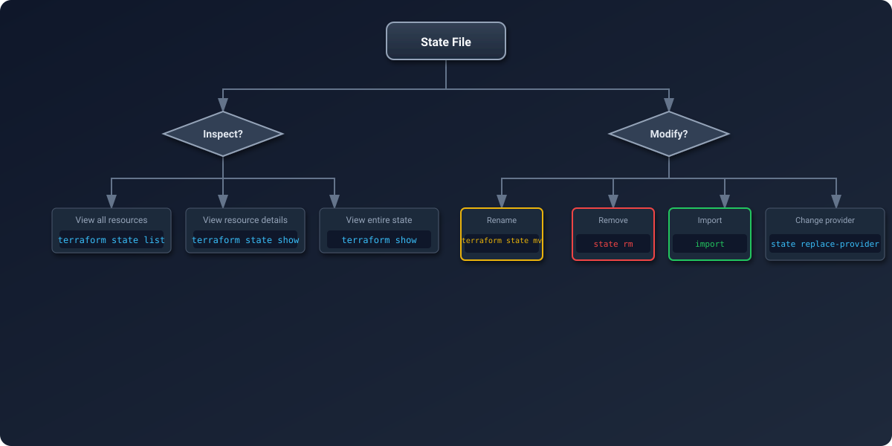

# Mastering the CLI
Mastering the CLI commands used to inspect and manipulate your state file is essential for effective infrastructure management. These commands allow you to refactor code, import legacy resources, and recover from management errors without affecting the actual cloud infrastructure.

---
## 🏗️ State Operations Workflow

  

---
## 🛡️ Security & Reliability Features
1.  **Safety Mechanism**: Most `state` commands (like `mv`) automatically back up the state file to a file named `terraform.tfstate.backup` (for local) or create a new version (for S3 backends) before making changes.
2.  **Validation**: Commands like `state mv` verify that the target address is valid syntax and doesn't conflict with an existing object before executing.
3.  **Atomic Operations**: State operations in remote backends use locking to ensure that a "Move" operation is atomic—you won't end up with a resource that is half-moved.
4.  **No-Op on Cloud**: Crucially, `terraform state` commands **NEVER** modify real-world resources (e.g., they won't termination an EC2 instance). They only change the JSON mapping.
---
## � Best Practices
1.  **Backup First**: Before running *any* complex state manipulation, run **terraform state pull > backup_manual.tfstate**. This gives you a local "Undo" button even if S3 Versioning fails.
2.  **Dry Runs**: Use **terraform state list** or **grep** to verify exactly which resources you are targeting before running **rm** or **mv**.
3.  **Refactor with MV**: Never rename a resource in your code and then just run **apply** (which would destroy/create). Always pair a code rename with a terraform state mv command.
4.  **One Change at a Time**: Do not mix **import** operations with **mv** operations in the same PR. Keep state refactoring separate from resource creation.
5.  **Use 'terraform show'**: When debugging **plan** errors, **terraform show** is often clearer than reading the raw JSON or the console output.
---
## �🏗️ Real-Life Scenarios
### Scenario 1: The "Rename-Destroy" Panic
**Problem**: An engineer renamed a core database resource in the HCL from `resource "aws_db_instance" "master"` to `resource "aws_db_instance" "production"`. 
**Crisis**: When they ran `terraform plan`, Terraform announced it would **DESTROY** the old database and **CREATE** a new one, causing 4 hours of downtime and data loss.
**Solution**: Use `terraform state mv`. By running `terraform state mv aws_db_instance.master aws_db_instance.production`, Terraform simply renames the record in its "Memory" (the state file).
**Result**: The next `terraform plan` showed "No changes," and the production database remained untouched.

### Scenario 2: The "Shadow IT" Adoption
**Problem**: A rogue team created 10 EC2 instances and 5 S3 buckets manually via the Amazon Console. Management now wants them brought under strict Terraform control.
**Crisis**: Writing the HCL code from scratch and running `apply` would fail because the resources already exist in AWS.
**Solution**: Use **Declarative Import (Terraform 1.5+)**. The team wrote an `import {}` block for each resource and used `terraform plan -generate-config-out=generated.tf`.
**Result**: Terraform automatically generated the HCL code and adopted the resources into the state file in a single, safe operation.

### Scenario 3: The "Split-Brain" State Migration
**Problem**: A monolithic Terraform project became too slow and risky (High Blast Radius). The team decided to move the "Network" resources to a separate state file.
**Crisis**: They needed to remove resources from the "App" state without actually deleting the VPCs in AWS.
**Outcome**: Using `terraform destroy` was impossible.
**Solution**: Use `terraform state rm`. They ran `terraform state rm module.vpc` in the old project, then used `terraform import` in the new "Network" project.
**Result**: The resources were successfully "moved" between state files with zero downtime.

---

## ❓ Interview Questions

1.  **What is the difference between `terraform state rm` and `terraform destroy`?**
    

    
Answer

    `terraform state rm` only removes the resource from the state file (management); the resource continues to exist in the cloud. `terraform destroy` deletes the resource from the cloud entirely.
    

2.  **When would you use `terraform state mv`?**
    

    
Answer

    When you rename a resource in your HCL code or move it into/out of a module. It ensures that Terraform maps the existing cloud resource to the new code address instead of trying to delete and recreate it.
    

3.  **How do you fix a 'Malformed' or 'Corrupted' state file?**
    

    
Answer

    1. Stop all operations.
    2. Use `terraform state pull > backup.json`.
    3. Attempt to fix the JSON manually (or restore a versioned backup from S3).
    4. Use `terraform state push` to upload the corrected file.
    

4.  **How does 'Declarative Import' (Terraform 1.5+) differ from the old CLI import?**
    

    
Answer

    The old CLI import was an imperitave command that required you to write HCL first. The new `import` block is part of your code, which allows for `-generate-config-out`. This makes the import process version-controlled and allows Terraform to write most of the HCL for you.
    

5.  **You want to see the specific IP address of an instance stored in state. Which command do you use?**
    

    
Answer

    `terraform state show resource_address. This displays every attribute Terraform currently knows about that specific resource.
    

6.  **Explain the danger of `terraform state push`.**
    

    
Answer

    It is an overwrite operation. If you push an incorrect or older version of the state file over the current one, you might lose track of newly created resources or cause Terraform to attempt to delete real infrastructure during the next run.
    

---
## 🧠 Comprehensive Quiz (25 Questions)

<b>1. Which command lists all resource addresses tracked in the state?</b>
- A) terraform list
- B) terraform state list
- C) terraform show list
- D) terraform inventory

Show Answer

Answer: B

<b>2. True/False: 'terraform state rm' triggers an API call to delete cloud resources.</b>
- A) True (It destroys the resource)
- B) False (It only updates the JSON file)
- C) True (If using -destroy flag)
- D) False (Unless the resource is tainted)

Show Answer

Answer: B

<b>3. Which command is used to rename a resource in the state file?</b>
- A) terraform rename
- B) terraform state mv
- C) terraform state rename
- D) terraform move

Show Answer

Answer: B

<b>4. To adopt an existing AWS S3 bucket into Terraform, you use:</b>
- A) terraform adopt
- B) terraform import
- C) terraform claim
- D) terraform state add

Show Answer

Answer: B

<b>5. Which flag generates HCL code from an import block (v1.5+)?</b>
- A) -make-hcl
- B) -generate-config-out
- C) -output-tf
- D) -create-code

Show Answer

Answer: B

<b>6. 'terraform show' displays:</b>
- A) Only the resource IDs
- B) The human-readable snapshot of the state file
- C) The cloud provider status
- D) The version of Terraform

Show Answer

Answer: B

<b>7. True/False: 'terraform state rm' is a safe way to 'forget' a resource.</b>
- A) True
- B) False (It leaves the resource unmanaged/orphaned in the cloud)
- C) True (It deletes it safely)
- D) False (It corrupts the state)

Show Answer

Answer: A (It is safe for the *state*, but users must know the cloud resource remains)

<b>8. Which command downloads remote state to your terminal?</b>
- A) terraform state download
- B) terraform state pull
- C) terraform get
- D) terraform fetch

Show Answer

Answer: B

<b>9. Why do you use 'quotes' in `terraform state rm 'module.vpc[0]'`?</b>
- A) Better readability
- B) To prevent the shell from interpreting brackets [] as glob patterns
- C) It is required by HCL
- D) To make it a string

Show Answer

Answer: B

<b>10. What happens if you run 'mv' without updating your HCL code?</b>
- A) Terraform updates your code automatically
- B) Terraform sees a discrepancy: state has new name, code has old name (or vice versa)
- C) Use of 'mv' is forbidden without code changes
- D) The resource is deleted

Show Answer

Answer: B (You will get a plan that tries to delete/create unless they match)

<b>11. Which command shows attributes like 'private_ip' for a single resource?</b>
- A) terraform state list
- B) terraform state show address
- C) terraform output
- D) terraform plan

Show Answer

Answer: B

<b>12. True/False: 'terraform import' modifies your .tf files automatically (v1.4 and below).</b>
- A) False (You had to write HCL manually)
- B) True
- C) True (If using -auto)
- D) False (It creates a new file)

Show Answer

Answer: A

<b>13. 'state push' should be preceded by:</b>
- A) terraform destroy
- B) terraform state pull (to ensure you have the latest version to edit)
- C) terraform init
- D) terraform apply

Show Answer

Answer: B

<b>14. Which command helps migrate from one provider to another?</b>
- A) terraform provider-switch
- B) terraform state replace-provider
- C) terraform import
- D) terraform init -upgrade

Show Answer

Answer: B

<b>15. 'State Operations' are performed at which 'Danger Level'?</b>
- A) Low
- B) High (Direct manipulation of the brain)
- C) None
- D) Medium

Show Answer

Answer: B

<b>16. True/False: You can use regex in 'terraform state list'.</b>
- A) False (It filters by substring/prefix usually)
- B) True
- C) True (With -regex flag)
- D) False (unless on Linux)

Show Answer

Answer: A (It generally accepts an address or id; standard list does not do regex filtering natively without external tools like grep)

<b>17. What is the 'id' in a `terraform import` command?</b>
- A) The Terraform resource name
- B) The Cloud Provider's unique identifier (e.g., i-012345678)
- C) The serial number
- D) The line number

Show Answer

Answer: B

<b>18. 'terraform state mv' across different modules is:</b>
- A) Impossible
- B) Possible and common for refactoring
- C) Dangerous
- D) Automatic

Show Answer

Answer: B

<b>19. Which command is used to verify that no drift exists?</b>
- A) terraform state list
- B) terraform plan (or apply -refresh-only)
- C) terraform init
- D) terraform show

Show Answer

Answer: B

<b>20. True/False: 'terraform state rm' can remove several resources at once.</b>
- A) True (Lists of args are accepted)
- B) False
- C) True (But only in TFC)
- D) False (One at a time)

Show Answer

Answer: A

<b>21. If you import a resource, you must eventually add its _____ to your code.</b>
- A) ID
- B) Configuration (HCL resource block)
- C) Output
- D) Variable

Show Answer

Answer: B

<b>22. Which command shows what Terraform intends to do without actually doing it?</b>
- A) terraform state dry-run
- B) terraform plan
- C) terraform test
- D) terraform predict

Show Answer

Answer: B

<b>23. 'JSON' is the format used when doing a:</b>
- A) terraform init
- B) terraform state pull (Output is JSON)
- C) terraform validate
- D) terraform fmt

Show Answer

Answer: B

<b>24. The CLI is your '_____ Tool' for state management.</b>
- A) Deployment
- B) Surgical
- C) Design
- D) Backup

Show Answer

Answer: B (Precise, risky operations)

<b>25. Refactoring is safe only if you master _____ .</b>
- A) HCL
- B) `terraform state mv`
- C) Git
- D) Python

Show Answer

Answer: B

