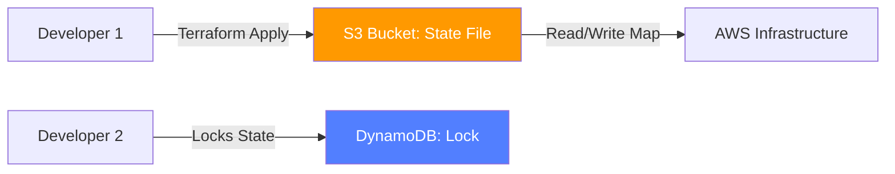

# State Management

The **Terraform State** (`.tfstate`) is the single source of truth for your infrastructure. It maps your configuration to real-world resources. If you lose your state file, Terraform "forgets" what it built.

## 📚 Module Structure
- **[Boilerplates](./Boilerplates/)**: `backend.tf` (Remote State with S3/DynamoDB).
- **[CHALLENGES](./CHALLENGES.md)**: State imports and fixing manual changes.

---

## 🏗️ Architecture: Remote State

In a team environment, state must be stored remotely (not on your laptop) to ensure consistency and locking.

---

## 🔑 Key Commands

| Command | Action |
| :--- | :--- |
| **`terraform state list`** | List all resources currently tracked in the state. |
| **`terraform state rm`** | Stop tracking a resource (does NOT delete it from AWS). |
| **`terraform import`** | Start tracking an existing resource. |
| **`terraform refresh`** | Update state with real-world metadata. |

---

## 🛡️ Safety Patterns: State Security
1.  **Encryption at Rest**: Always enable `encrypt = true` in S3 backend. State files often contain passwords in plain text!
2.  **Version Management**: Enable Versioning on the S3 bucket so you can rollback a corrupted state file.
3.  **No Manual Edits**: NEVER touch the `.tfstate` file with a text editor. Use `terraform state` commands.

---

## 📖 Real-World Story: The "Local State" Disaster
**Scenario**: A lone engineer was managing the company's VPC using local state on his laptop.
**Crisis**: His laptop was stolen. No one else had the state file.
**Outcome**: The team couldn't update the VPC for 2 weeks. They had to manually trace every resource and use `terraform import` to rebuild the state from scratch.
**Solution**: Switched to S3 Backend with DynamoDB locking.

---

## ❓ Interview Questions

1. **Why do we need a state file?**
   - *Answer*: To track resource mappings, store metadata (like instance IDs), and handle dependencies between resources that haven't been created yet.
2. **What happens if two people run `terraform apply` at the same time?**
   - *Answer*: Without a lock, the state file could become corrupted. With DynamoDB locking, the second person will receive a "State Locked" error.
3. **Is it safe to store secrets in Terraform state?**
   - *Answer*: Technically, no. Terraform state stores everything in plain text JSON. You must secure the state bucket with IAM and encryption, and ideally use a Secrets Manager for sensitive data.

---

[Next: Modules](../04-Modules/README.md)