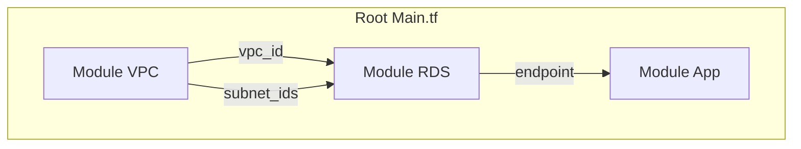
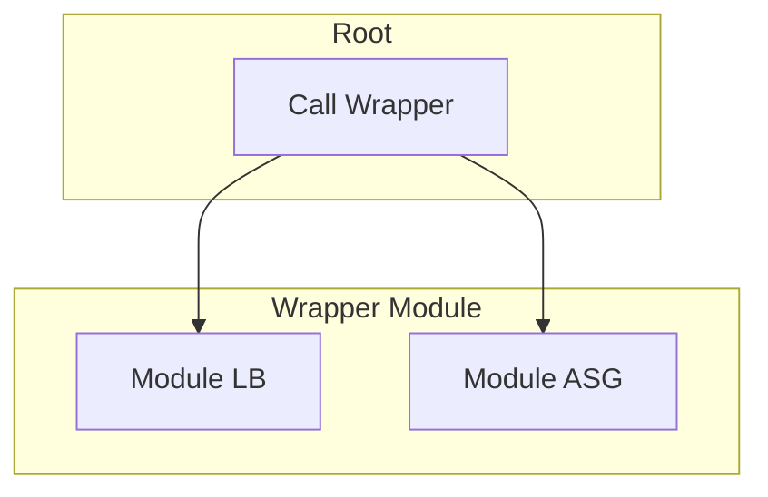

# Module Composition

Composition is the art of assembling small, reusable modules into larger, complex systems. It is the "Lego" aspect of Terraform.

## 1. Composition Patterns

### Pattern A: Data-Driven Composition (Recommended)
This is the "Flat" structure. The Root Module calls Child Modules side-by-side and passes outputs from one as inputs to another.



**Code Example:**
```hcl
module "network" {
  source = "./modules/vpc"
}

module "database" {
  source    = "./modules/rds"
  vpc_id    = module.network.vpc_id        # Implicit Dependency
  subnet_id = module.network.private_subnets[0]
}
```
*Why it's good*: It's easy to read, debug, and refactor. Dependencies are explicit in the root file.

### Pattern B: Wrapper/Nested Composition (Use with Caution)
A "Wrapper Module" creates a higher-level abstraction. For example, a `module "standard_service"` might contain a Load Balancer, an Auto Scaling Group, and a Security Group inside it.



*Why it's risky*: Variables must be passed through layers ("Variable Bucket Brigade"). Debugging a failure inside a module inside a module is painful.

---

## 2. Managing Dependencies

### Implicit Dependencies (Automatic)
When you reference `module.a.output` in `module.b`, Terraform automatically creates a dependency. Module A *must* finish before Module B starts.
```hcl
input_variable = module.other_module.output_value
```

### Explicit Dependencies (`depends_on`)
Sometimes, a dependency exists but isn't visible in the data (e.g., waiting for an IAM Policy attachment to propagate before creating an EKS cluster).
```hcl
module "eks" {
  source     = "./modules/eks"
  depends_on = [module.iam_policies]
}
```
**Warning**: Using `depends_on` on a module block postpones the *plan* phase for that module until the dependency is applied, which can slow down operations.

---

## 3. Real-Life Scenarios

### Scenario 1: The "Lego" Architecture (Success Story)
**Goal**: Deploy a full stack (VPC, EKS, RDS) in 10 minutes.
**Implementation**: A single Root Module calls 3 standard modules.
1. `module.vpc` creates the network.
2. `module.rds` reads `module.vpc.id`.
3. `module.eks` reads `module.vpc.id`.
**Benefit**: Components are decoupled. You can swap out `module.rds` for `module.dynamodb` without touching the networking code.

### Scenario 2: The "Variable Bucket Brigade" (Anti-Pattern)
**Problem**: You have a nested structure: `Root -> Tier1 -> Tier2 -> Tier3 -> Resource`.
**Pain**: To change the `instance_type` of the Resource, you must add `variable "instance_type"` to **all 4 files** and pass it down chain-style.
**Fix**: Flatten the architecture. Have Root call Tier3 directly.

### Scenario 3: The "Circular Dependency" Deadlock
**Problem**:
- Module A creates an App (needs DB endpoint).
- Module B creates a DB (needs App Security Group ID).
**Result**: Terraform errors with `Cycle: module.A -> module.B -> module.A`.
**Fix**: Extract the shared dependency. Create the Security Group in the Root (or a third module), then pass the ID to both A and B.

---

## 4. ❓ Interview Questions

1.  **What is the difference between explicit and implicit dependencies?**
    *   **Answer**: Implicit dependencies are created automatically when one resource references another's attributes. Explicit dependencies are manually defined using `depends_on`.

2.  **Why is "Flat Composition" generally preferred over "Deep Nesting"?**
    *   **Answer**: Flat composition makes data flow visible in one place (the root). Deep nesting hides logic, makes variables hard to manage (passing them down multiple layers), and complicates debugging.

3.  **Can a module output be used as a provider configuration for another module?**
    *   **Answer**: Generally No (in older versions) and discouraged in newer versions. Providers should be configured at the root. Passing provider configurations from child module outputs leads to "chicken-and-egg" problems during the plan phase.

4.  **How do you refactor a large monolithic module into smaller composed modules?**
    *   **Answer**: Identify logical boundaries (Network, Data, Compute). Move resources into separate folders. Use `outputs.tf` to expose necessary IDs. Use `terraform state mv` to move resources without destroying them.

5.  **When is a "Wrapper Module" actually useful?**
    *   **Answer**: When enforcing strong standardization. E.g., a "Company Compliance Microservice" module that inextricably bundles an EC2 instance with a Splunk Agent, Datadog Agent, and specific IAM roles, and you don't want developers disabling parts of it.

6.  **What happens to the dependency graph if you use `depends_on` on a module?**
    *   **Answer**: All resources in the dependent module will wait until *all* resources in the dependency module are created. It acts as a barrier.

7.  **How do you share data between modules that are NOT in the same Terraform configuration (different state files)?**
    *   **Answer**: Use `terraform_remote_state` data source to read outputs from the other state file.

8.  **Can you loop over a module causing it to create multiple sets of resources?**
    *   **Answer**: Yes, using `count` or `for_each` in the `module` block module.

9.  **If Module A depends on Module B, does Module A get destroyed first or second?**
    *   **Answer**: First. Terraform reverses the dependency order for destruction. A depends on B, so A is created after B. Therefore, A must be destroyed *before* B.

10. **Is it possible to pass an entire object (like a map of tags) to a module?**
    *   **Answer**: Yes. Define the variable type as `map(string)` or `object({...})`. This is cleaner than passing 10 individual string variables.

---

## 5. 🧠 Knowledge Check (Quiz)

### Dependency Logic
1.  **Which keyword creates a manual dependency?**
    *   [ ] `wait_for`
    *   [x] `depends_on`
    *   [ ] `after`
    *   [ ] `require`

2.  **If Module B reads `var.input = module.A.output`, this is an:**
    *   [ ] Explicit Dependency.
    *   [x] Implicit Dependency.
    *   [ ] Circular Dependency.

3.  **True/False: `depends_on` in a module block affects only the first resource in that module.**
    *   [ ] True.
    *   [x] False (It affects ALL resources in that module).

4.  **What is the primary way modules exchange data?**
    *   [ ] Global Variables.
    *   [ ] Environment Variables.
    *   [x] Input Variables and Outputs.
    *   [ ] Shared State methods.

5.  **When Terraform destroys infrastructure, dependencies are processed in:**
    *   [ ] The same order as creation.
    *   [x] Reverse order.
    *   [ ] Random order.

### Architecture
6.  **Which structure is easier to debug?**
    *   [x] Flat (Root calls A, B, C).
    *   [ ] Nested (Root calls A, A calls B, B calls C).
    *   [ ] Circular.

7.  **The "Propagating Variables" problem occurs when:**
    *   [ ] You have too many variables.
    *   [x] You force data through multiple layers of nested modules without it being used in the middle layers.
    *   [ ] You use `locals`.

8.  **To reuse a standard set of resources (e.g., "Web Server + Firewall + Logs"), you might use:**
    *   [x] A Wrapper Module (Composition).
    *   [ ] Copy-Paste.
    *   [ ] A monorepo.

9.  **If you split a monolithic state into two (Network vs App), how do you link them?**
    *   [ ] `depends_on`
    *   [x] `data "terraform_remote_state"`
    *   [ ] You can't.

10. **Circular dependencies are resolved by:**
    *   [ ] Increasing timeout.
    *   [ ] Using `depends_on`.
    *   [x] Refactoring code to remove the cycle (e.g., using a 3rd mediator resource).

### Scenarios
11. **You need to ensure an S3 bucket is empty before destroying it, using a `null_resource` script. How do you ensure the bucket waits for the script during destroy?**
    *   [ ] Manual timing.
    *   [x] `depends_on` (linking the bucket to the script resource). Note: This is tricky in TF, usually requires specific destroy-time provisioners.

12. **Flat composition encourages usage of:**
    *   [ ] `outputs.tf` in child modules.
    *   [x] All of the above (Root logic, clear data flow).

13. **Why might you use `for_each` on a module call?**
    *   [ ] To speed up download.
    *   [x] To create multiple environments (e.g., `dev`, `staging`) or identical stacks from one config.
    *   [ ] To retry on failure.

14. **What is a "Landing Zone"?**
    *   [x] A composed set of modules that sets up the baseline account structure (Security, Network, Logging).
    *   [ ] A place where Terraform binaries are stored.

15. **If you change a child module's output name, what happens?**
    *   [ ] Nothing.
    *   [x] The Root module code breaks (references become invalid) until updated.

### Syntax
16. **Correct syntax to access output `vpc_id` from a module named `network`?**
    *   [x] `module.network.vpc_id`
    *   [ ] `outputs.network.vpc_id`
    *   [ ] `network.vpc_id`

17. **Can you conditionally disabled a module using `count = 0`?**
    *   [x] Yes.
    *   [ ] No, modules are always loaded.

18. **Where is `source` defined?**
    *   [x] In the `module` block.
    *   [ ] In the `provider` block.

19. **If `source` starts with `./`, it is:**
    *   [x] A local path.
    *   [ ] A registry module.

20. **Can you mix local and registry modules in one composition?**
    *   [x] Yes, absolutely.
    *   [ ] No.