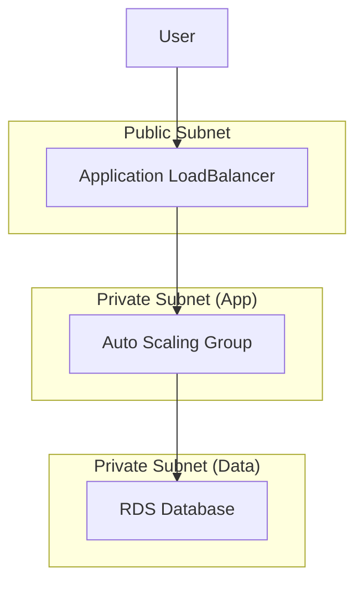

# Real-World Module Patterns

Theory is great, but production is where it counts. These are the "Blueprints" for the most common infrastructure patterns you will encounter.

## 1. The "Standard VPC" Blueprint

Almost every AWS environment starts here.

### Architecture
*   **Public Subnets**: For Load Balancers and NAT Gateways.
*   **Private Subnets**: For Applications and Databases.
*   **NAT Gateways**: To allow private instances to reach the internet (updates/patches).

### Module Composition
```hcl
module "vpc" {
  source = "terraform-aws-modules/vpc/aws"

name = "main-vpc"
  cidr = "10.0.0.0/16"

azs             = ["us-east-1a", "us-east-1b"]
  private_subnets = ["10.0.1.0/24", "10.0.2.0/24"]
  public_subnets  = ["10.0.101.0/24", "10.0.102.0/24"]

enable_nat_gateway = true
  single_nat_gateway = true # Cost saving for non-prod
}
```

---

## 2. The "3-Tier Web App" Blueprint

The classic architecture: Load Balancer -> App Server -> Database.

### Architecture Diagram


### Module Code
```hcl
module "alb" {
  source  = "./modules/alb"
  subnets = module.vpc.public_subnets
}

module "app_asg" {
  source            = "./modules/asg"
  vpc_id            = module.vpc.vpc_id
  target_group_arn  = module.alb.target_group_arn
  private_subnets   = module.vpc.private_subnets
}

module "db" {
  source  = "./modules/rds"
  subnets = module.vpc.database_subnets
  # Security Group Rule: Allow Traffic ONLY from ASG
  allowed_security_groups = [module.app_asg.security_group_id]
}
```

---

## 3. The "Kubernetes Platform" (EKS) Blueprint

Modern applications often run on specific platforms like Kubernetes.

### Key Components
1.  **VPC**: Must have specific tags (`kubernetes.io/role/elb`).
2.  **Control Plane**: The EKS Cluster (Managed by AWS).
3.  **Data Plane**: Managed Node Groups (EC2 instances).

### Best Practice
Don't write this from scratch. Use the community module `terraform-aws-modules/eks/aws`. It handles hundreds of edge cases (Auth maps, IAM roles, CNI plugins).

```hcl
module "eks" {
  source  = "terraform-aws-modules/eks/aws"
  version = "~> 19.0"

cluster_name    = "my-cluster"
  cluster_version = "1.27"

vpc_id     = module.vpc.vpc_id
  subnet_ids = module.vpc.private_subnets

eks_managed_node_groups = {
    general = {
      min_size     = 1
      max_size     = 3
      instance_types = ["t3.medium"]
    }
  }
}
```

---

## 4. Real-Life Scenarios

### Scenario 1: The "Spaghetti VPC"
**Problem**: A startup had one 3,000 line `main.tf` file creating a VPC, 50 subnets, route tables, and instances.
**Discovery**: Adding a new subnet took 4 hours because developers were afraid to touch the file.
**Solution**: Replaced the network code with the standard `vpc` module. Deleted 1,200 lines of code.

### Scenario 2: "Database Drift"
**Problem**: The DBA manually changed the RDS storage type from `gp2` to `gp3` in the AWS Console to save money.
**Consequence**: Terraform Plan showed "Force Replacement" (Delete & Recreate) for the database because the state didn't match the code.
**Fix**: Updated the module code to match the console reality *before* running apply. Used `lifecycle { ignore_changes = [...] }` for fields that change often outside TF.

### Scenario 3: "Cost Shock"
**Problem**: Developers kept spinning up `m5.4xlarge` instances in dev environments.
**Solution**: Creating a wrapper module for EC2 that used `validation` to restrict `instance_type` to a specific allowed list (`t3.micro`, `t3.small`) for non-prod workspaces.

---

## 5. ❓ Interview Questions

1.  **What is the benefit of using the `community` VPC module over writing your own?**
    *   **Answer**: It handles complex logic like subnet calculation, NAT Gateway HA, and proper tagging automatically. It is tested by thousands of users.

2.  **In a 3-tier architecture, why do we pass the ASG Security Group ID to the RDS module?**
    *   **Answer**: To implement "Least Privilege." We allow port 5432/3306 ONLY from the application servers, not the whole subnet or internet.

3.  **How do you handle "Circular Dependencies" between modules (e.g., App needs DB address, DB needs App Security Group)?**
    *   **Answer**: Terraform generally handles this graph, but if strictly circular, we might need to separate the Security Group creation into its own step or module to break the loop.

4.  **Why use `single_nat_gateway = true` in Dev?**
    *   **Answer**: NAT Gateways are expensive (~$30/month + data). In Dev, High Availability (HA) across zones is rarely needed.

5.  **What is a "Wrapper Module"?**
    *   **Answer**: A custom module that calls a generic public module (like `aws_instance`) but sets specific defaults, enforces policies (tagging), or simplifies the interface for internal users.

6.  **How do you connect a `provisioner` (like Ansible) to a module-created instance?**
    *   **Answer**: Use `null_resource` or `local-exec` triggered by the instance ID. However, best practice is to use User Data (cloud-init) or Golden AMIs (Packer) instead of provisioners.

7.  **Can modules output sensitive values like Database Passwords?**
    *   **Answer**: Yes, but the output must be marked `sensitive = true`, or Terraform will error.

8.  **What happens if you delete a module block from your code?**
    *   **Answer**: Terraform acts as if you performed a `destroy` on all resources contained within that module.

9.  **How do you upgrade a production module version safely?**
    *   **Answer**: Plan first. Review the `CHANGELOG` for breaking changes. Use `terraform plan -target=module.name` to isolate the verification.

10. **Why separate "Stateful" (RDS) and "Stateless" (ASG) resources into different modules/stacks?**
    *   **Answer**: To reduce risk. You change App servers daily; you change State/DBs rarely. Separating them prevents accidental DB destruction during an App deployment.

---

## 6. 🧠 Knowledge Check (Quiz)

### Architectures
1.  **A standard VPC typically has:**
    *   [ ] Only public subnets.
    *   [x] Public and Private subnets.
    *   [ ] Only private subnets.

2.  **NAT Gateways live in the:**
    *   [x] Public Subnet (to reach IGW).
    *   [ ] Private Subnet.
    *   [ ] Database Subnet.

3.  **To expose an EKS cluster to the internet properly:**
    *   [ ] Put nodes in public subnets.
    *   [x] Use a Load Balancer (Ingress) in public subnets.

### Terraform Logic
4.  **`source = "terraform-aws-modules/vpc/aws"` points to:**
    *   [ ] A local file.
    *   [x] The Public Terraform Registry.

5.  **If `enable_nat_gateway = false`, private instances:**
    *   [x] Cannot reach the internet.
    *   [ ] Can reach the internet freely.

6.  **Wrapper modules are good for:**
    *   [x] Enforcing policy and simplifying inputs.
    *   [ ] Increasing complexity.

7.  **"Force Replacement" on a Database is:**
    *   [ ] Good practice.
    *   [x] Extremely dangerous (Data loss).

8.  **Tags are:**
    *   [ ] Useless.
    *   [x] Critical for billing, automation, and filtering.

### Scenarios
9.  **Why use `terraform plan -target`?**
    *   [x] To update/fix a specific part of the infrastructure without scanning everything.
    *   [ ] To target specific users.

10. **If you rename a module block:**
    *   [x] Terraform creates new resources and destroys old ones (unless `moved` blocks are used).
    *   [ ] It just renames them.

### General
11. **EKS stands for:**
    *   [ ] Elastic Kernel Service.
    *   [x] Elastic Kubernetes Service.

12. **RDS stands for:**
    *   [x] Relational Database Service.
    *   [ ] Remote Data Service.

13. **ASG stands for:**
    *   [x] Auto Scaling Group.
    *   [ ] Application Service Group.

14. **Best practice for EC2 SSH access:**
    *   [ ] Open 0.0.0.0/0.
    *   [x] Use Session Manager (SSM) or VPN (Bastion).

15. **Public Subnets need a Route Table entry to:**
    *   [x] Internet Gateway (IGW).
    *   [ ] NAT Gateway.

16. **Private Subnets need a Route Table entry to:**
    *   [x] NAT Gateway.
    *   [ ] Internet Gateway.

17. **Can you output a whole object (like `aws_vpc.this`) from a module?**
    *   [x] Yes (Output all attributes).
    *   [ ] No, only strings.

18. **The "Data Plane" in EKS refers to:**
    *   [x] The worker nodes where apps run.
    *   [ ] The master API server.

19. **Circular dependencies cause:**
    *   [x] Plan/Apply errors.
    *   [ ] Faster deployments.

20. **Is 100% test coverage possible in Terraform?**
    *   [ ] Yes.
    *   [x] No (Cloud APIs change, eventual consistency issues).