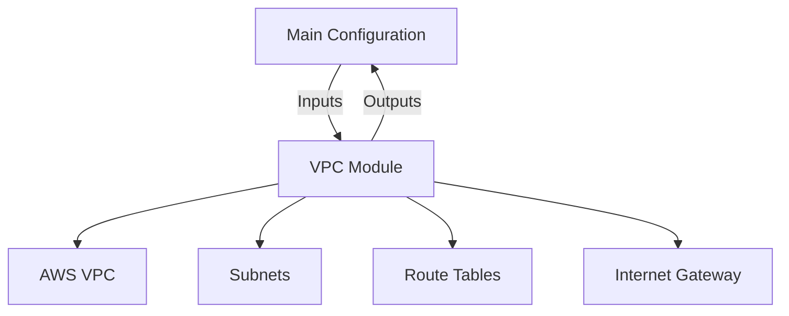

# Terraform Modules

Modules are containers for multiple resources that are used together. They allow you to package complex infrastructure into simple, reusable components, similar to functions in a programming language.

## 📚 Module Structure
- **[Boilerplates](./Boilerplates/)**: `module_usage.tf` (Calling local and remote modules).
- **[CHALLENGES](./CHALLENGES.md)**: Building an S3 Static Site module.

---

## 🏗️ Architecture: Reusability

A module abstracts away the complexity. Instead of defining 20 resources for a VPC, you call a "VPC Module" with 2 inputs.

---

## 🔑 Key Concepts

| Concept | Description |
| :--- | :--- |
| **Root Module** | The `.tf` files in your main working directory. |
| **Child Module** | A module called by the root module. |
| **Source** | Where the module code lives (Local path, GitHub, Terraform Registry). |
| **Version** | Crucial for production. Always pin your modules to a specific version. |

---

## 🛡️ Robust Pattern: The Standard Module Structure
Every module should follow this file pattern:
1.  `main.tf`: The actual resources.
2.  `variables.tf`: Inputs for the module.
3.  `outputs.tf`: Values returned by the module.
4.  `README.md`: Documentation for the module.

---

## 📖 Real-World Story: The "Spaghetti" Infrastructure
**Scenario**: A company had 5,000 lines of Terraform in a single `main.tf` file. 
**Problem**: It was impossible to read, and changing one resource often accidentally broke others.
**Solution**: They refactored the code into **Modules** (`compute`, `network`, `database`).
**Result**: The code became 70% smaller and could be reused for development, staging, and production environments.

---

## ❓ Interview Questions

1. **What is a Terraform Module?**
   - *Answer*: A set of Terraform configuration files in a single directory. It is the primary way to package and reuse infrastructure.
2. **Where can modules be sourced from?**
   - *Answer*: Local paths, Git repositories (GitHub, Bitbucket), S3 buckets, and the public/private Terraform Registry.
3. **What is the `terraform get` command used for?**
   - *Answer*: It is used to download and update modules defined in the configuration (usually part of `terraform init`).

---

[Next: Best Practices](../05-Best-Practices/README.md)