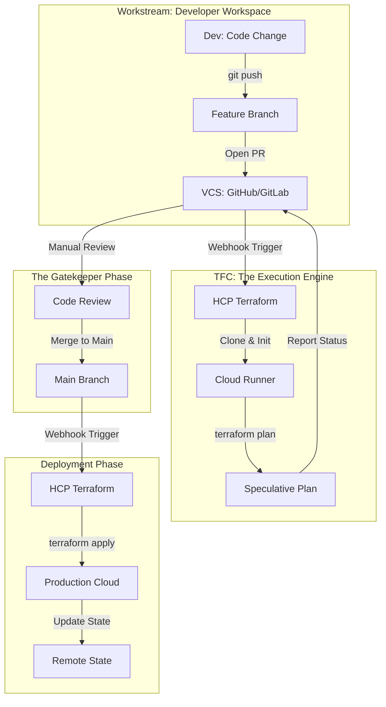

The **VCS-Driven Workflow** is the primary operational model for HCP Terraform. It represents a paradigm shift from **"Manual Infrastructure"** to **Automated GitOps**, where the Version Control System (VCS) acts as the bridge between developer intent and cloud reality.

---

## 🏗️ 1. The Integrated GitOps Lifecycle

In this workflow, the VCS is the **Source of Truth**. Every `git push` or Pull Request (PR) triggers a secure, automated sequence inside the HCP Terraform execution environment.

### The Key Phases:
1.  **Triggering Phase**: TFC listens for Webhook events (Push, Pull Request, Tag).
2.  **Speculative Phase**: Non-destructive plans are run on PRs to show impact before merging.
3.  **Governance Phase**: Sentinel/OPA policies run against the plan to ensure compliance.
4.  **Application Phase**: Post-merge plans are generated and (optionally) auto-applied to the environment.

---

## 🛡️ 2. Speculative Plans: Security in Pre-Review

A **Speculative Plan** is HCP Terraform’s "safety net."

*   **Read-Only Validation**: It fetches secrets and remote state to calculate a real plan, but it **CANNOT** be applied.
*   **PR Integration**: Results are streamed directly to the PR conversation (via the TFC Bot), allowing reviewers to see:
    - Exactly which resources will be created/destroyed.
    - Cost Estimation deltas.
    - Policy evaluation results (Pass/Fail).
*   **Branch Protection**: High-maturity teams configure GitHub to **require** the TFC Status Check to pass before a merge is permitted.

---

## ⚙️ 3. The Webhook & Connectivity Layer

### Connection Methods
| Method | Security Level | Advantage |
| :--- | :--- | :--- |
| **GitHub App** | **High** | Org-level permissions; no personal tokens; granular access. |
| **OAuth Token** | **Medium** | Simple setup; tied to a specific user identity. |
| **SSH Keys** | **Necessary** | Required for runners to clone **Private Modules** in separate repos. |

### Monorepo Strategy (Directory Filtering)
If you have a large repository with 50 projects, a change in Project A should not rebuild Project B.
- **Working Directory**: Set this to the project root (e.g., `/infra/prod/network`).
- **Trigger Patterns**: Use globs (e.g., `modules/compute/**/*`) to ensure TFC only wakes up when relevant files change.

---

## 🛑 4. Common Anti-Patterns

- ❌ **The "Force-Push" Habit**: Force-pushing to `main` bypasses the review loop and can lead to unpredicted destructive changes.
- ❌ **Missing Directory Filters**: In monorepos, ignoring directory filters causes "Notification Storms" and exhausts your runner concurrency limits.
- ❌ **Manual Console Tweaks**: Making changes in the AWS Console (ClickOps) breaks the GitOps link. **Drift Detection** must be used to find and revert these.
- ❌ **Ignoring PR Comments**: Applying a merge without reading the TFC Bot's plan summary is like signing a contract without reading the fine print.

---

## 🏗️ 5. Real-Life Scenarios

### Scenario 1: The "Locked" Merge Button
*   **The Incident**: A developer tried to merge a database refactor that unintentionally would have deleted the production RDS instance.
*   **The Fix**: A **Sentinel Policy** flagged the destruction of a "stateful" resource. The TFC Status Check reported a **Hard Failure** to GitHub. Because "Require Status Checks to Pass" was enabled, the **Merge button was disabled**.
*   **Outcome**: High-risk infrastructure destruction was prevented by automated governance.

### Scenario 2: Emergency CLI Bypass
*   **The Incident**: The VCS provider (GitHub) went down for 4 hours during a critical production outage that required an immediate firewall change.
*   **The Fix**: The SRE team temporarily switched the workspace to **CLI-Driven** workflow. They ran `terraform apply` from their secure workstations, which pushed the plan to TFC runners directly, bypassing the broken GitHub webhook.
*   **Outcome**: MTTR (Mean Time To Recovery) was minimized despite the external platform failure.

---

## ❓ 6. Interview Questions (Expert Deep Dive)

1.  **How do you secure the connection between HCP Terraform and GitHub?**
    

    
Show Answer

    By using the **HCP Terraform GitHub App**. It allows for granular, organization-level permissions and removes the dependency on individual user OAuth tokens. Additionally, you should enable "Branch Protection Rules" in GitHub to enforce TFC plan success before merging.
    

2.  **Does a Speculative Plan use real credentials and real state?**
    

    
Show Answer

    **Yes**. To generate an accurate plan, it must authenticate with the cloud provider and read the current remote state file. However, it is strictly forbidden from writing to the state file or performing any "Apply" actions.
    

3.  **What happens to a queued run if you push a new commit to the same branch?**
    

    
Show Answer

    HCP Terraform uses **Auto-Cancellation**. If a run is pending or in the "Plan" phase, it is automatically cancelled to make way for a new run based on the latest commit. This saves runner capacity and ensures you are always reviewing the most recent code.
    

4.  **Explain the "Source of Truth" in a GitOps workflow.**
    

    
Show Answer

    The **Git Branch** (usually `main`) is the source of truth. The state in the cloud should always be an exact reflection of the code merged into that branch. Manual changes in the console are considered "Drift" and should be reverted.
    

5.  **How do you handle private submodules in a TFC runner?**
    

    
Show Answer

    You must add a **Private SSH Key** to the TFC Workspace settings. The runner uses this key to authenticate with the VCS provider during the `terraform init` phase to clone the private module repositories.
    

---

## 🧠 7. Knowledge Check (Quiz)

### Lifecycle & Triggers
1.  **A run triggered by a Pull Request is called a:**
    - [ ] Final Plan.
    - [x] **Speculative Plan**.
2.  **When code is merged to the tracked branch, TFC:**
    - [ ] Deletes the workspace.
    - [x] **Triggers a real Plan and (optionally) an Apply**.
3.  **Webhook security in TFC relies on:**
    - [ ] Password protection.
    - [x] **HMAC Secret Signature** verification from the VCS provider.

### Monorepo & Filters
4.  **In a monorepo, "Trigger Patterns" ensure that:**
    - [x] **Only relevant changes** in specific directories wake up the workspace.
    - [ ] All workspaces run at once.
5.  **The "Working Directory" setting tells TFC:**
    - [x] **Where to find the .tf files** within the repository.
    - [ ] Where to save logs.

---

## 📖 8. Summary Checklist

✅ **GitHub App Integration**: Prefer App over OAuth for better long-term security.
✅ **Branch Protection**: Block merges if the TFC plan fails.
✅ **Trigger Patterns**: Configure filters for all monorepos to avoid "Notify Storms."
✅ **TFC Bot**: Enable PR comments for instant visibility into infra changes.
✅ **Auto-Apply Selection**: Only enable Auto-Apply for Dev/Sandbox environments; never for High-Stakes Prod.

---
**Module Status**: ✅ Comprehensive Verified
**Last Updated**: 2026-01-08