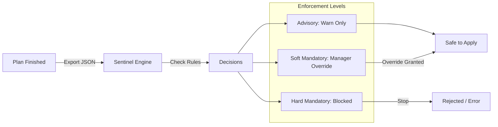

# Policy as Code (Sentinel)

Sentinel is HashiCorp's proprietary functional policy framework. In HCP Terraform, it acts as an automated **<font color="#ff0000">Gatekeeper</font>** that intercepts the "Plan" before it can be "Applied," ensuring that every infrastructure change complies with corporate security, cost, and operational standards.

---

## 🏗️ 1. The Policy Enforcement Pipeline

Sentinel policies run automatically after the `terraform plan` is finished. If a policy fails, the infrastructure life-cycle is halted based on the enforcement level.



### Strategic Value:
- **Scalability**: One security team can write rules that 1,000 developers must follow, without being a manual bottleneck.
- **Compliance**: Proof of "policy-at-source" for auditors (SOC2, HIPAA).
- **Cost Control**: Automatic rejection of oversized instances (e.g., `p3.16xlarge`) in development environments.

---

## 🛠️ 2. Enforcement Levels & Import Logic

### 1. Enforcement Levels
| Level | Security Impact | Operational Impact | Use Case |
| :--- | :--- | :--- | :--- |
| **Advisory** | Log Warnings | No block. | Best practices (e.g., "Missing optional tag"). |
| **Soft Mandatory** | Audit Trail | Requires Admin/Manager "Click-to-Approve". | Cost thresholds, non-standard regions. |
| **Hard Mandatory** | Absolute Guardrail | Permanent failure; no override possible. | Critical security (e.g., "Public S3 Buckets"). |

### 2. The Four Key Imports
Sentinel gains its power by inspecting four distinct data streams from a Terraform run:
1.  **tfplan**: Proposed changes (what *will* happen).
2.  **tfstate**: Current state (what *is* there now).
3.  **tfconfig**: Source code (how it was written, e.g., module versions).
4.  **tfrun**: Metadata (who is running it, the workspace name, the cost delta).

---

## 💻 3. Simple Sentinel Logic (Restrict Regions)

Sentinel uses a language that feels like a mix of Python and Go.
```sentinel
import "tfplan/v2" as tfplan

# 1. Define allowed regions
allowed_regions = ["us-east-1", "eu-central-1"]

# 2. Rule: Every provider must use allowed region
main = rule {
    all tfplan.resource_changes as _, rc {
        rc.provider_name is not "aws" or
        rc.change.after.region in allowed_regions
    }
}
```

---

## 4. The Fail-Closed Security Model

Sentinel operates on a "fail-closed" principle. This means that if the Sentinel policy engine cannot execute (e.g., due to misconfiguration, network issues preventing policy download, or an error in the policy itself), the Terraform run is automatically blocked. This prevents un-policed infrastructure changes, ensuring security posture is maintained even under adverse conditions.

---

## 5. Cross-Workspace Data Validation

While Sentinel policies are typically applied to a single workspace or a policy set, advanced use cases can involve cross-workspace data validation. Using the `http` import, a Sentinel policy in one workspace can query the state of another workspace (via the HCP Terraform API) to enforce dependencies or ensure unique resource naming across an organization. This enables complex, distributed policy enforcement.

---

## 6. Sentinel vs. Rego Syntax

Both Sentinel and Rego (Open Policy Agent's language) are policy-as-code frameworks. While both are declarative, they have distinct syntaxes and ecosystems:
- **Sentinel**: HashiCorp's proprietary language, designed specifically for HashiCorp products (Terraform, Vault, Consul, Nomad). It has a more imperative feel, resembling Python/Go, and includes built-in imports for Terraform-specific data (`tfplan`, `tfstate`, `tfconfig`, `tfrun`).
- **Rego**: An open-source declarative query language used by OPA. It's more general-purpose, often used for Kubernetes admission control, API authorization, and microservice policies. Its syntax is based on Datalog.

Choosing between them often depends on your existing ecosystem and specific policy needs.

---

## 🚀 7. Real-Life Scenarios

### Scenario 1: The "Friday Afternoon" Save
*   **The Incident**: A developer tried to push a major database change at 4:30 PM on a Friday.
*   **The Policy**: A **Hard Mandatory** policy checks the `time` import. If the current time is between Friday 4 PM and Monday 8 AM, the apply is blocked.
*   **Outcome**: The team stayed out of "incidental on-call" and the change was safely reviewed on Monday morning.

### Scenario 2: The "Open Port 22" Breach
*   **The Incident**: A testing script accidentally added an ingress rule allowing `0.0.0.0/0` (The World) to SSH into production instances.
*   **The Policy**: A **Hard Mandatory** security policy scans all `aws_security_group` resources. It rejects any rule where the CIDR is `0.0.0.0/0` and the port is `22`.
*   **Outcome**: The run was cancelled instantly. The security vulnerability never reached the cloud.

### Scenario 3: The "Sneaky" Expensive Service
*   **The Incident**: An engineer switched an RDS instance to Multi-AZ with Provisioned IOPS, tripling the cost.
*   **The Policy**: A **Soft Mandatory** policy imports `tfrun`. If the `delta_monthly_cost` is > $500, it requires a manager's digital approval signature in the TFC UI.
*   **Outcome**: The manager reviewed the cost, realized it was for a temporary load test, granted the override, and added a comment for auditing.

---

## ❓ 8. Interview Questions (Expert Deep Dive)

1.  **Explain the difference between "Mock Data" and Live Data in Sentinel testing.**
    <details>
    <summary>Show Answer</summary>
    **Mock Data** is a stagnant JSON representation of a plan or state used with the **Sentinel CLI** (`sentinel test`) to verify policy logic on your local machine. **Live Data** is the real-time plan stream that HCP Terraform feeds into the engine during an actual deployment.
    </details>

2.  **Can Sentinel communicate with external systems?**
    <details>
    <summary>Show Answer</summary>
    **Yes**. Using the `http` import, Sentinel can make GET or POST requests to external APIs. For example, it could check a ServiceNow ticket status or an IPAM database before allowing an "IP assignment" in Terraform.
    </details>

3.  **What is a "Policy Set"?**
    <details>
    <summary>Show Answer</summary>
    A Policy Set is a group of Sentinel (or OPA) files stored in a Git repository. It is connected to HCP Terraform and can be mapped to specific workspaces (e.g., "Network Policies") or globally to the entire organization.
    </details>

4.  **How do you handle "Exemptions" in a Hard Mandatory policy?**
    <details>
    <summary>Show Answer</summary>
    There are no UI overrides for Hard Mandatory policies. To grant an exemption, you must modify the Sentinel code itself to include logic like `if (tfrun.workspace.name matches "emergency-bypass-*")` or use a specific tag/attribute check.
    </details>

5.  **Why is `tfconfig` useful if we already have `tfplan`?**
    <details>
    <summary>Show Answer</summary>
    `tfplan` tells you what will be created. `tfconfig` tells you *how* it was structured. For example, you can use `tfconfig` to enforce that teams *only* use approved modules from the Private Registry and ban "direct resource" creation for specific tiers.
    </details>

---

## 🧠 9. Knowledge Check (Quiz)

### Flow & Enforcement
1.  **Sentinel runs after which command?**
    - [ ] `terraform apply`.
    - [x] `terraform plan`.
2.  **Which level allows a manager to "Click to approve" a policy failure?**
    - [ ] Advisory.
    - [x] **Soft Mandatory**.
3.  **A "Fail Closed" design in Sentinel means:**
    - [x] If the policy engine can't run or is missing, the run is blocked.
    - [ ] The run proceeds normally.

### Data & Logic
4.  **To check if a resource is being deleted, Sentinel inspects:**
    - [ ] `tfstate`.
    - [x] `tfplan.resource_changes`.
5.  **Sentinel policies are written in:**
    - [ ] YAML.
    - [x] **The Sentinel Language** (Functional/Imperative mix).
6.  **Can Sentinel block a run based on the creator's identity?**
    - [x] **Yes** (via the `tfrun` import and Team/User data).
    - [ ] No.

---

## 📖 10. Summary & Best Practices

Policy as Code transforms security from a manual "No" to an automated "Safe Self-Service."

**Best Practices:**
- ✅ **Start with Advisory**: Run a new policy in Advisory mode for 2 weeks to identify false positives.
- ✅ **Version Control your Policies**: Treat your Policy repo with the same rigor as your Infra repo.
- ✅ **Unit Test Locally**: Use the `sentinel test` CLI to verify logic before pushing to TFC.
- ✅ **One Rule per File**: Keep policies modular (e.g., `enforce-mandatory-tags.sentinel`).
- ✅ **Explain the "Why"**: Always provide a custom error message so developers know how to resolve the failure.

---
**Module Status**: ✅ Comprehensive Verified
**Last Updated**: 2026-01-08