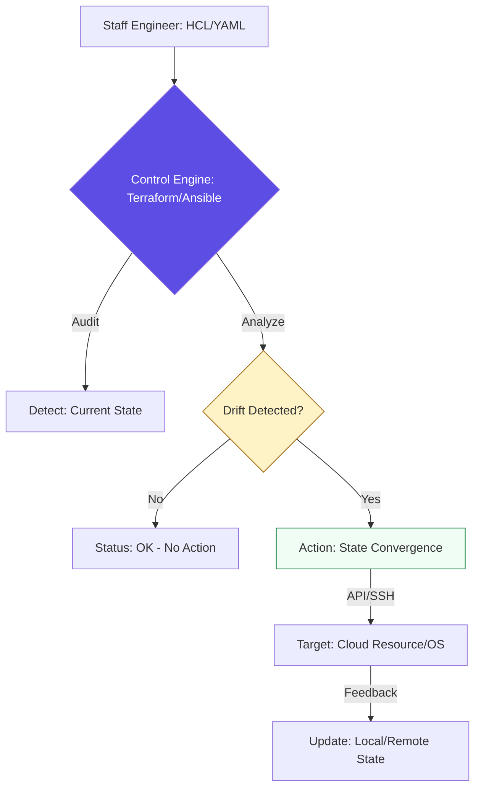

# 🏗️ Introduction to Config Management & IaC

> **"In the physical world, hardware is slow to change. In the cloud world, hardware is just a variable in a YAML file. If you treat your servers like pets, you will fail; if you treat them like cattle, you will scale."**

Welcome to the **Config Management Foundations**. This module marks your transition from "Administering Servers" to "Engineering Infrastructure." You will learn to eliminate the "Snowflake" effect and build systems that are reproducible, version-controlled, and self-healing.

---

## 🏗️ The Declarative Architecture

Modern infrastructure relies on the **Desired State Configuration (DSC)** model. We move from "Executing Steps" to **"Defining Realities."**



---

## 🎭 Real-World DevOps Scenarios

### 🛡️ Scenario: The "Snowflake" Meltdown
**The Incident:** A high-traffic application began failing only on 3 out of 10 nodes in the cluster.
**The Failure:** Senior engineers spent 6 hours comparing logs. They discovered that 6 months prior, a consultant had manually updated the Java version on those 3 nodes to fix a minor bug but never updated the documentation or the other nodes.
**The Fix:** Implementation of **Ansible**. On the first run, Ansible detected the Java version mismatch (Drift) and automatically downgraded the 3 nodes to match the "Global Standard" defined in the playbook.
**The Result:** The 10 nodes are now identical. Zero snowflakes.

---

## 💻 DevOps Logic Snippets: "The Guardrail"

Master the difference between **Imperative** (Procedural) and **Declarative** (Idempotent) logic.

```bash
# ❌ IMPERATIVE: A script that fails if run twice
mkdir /data/database
useradd db_admin
apt install postgresql -y

# ✅ DECLARATIVE: A definition that is safe to run forever
- name: Ensure DB Infrastructure Exists
  hosts: all
  tasks:
    - name: Ensure Directory is present
      file:
        path: /data/database
        state: directory
    - name: Ensure User exists
      user:
        name: db_admin
        state: present
```

---

## 🎙️ Interview Preparation (Foundations)

1.  **"What is 'GitOps' and how does it relate to Config Management?"**
    *   *Answer:* GitOps is the practice of using a Git repository as the "Single Source of Truth." All infrastructure changes are made via Pull Requests. If the repository says there should be 5 servers, but the cloud has 4, the Config Management tool automatically provisions the 5th one to match Git.
2.  **"What is 'Configuration Drift'?"**
    *   *Answer:* Drift is the inevitable decay of infrastructure where the actual state of a system deviates from the documented or coded state over time due to manual updates or ad-hoc fixes.
3.  **"Why is 'Idempotency' a requirement for automation?"**
    *   *Answer:* Without idempotency, running an automation script multiple times would cause errors or duplicate resources (e.g., trying to create a user that already exists). Idempotency makes automation safe to run on a schedule.
4.  **"Explain the 'Cattle vs. Pets' analogy."**
    *   *Answer:* "Pets" are servers you name, manually nurture, and mourn when they die. "Cattle" are numbered resources that are identical; if one becomes unhealthy, you destroy it and provision a new one without second thought.
5.  **"What is the 'Source of Truth' in a Terraform environment?"**
    *   *Answer:* The **State File** (`.tfstate`). It contains the map of IDs and attributes that connects your HCL code to the real-world resources.

---

## 🧠 Knowledge Check

1.  **Which keyword describes a tool that only makes changes if needed?**
    *   [ ] Mutable
    *   [x] Idempotent
    *   [ ] Sequential
2.  **True or False: Declarative code defines 'How' to build a server.**
    *   [ ] True
    *   [x] False (It defines 'What' the server should look like).
3.  **What happens in a 'Snowflake' server environment?**
    *   [x] Every server has slightly different, manual configurations.
    *   [ ] The data center is in the Arctic.
    *   [ ] All servers are identical.
4.  **Where should infrastructure passwords NEVER be stored?**
    *   [ ] In a Vault.
    *   [x] In plain-text Git code.
    *   [ ] In a secret manager.
5.  **Which tool is best for Provisioning (the 'Outside' code)?**
    *   [ ] Ansible
    *   [x] Terraform
    *   [ ] Jenkins

---

[⬅️ Back to Start](../README.md) | [Next: Infrastructure Provisioning](../02-Infrastructure-Provisioning/README.md) ➡️
