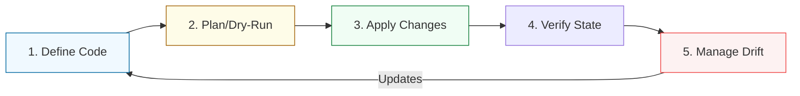

# 🏗️ 01: Introduction to Config Management & IaC

> **"If a server is configured by hand, it is a snowflake. If it is configured by code, it is a resource."**

---

## 🌟 Overview

In the physical world, setting up a data center takes months of planning, cabling, and manual configuration. In the cloud world, we treat infrastructure as **Software**. 

This transition from "Click-Ops" (manually clicking in the console) to **Infrastructure as Code (IaC)** is the single most important shift in modern DevOps. It allows teams to version their hardware, rollback changes, and replicate whole environments in minutes.

### The Problem: Configuration Drift
When servers are managed manually, they inevitably become "Snowflakes"—unique systems with settings that nobody remembers. This leads to the "It worked in Dev but failed in Prod" crisis.

---

## 🔄 The IaC Lifecycle

Every resource managed by code follows a standardized lifecycle.

---

## 🚀 Key Intermediate Concepts

1.  **Idempotency**: The ability to run the same code multiple times and get the same result. If you say "Create a DB," and the DB exists, an idempotent tool does nothing.
2.  **State Management**: Maintaining a "Map" of what is currently deployed. Without state, the tool doesn't know what to delete or update.
3.  **Declarative vs. Imperative**: 
    - **Imperative**: "Do Step A, then Step B." (Shell Scripts).
    - **Declarative**: "I want the result to look like this." (Terraform/Ansible).

---

## 🏆 Real-World Scenario: The Disaster Recovery Miracle

**The Crisis**: A regional AWS outage destroyed an entire production VPC including 50 servers and 10 databases.
**Traditional Response**: Weeks of manual rebuilding from documentation that is 2 years out of date.
**IaC Response**: The team changed the `region` variable in their **Terraform** config and ran `apply`. Within 30 minutes, the entire infrastructure was recreated in a different region, perfectly matching the production specs.

---

## ❓ Interview Preparation (Introduction)

1.  **Q: What is 'Configuration Drift'?**
    *A: Drift occurs when the actual state of a server or resource deviates from its defined code (e.g., someone manually changed a firewall rule via the UI). Config management tools are designed to detect and correct this drift.*

2.  **Q: Why is 'Declarative' code preferred for infrastructure?**
    *A: It is "Self-Documenting." Instead of reading a list of steps to build a server, you read a description of the final server. This makes the system more predictable and easier to maintain.*

---

## 📝 Knowledge Check

1.  **Which term describes a tool that only takes action if the system's state doesn't match the desired state?**
    - [ ] a) Sequential
    - [x] b) Idempotent
    - [ ] c) Volatile

2.  **Where is the 'Source of Truth' in a GitOps workflow?**
    - [ ] a) The Cloud Console
    - [x] b) The Git Repository
    - [ ] c) The Developer's Laptop

---

## 🔗 Next Steps
Proceed to: **[Infrastructure Provisioning](../02-Infrastructure-Provisioning/README.md)** →
