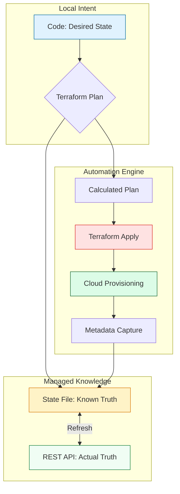

# 💾 Terraform State Fundamentals: The Memory of the Cloud

> **"Infrastructure without state isn't automation; it's just a script. State is the single source of truth that turns a collection of API calls into a managed infrastructure lifecycle. In the cloud, the deed to the house is a JSON file."**

Welcome to the foundation of **Terraform Operations**. Before you can manage complex, multi-team production environments, you must master the **State File**. This module covers the standards of mapping, drift detection, and the strict metadata principles that allow Terraform to safely manage millions of dollars of cloud resources.

**Why This Matters for Junior DevOps Engineers:**
- 🚨 **Production Safety**: 80% of accidental deletions stem from a misunderstanding of how Terraform maps state to physical reality.
- � **Operational Cost**: State acts as a high-speed cache; without it, every `plan` would take hours of slow API calls.
- 🎯 **Interview Gatekeeper**: State lifecycle questions are the "FizzBuzz" of DevOps interviews; if you don't know state, you aren't hired.
- � **Daily Triage**: You will use `terraform state` commands to fix infrastructure drift and refactor code daily.

---

## 📚 Table of Contents

1. [The State Lifecycle](#-the-state-lifecycle)
2. [Anatomy of a .tfstate File (Deep-Dive)](#-anatomy-of-a-tfstate-file-deep-dive)
3. [The Logic: Refreshing and Drift](#-the-logic-refreshing-and-drift)
4. [Backend Implementation Standards](#-backend-implementation-standards)
5. [Real-World DevOps Scenarios](#-real-world-devops-scenarios)
6. [Professional State Command Mastery](#-professional-state-command-mastery)
7. [Common Pitfalls & Solutions](#-common-pitfalls--solutions)
8. [Hands-On Exercises](#-hands-on-exercises)
9. [Interview Preparation](#-interview-preparation)
10. [Knowledge Check](#-knowledge-check)

---

## 🏗️ The State Lifecycle

Terraform state isn't just a file; it's a dynamic bridge that undergoes constant synchronization.



### 🔍 Lifecycle Breakdown for Beginners

**Stage 1: Intent Mapping**
- **What**: Terraform reads your `.tf` files.
- **Why**: It extracts the *names* you gave things (e.g., `aws_instance.web`).

**Stage 2: The Reality Check (Refresh)**
- **What**: Terraform queries the S3/Azure/GCP API using the IDs in your state.
- **Why**: To see if a human manually changed a setting (e.g., changed an instance size) in the console.

**Stage 3: Delta Calculation**
- **What**: Comparing **Desired State** (Code) vs **Current State** (Cloud).
- **Goal**: Find the minimum amount of work to reach the goal.

**Stage 4: Metadata Persistence**
- **What**: Recording the new Cloud ID (e.g., `i-0abcdef123`) into the JSON state.
- **Why**: If Terraform doesn't "remember" the ID, it will try to create a duplicate resource next time.

---

## 🔐 Anatomy of a .tfstate File (Deep-Dive)

### The JSON Structure
A `.tfstate` file is a strict JSON document. Understanding its raw structure is essential for debugging.

```json
{
  "version": 4,
  "terraform_version": "1.5.0",
  "serial": 12,
  "lineage": "550e8400-e29b-41d4-a716-446655440000",
  "outputs": {
     "lb_ip": { "value": "1.2.3.4", "type": "string" }
  },
  "resources": [
    {
      "mode": "managed",
      "type": "aws_instance",
      "name": "web",
      "provider": "provider[\"registry.terraform.io/hashicorp/aws\"]",
      "instances": [
        {
          "schema_version": 1,
          "attributes": {
            "id": "i-0987654321fedcba",
            "ami": "ami-0c55b159cbfafe1f0",
            "instance_type": "t2.micro",
            "tags": { "Name": "Prod-Web" }
          }
        }
      ]
    }
  ]
}
```

### Key Field Deep-Dive

| Field | Production Purpose | Analogy |
|:---|:---|:---|
| **`version`** | Schema version (V4 is standard for TF 1.0+). | The language version of the deed. |
| **`terraform_version`** | Prevents older TF binaries from corrupting newer state. | The ink used by the architect. |
| **`serial`** | Monotonic integer. Every successful `apply` increases it. | The version number of the blueprints. |
| **`lineage`** | Unique ID for the project life. Prevents state collisions. | The DNA of the infrastructure stack. |

---

## 🔐 Local vs. Remote State Standards

### Why Local State is a Production Hazard
❌ **BAD: Local terraform.tfstate**
```bash
# Problem 1: It's on YOUR laptop. Team members can't see it.
# Problem 2: No Locking. Two people can run 'apply' simultaneously.
# Problem 3: Secrets. Your DB password is now in plain text on your SSD.
```
 ✅ **GOOD: Remote S3 Backend**
```hcl
terraform {
  backend "s3" {
    bucket         = "company-tf-state"
    key            = "prod/vpc/terraform.tfstate"
    region         = "us-east-1"
    encrypt        = true              # MUST BE TRUE
    dynamodb_table = "terraform-locks" # ENABLES STATE LOCKING
  }
}
```

---

## 🚠 The Logic: Refreshing and Drift

### What is Drift?
Drift is the measurable difference between **Code** and **Physical Reality**.

- **Refresh**: Corrects the **State** to match the **Cloud**.
- **Plan**: Corrects the **Cloud** to match the **Code**.

### The "Drift" Workflow
1. **Cloud Change**: Admin manually deletes a Security Group via AWS Console.
2. **State**: Still has a record of that Security Group.
3. **Terraform Refresh**: Queries AWS, realizes the ID is gone, removes it from **State**.
4. **Terraform Plan**: Sees code says "Create SG" but state is empty. Proposes **"Create"**.
5. **Applied Reality**: Infrastructure is restored to the desired state defined in code.

---

## 🎭 Real-World DevOps Scenarios

### 🛡️ Scenario 1: The "Ghost" Resource Outage

**The Incident:** A junior SRE deleted a "test" VPC Peering connection in the AWS Console, thinking it was unused.

**The Failure:** The peering was actually production-critical. Terraform still had it in the state. When the Senior SRE ran `terraform plan` for a DIFFERENT component, they used `-refresh=false` to save time.

**The Impact:**
- ❌ Routing was broken for 4 hours.
- ❌ Terraform reported "All systems go" because its memory (State) was out of sync.

**The Fix:** Standardize on full refreshes for all PR checks. Drift detection is useless if you skip the refresh.

**The Lesson:** The State File is the **Source of Truth**, but the Cloud API is the **Reality**. Treat them as a dual-validation system.

### 🔥 Scenario 2: The "Version Jump" Corruption

**The Incident:** A team was running Terraform `v0.12`. A contractor ran `terraform apply` using their local `v1.5` binary.

**The Failure:** Terraform v1.5 upgraded the state file format automatically to Version 4. 

**The Impact:**
- ❌ The rest of the team (on v0.12) could no longer read the upgraded state.
- ❌ Production changes were halted for 2 days until everyone's environment was synchronized.

**The Fix:** Always use a version lock.
```hcl
terraform {
  required_version = ">= 1.5.0"
}
```

---

## � Professional State Policy (The Boilerplate)

Every production-grade project should follow this structure for isolation and safety.

### The "SRE Standard" Backend Configuration

```hcl
# backend.tf
# ─────────────────────────────────────────────────────
# This standard ensures:
# 1. State Isolation (Key paths per environment)
# 2. State Locking (DynamoDB)
# 3. Encryption at Rest (S3)
# 4. Peer-Reviewed binaries (Version pinning)
# ─────────────────────────────────────────────────────

terraform {
  required_version = "~> 1.5.0" # Prevents version jumps

  backend "s3" {
    # The S3 Bucket should have Versioning ENABLED
    bucket = "org-infrastructure-state-${var.environment}" 
    
    # Pathing standard: <org>/<account>/<region>/<component>.tfstate
    key    = "infrastructure/networking/vpc.tfstate"
    
    region = "us-east-1"
    
    # Mandatory Encryption
    encrypt = true
    
    # Mandatory State Locking
    # DynamoDB table must have 'LockID' (String) as Partition Key
    dynamodb_table = "terraform-lock-table"
    
    # Security: Require SSL for backend interactions
    # (Achieved via S3 Bucket Policy, but mentioned here for policy)
  }
}
```

---

## ⚠️ Common Pitfalls & Solutions

### Pitfall 1: Manual State Editing
**Problem**: "I'll just change this ID in the JSON file to fix the error."
**The Result**: Serial/Lineage mismatch or syntax error. Terraform crashes and refuses to read the file.
**Solution**: Use `terraform state mv` or `terraform state rm`.

### Pitfall 2: Local State Sprawl
**Problem**: Different developers have fragmented `terraform.tfstate` files on their local drives.
**The Result**: Conflict. Two people create the same S3 bucket, causing "Already Exists" errors.
**Solution**: Enforce a Remote Backend in your `main.tf` immediately.

### Pitfall 3: Not Versioning the S3 Bucket
**Problem**: Someone accidentally deletes a folder in the S3 state bucket.
**The Result**: All infrastructure history is lost. Terraform wants to recreate the world.
**Solution**: Enable **S3 Versioning** on your state bucket so you can roll back.

---

## 🎯 Hands-On Exercises

### Exercise 1: The Anatomy Audit
**Objective**: Read the "Matrix" and understand the JSON.
1. Run `terraform apply` for a simple resource (like a `null_resource` or `local_file`).
2. Open the `terraform.tfstate` file in VS Code.
3. Identify the `serial` number.
4. Run `apply` again with a small change. Watch the `serial` increment.

### Exercise 2: Refactoring without Damage
**Objective**: Rename a resource and keep the cloud alive.
1. Create a resource `aws_instance.server_A`.
2. Rename it in code to `aws_instance.app_server`.
3. Try a `terraform plan`. It should say **Destroy/Create**.
4. Use `terraform state mv aws_instance.server_A aws_instance.app_server`.
5. Run `plan` again. It should now say **"No changes"**.

### Exercise 3: Importing Reality
**Objective**: Bring a manually created resource into Terraform state.
1. Manually create an S3 bucket in the AWS Console.
2. Write a `resource "aws_s3_bucket" "manual" {}` block in your code.
3. Use `terraform import aws_s3_bucket.manual <bucket-name>`.
4. Verify the bucket attributes are now in your state JSON.

---

## 🎙️ Interview Preparation

### Foundation Questions

**1. "Why is the Terraform state file written in JSON instead of HCL?"**
**Answer**: JSON is the industry standard for metadata exchange. It is predictable, machine-readable, and easy for the cloud provider's API to map to. HCL is optimized for humans to write; JSON is optimized for Terraform to read/write at high speeds.

**2. "What happens if a state file is deleted but the infrastructure still exists?"**
**Answer**: Terraform "loses its memory." On the next `apply`, it will try to create every resource from scratch. If those resources have unique global names (like S3 buckets), the Cloud API will throw an "Already Exists" error, and the deployment will fail. You would then need to manually `import` every resource back into a new state.

---

### Advanced Scenario Questions

**3. "Explain the significance of the 'Lineage' UUID."**
**Answer**: Lineage identifies the specific project. If you try to apply a state file from **Project A** into the folder for **Project B**, Terraform checks the lineage. If they don't match, it blocks the operation, preventing you from accidentally overwriting Project B's cloud infrastructure with Project A's data.

**4. "How do you resolve a stuck State Lock?"**
**Answer**: 
1. Verify no one is actually running a job (check CI/CD).
2. Grab the **Lock ID** from the error message.
3. Run `terraform force-unlock <LOCK_ID>`.
4. **Senior Note**: Only do this as a last resort; corruption is possible if the underlying process is still writing.

---

## 🧠 Knowledge Check

### Basic Concepts

**1. Which command update the state file with manual changes from the cloud?**
- [ ] `terraform plan`
- [x] `terraform refresh`
- [ ] `terraform pull`
- [ ] `terraform cloud-sync`

**2. Where is 'Sensitive' data (like DB passwords) stored in a remote state?**
- [ ] Encrypted by HCL logic only.
- [ ] Omitted from the state file entirely.
- [x] Stored in plain text within the JSON (requiring S3 encryption at rest).
- [ ] Hashed using BCrypt.

---

## 📖 Additional Resources
- [The Purpose of Terraform State](https://developer.hashicorp.com/terraform/language/state)
- [Remote Backends (Best Practices)](https://developer.hashicorp.com/terraform/language/settings/backends)
- [Managing Drift at Scale](https://www.hashicorp.com/blog/detecting-and-managing-drift-with-terraform)

---

## 🎯 Next Steps

After mastering State Fundamentals, you are ready to stop working on your machine and move to **Team Operations**.

**Proceed to**: [Part 1: Local vs Remote State →](../../02-Local-vs-Remote-State/README.md)

---

## 🎓 Self-Assessment Checklist

Before moving to the next module, ensure you can:
- [ ] Locate the `serial` and `lineage` fields in a raw JSON file.
- [ ] Explain why `terraform state mv` is safer than manual JSON editing.
- [ ] Define what "Drift" is and how `refresh` identifies it.
- [ ] Configure a basic S3 backend with DynamoDB locking.
- [ ] Explain why committing state to Git is a security violation.
- [ ] Perform a basic `terraform import` of a manually created resource.

**Score yourself**: 5+/6 = Ready to advance | <5 = Review the State Lifecycle diagram.

---
**Status**: ✅ Completed (2026-02-02)
