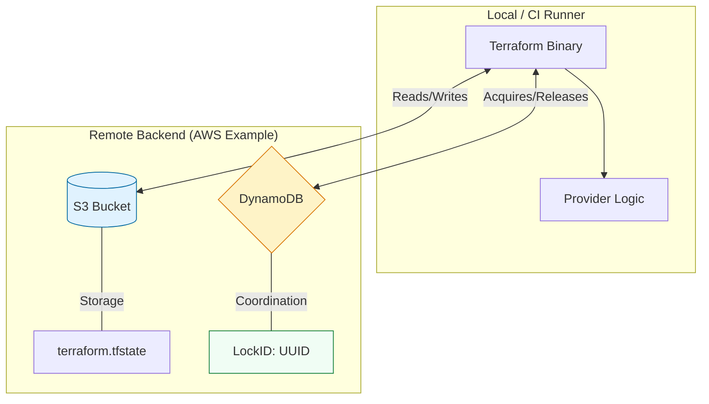

# ☁️ Remote State Backends: The Foundation of Engineering Scale

> **"A backend is the bridge between your local laptop and the shared truth of the cloud. Without a robust backend, you aren't managing infrastructure; you're just writing code that overwrites other people's work."**

Welcome to **The Engine**. In previous modules, we established *why* remote state is necessary. Now, we dive into *how* it works under the hood. In Terraform, a **Backend** defines two things: **Where** your state is stored and **How** your operations are executed. Mastering backends is the prerequisite for building high-concurrency, team-based automation.

**Why This Matters for Junior DevOps Engineers:**
- 🛡️ **Data Integrity**: Backends prevent "Double-Apply" corruptions that can halt production deployments.
- 🔐 **Security Logic**: You'll learn how to keep credentials out of code using **Partial Configurations**.
- 🛠️ **Disaster Recovery**: You will be the one tasked with fixing "Stuck Locks" and restoring state from S3 versions.
- 🤝 **Team Enablement**: Proper backend design allows dozens of engineers to work on the same cloud account without collisions.

---

## 📚 Table of Contents

1. [The Backend Architecture](#-the-backend-architecture)
2. [Types of Backends: Standard vs. Enhanced](#-types-of-backends-standard-vs-enhanced)
3. [Cloud Provider Deep-Dives](#-cloud-provider-deep-dives)
4. [Advanced Operational Patterns](#-advanced-operational-patterns)
5. [Real-World DevOps Scenarios](#-real-world-devops-scenarios)
6. [Professional Policy: The "SRE Standard" Backend](#-professional-policy-the-sre-standard-backend)
7. [Common Pitfalls & Solutions](#-common-pitfalls--solutions)
8. [Hands-On Exercises](#-hands-on-exercises)
9. [Interview Preparation](#-interview-preparation)
10. [Knowledge Check](#-knowledge-check)

---

## 🏗️ The Backend Architecture

For team environments, we use a two-service architecture to separate **Storage** from **Coordination**.



### The "Handshake" Workflow
1. **Instruction**: You run `terraform plan`.
2. **Locking**: Terraform asks DynamoDB: "Can I have the lock?"
3. **Download**: Terraform pulls the latest `.tfstate` from S3 into memory.
4. **Execution**: It performs the diff and shows you the plan.
5. **Unlock**: Once done, it releases the lock in DynamoDB so others can work.

---

## 📂 Types of Backends

Terraform classifies backends based on where the **compute** happens.

### 1. Standard Backends (Storage Only)
- **Function**: They only store the state file.
- **Compute**: The `plan` and `apply` logic runs on **your machine**.
- **Examples**: `s3`, `gcs`, `azurerm`, `consul`.
- **Verdict**: Best for teams building their own CI/CD pipelines (Jenkins, GitHub Actions).

### 2. Enhanced Backends (Storage + Compute)
- **Function**: They store the state AND execute the code on their own servers.
- **Compute**: Logic runs in **The Cloud**.
- **Examples**: `remote` (Terraform Cloud), **Terraform Enterprise**.
- **Verdict**: Best for organizations wanting "Hassle-Free" state and consistent run environments.

---

## ☁️ Cloud Provider Deep-Dives

### 1. The AWS Standard (S3 + DynamoDB)
- **Pros**: Dirt cheap, highly durable, standard across 90% of AWS shops.
- **Cons**: Requires two separate resources (Bucket + Table) created *before* use.
- **Key Requirement**: DynamoDB must have a Partition Key named `LockID` (String).

### 2. The Azure Standard (azurerm)
- **Pros**: Native locking via "Blob Leases" (no extra DB needed).
- **Cons**: Requires a Storage Account and Container.
- **Key Requirement**: Use `resource_group_name`, `storage_account_name`, and `container_name`.

### 3. The Google Standard (gcs)
- **Pros**: Simplest configuration. Native locking built into the bucket.
- **Cons**: Bucket names must be globally unique across GCP.
- **Key Requirement**: The `prefix` attribute acts as your sub-directory in the bucket.

---

## ⚙️ Advanced Operational Patterns

### 1. Partial Configuration (Security Best Practice)
Never hardcode your bucket name or environment keys in the code. This makes the code non-portable.

**In `backend.tf` (The Skeleton):**
```hcl
terraform {
  backend "s3" {
    # We leave bucket and key empty!
    region = "us-east-1"
  }
}
```

**During `terraform init` (The Injection):**
```bash
terraform init \
  -backend-config="bucket=prod-state-12345" \
  -backend-config="key=networking/vpc.tfstate" \
  -backend-config="dynamodb_table=app-locks"
```
**Why?** This allows you to use the **same code** for 50 different customers or 3 different environments just by changing the `init` command.

### 2. Recovery: The Force Unlock
If your terminal crashes or the internet dies during an `apply`, Terraform might leave the lock "Stuck."

**The Error**: `Error: Error acquiring the state lock`
**The Solution**:
1. Check the error message for the `Lock ID`.
2. Verify NO ONE else is running a real apply.
3. Run: `terraform force-unlock <LOCK_ID>`

---

## 🎭 Real-World DevOps Scenarios

### 🛡️ Scenario 1: The "Manual Bucket Cleanup" Disaster
**The Context**: An intern was tasked with cleaning up "unused" AWS resources and deleted an S3 bucket named `temp-bucket-terraform`.
**The Failure**: That bucket held the state for the entire development cluster.
**The Impact**: Terraform "lost its mind." The team couldn't delete or update anything without manually `importing` 500+ resources.
**The Lesson**: Enable **S3 MFA Delete** and **Versioning**. State buckets should be the most protected resources in your account.

### 🔥 Scenario 2: The "Cross-Cloud" Dependency Hit
**The Context**: A multi-cloud team managed Azure resources but used an AWS S3 bucket for the state (to "keep everything in one place").
**The Failure**: AWS `us-east-1` had a major outage. 
**The Impact**: Even though Azure was healthy, the team couldn't scale their Azure cluster because they couldn't read the state from AWS.
**The Lesson**: Store state in the **Same Cloud** as the resources to avoid "Fate Sharing" across providers.

### 🚨 Scenario 3: The "Dynamic Workspace" Leak
**The Context**: A developer hardcoded the same `key` value for both `staging` and `production` folders.
**The Failure**: When they ran `init` in the production folder, they accidentally migrated the staging state over the production state.
**The Impact**: Production resources were deleted because they weren't in the staging state file.
**The Fix**: Use **Partial Configuration** to ensure paths are injected correctly by the CI/CD pipeline.

---

## 💻 Professional Policy: The "SRE Standard" Backend

### Mandatory Governance Boilerplate

```hcl
# backend.tf
# ─────────────────────────────────────────────────────
# This config ensures multi-layer protection:
# 1. State Isolation: No hardcoded paths
# 2. Integrity: Forced encryption
# 3. Concurrency: DynamoDB Locking
# 4. Versioning: (Configured at the S3 level)
# ─────────────────────────────────────────────────────

terraform {
  backend "s3" {
    # Region is the only thing we 'should' hardcode
    region = "us-east-1"
    
    # Security must be explicitly true
    encrypt        = true
    
    # We omit bucket and key to support 
    # 'Partial Configuration' via CI/CD
  }
}
```

---

## ⚠️ Common Pitfalls & Solutions

### Pitfall 1: Init without Migration
**Problem**: You change your backend config and run `init`, but when it asks to copy the state, you say `no`.
**Result**: Terraform creates a blank state. Next `apply` will try to recreate everything, causing "Resource Already Exists" errors.
**Solution**: Always say `yes` to migration unless you are explicitly starting over.

### Pitfall 2: No DynamoDB Table
**Problem**: You configure S3 but forget to create the DynamoDB table first.
**Result**: `terraform init` fails immediately.
**Solution**: The backend storage (Bucket/DB) must exist **BEFORE** you run init.

---

## 🎯 Hands-On Exercises

### Exercise 1: The Partial Config Audit
1. Create a simple project with a `null_resource`.
2. Configure a backend with NO bucket or key.
3. Attempt to `init`. Observe the failure.
4. `init` again using `-backend-config` flags. Verify it works.

### Exercise 2: The Lock Jam
1. Run `terraform apply` in one window. When it asks for confirmation, **STAY THERE**.
2. Open a second window and run `terraform plan`.
3. Capture the error. Identify the `Lock ID` and the `Who` (your username).

---

## 🎙️ Interview Preparation

### Foundation Questions

**1. "What is the Partition Key for a DynamoDB lock table?"**
- **Answer**: It must be exactly `LockID` and it must be a **String**. If you name it anything else, Terraform won't be able to find it.

**2. "Explain the 'Chicken and Egg' problem of backends."**
- **Answer**: Terraform needs a backend to store state, but the backend itself (S3 Bucket) is an AWS resource. You usually have to create the state bucket manually or with a separate "Bootstrap" Terraform project before you can use it.

---

### Advanced Scenario Questions

**3. "How do you handle secrets that are stuck in a state file?"**
- **Answer**: You don't "hide" them in state; you keep them out of state. 1. Use **AWS Secrets Manager**. 2. Store the ARN in Terraform. 3. Pass values via `-var` from the CI/CD environment. **State is not a vault.**

**4. "What is the difference between `-reconfigure` and `-migrate-state`?"**
- **Answer**: 
  - `-migrate-state`: Copies your existing state to the new location.
  - `-reconfigure`: Ignores existing state and starts fresh with the new backend settings.

---

## 🧠 Knowledge Check

### Basic Concepts

**1. Which backend allows you to skip local compute and run logic on a remote server?**
- [ ] `s3`
- [ ] `azurerm`
- [x] `remote` (Terraform Cloud)
- [ ] `consul`

**2. True or False: Azure Storage supports locking without DynamoDB.**
- [x] True (It uses Blob Leases).
- [ ] False.

**3. What happens if you run `terraform force-unlock` while an apply is actually running?**
- [ ] It speeds up the apply.
- [ ] It creates a backup.
- [x] It risks corrupting the state file by allowing a second process to write simultaneously.
- [ ] It refreshes the cloud metadata.

---

## 📖 Additional Resources
- [HashiCorp: Backend Configuration Guide](https://developer.hashicorp.com/terraform/language/settings/backends)
- [Managing S3 Backends with CloudFormation/Terraform](https://repost.aws/knowledge-center/s3-terraform-backend)

---

## 🎯 Next Steps

Now that you've mastered the backends, it's time to learn how to keep your code clean and portable.

**Proceed to**: [Part 2: State Isolation Patterns →](../../02-State-Isolation/README.md)

---

## 🎓 Self-Assessment Checklist

Before moving to the next module, ensure you can:
- [ ] Explain why backends are necessary for team collaboration.
- [ ] Identify the difference between a Standard and Enhanced backend.
- [ ] Set up an AWS S3 backend with DynamoDB locking.
- [ ] Resolve a "Stuck Lock" using the CLI.
- [ ] Configure a "Partial Backend" and explain the security benefit.
- [ ] Explain why you should enable versioning on state buckets.

**Score yourself**: 5+/6 = Ready to advance | <5 = Review the Architecture Visualization.

---
**Status**: ✅ Enhanced (2026-02-02)
