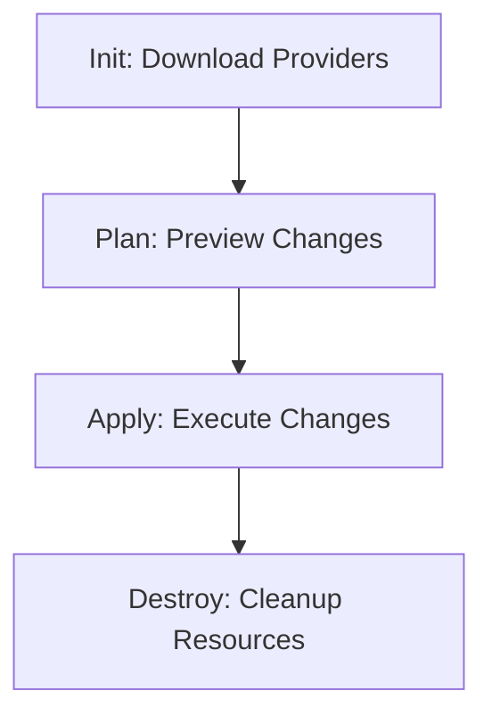

# Terraform Fundamentals

Terraform is a tool for building, changing, and versioning infrastructure safely and efficiently. It uses a **Declarative** approach—you describe *what* you want, and Terraform figures out *how* to build it.

## 📚 Module Structure
- **[Boilerplates](./Boilerplates/)**: `main.tf` (Basic Provider & Resource).
- **[CHALLENGES](./CHALLENGES.md)**: S3 provisioning and variable usage.

---

## 🔑 Key Concepts

| Concept | Description |
| :--- | :--- |
| **Provider** | Plugins that talk to APIs (AWS, Azure, GCP, Cloudflare). |
| **Resource** | The "Thing" you want to create (EC2 instance, S3 Bucket). |
| **Plan** | A "Dry Run" that shows what Terraform *would* do without acting. |
| **Apply** | The command that executes the changes. |
| **Idempotency** | Running `apply` with no changes results in "No changes needed." |

---

## 🏗️ Workflow: The Lifecycle

---

## 🛡️ Best Practices
- **Never hardcode credentials**: Use `aws configure` or Environment Variables.
- **Review before Apply**: Always read the `plan` output to ensure you aren't deleting something critical.

---

## ❓ Interview Questions

1. **What is Infrastructure as Code?**
   - *Answer*: Managing and provisioning infrastructure through machine-readable definition files, rather than physical hardware configuration or interactive configuration tools.
2. **Explain the difference between Declarative and Imperative.**
   - *Answer*: Imperative (Bash/Python) defines the *steps* to reach a goal. Declarative (Terraform) defines the *end goal* and lets the tool find the steps.
3. **What is `terraform init` used for?**
   - *Answer*: It initializes the working directory, downloads the necessary provider plugins, and sets up the backend for state storage.

---

[Next: HCL and IaC](../02-HCL-and-IaC/README.md)