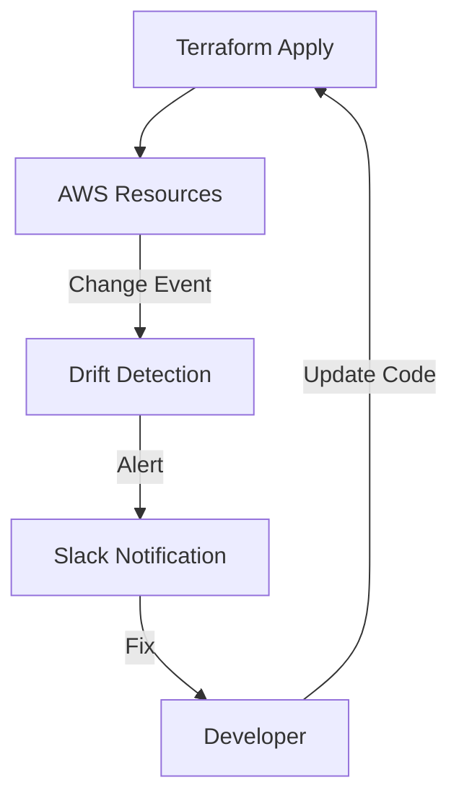

# Monitoring and Observability

"If you can't measure it, you can't manage it." In Terraform, this means tracking Cost, Drift, and Changes.

## 1. Cost Estimation (`infracost`)

Cloud bills are the number one surprise in DevOps. Stop the bleeding *before* you merge.

**Tool**: `infracost` (Open Source).
**Workflow**:
1.  Developer opens a Pull Request.
2.  CI runs `infracost breakdown --path .`.
3.  Bot comments: "This PR increases monthly cost by **$520** (Adding 2x r5.large RDS)."

**Why it matters**: It shifts cost awareness left, to the engineer writing the code.

---

## 2. Drift Detection

Drift is when reality diverges from your Terraform code.

### Strategies
1.  **Scheduled Plan**: Run `terraform plan -detailed-exitcode` nightly. If it returns `2`, alert the team.
2.  **AWS Config / Cloud Asset Inventory**: Native cloud tools that track configuration changes history.

### Visual: The Feedback Loop



---

## 3. Tagging Strategy

Tags are the *only* way to attribute costs in a shared cloud account.

**Mandatory Tags Pattern**:
```hcl
locals {
  common_tags = {
    Project     = var.project_name
    Environment = var.environment
    Owner       = "Team-DevOps"
    ManagedBy   = "Terraform"
    CostCenter  = "CC-1234"
  }
}

resource "aws_s3_bucket" "this" {
  tags = local.common_tags
}
```
**Enforcement**: Use **Tagging Policies** (SCP or Azure Policy) to deny resource creation if mandatory tags are missing.

---

## 4. Audit Logging

Who deleted the database? Terraform (usually) doesn't log *who* ran the apply unless you use a managed platform.

1.  **CloudTrail (AWS)**: Logs every API call. Filter by `userAgent = Terraform`.
2.  **State File Versioning**: S3 Versioning allows you to rollback the state file to see what it looked like yesterday.
3.  **CI/CD Logs**: The build logs are the history of your infrastructure changes.

---

## 5. Real-Life Scenarios

### Scenario 1: "The $10,000 Bill"
**Problem**: A developer spun up a "test" Load Balancer and forgot about it.
**Event**: At the end of the month, the bill arrived.
**Fix**: Implemented **Infracost** to show the recurring cost of resources in the PR, and **auto-tagging** to identify the owner of the orphan resource.

### Scenario 2: "The Shadow Admin"
**Problem**: A senior engineer manually attached an `AdministratorAccess` policy to their IAM User to "debug" an issue.
**Event**: They forgot to remove it.
**Discovery**: Nightly Drift Detection ran `terraform plan` and flagged that the IAM User resource had an extra policy attachment not in the code.
**Fix**: `terraform apply` effectively stripped the admin rights, restoring security.

### Scenario 3: "The Forgotten State"
**Problem**: A deployment failed halfway, leaving the `terraform.tfstate.lock` file in DynamoDB.
**Event**: Subsequent builds failed with "Error exquiring the state lock."
**Fix**: Checked CI logs to confirm the previous build was dead, then manually used `terraform force-unlock` (with extreme caution).

---

## 6. ❓ Interview Questions

1.  **How do you prevent cost overruns in Terraform?**
    *   **Answer**: Use tools like Infracost in CI, set up AWS Budgets/Alerts, and enforce strict tagging for cost allocation.

2.  **What does `terraform force-unlock` do?**
    *   **Answer**: It removes the lock entry from the backend (e.g., DynamoDB). It should only be used if you are 100% sure no other process is running, otherwise, you risk state corruption.

3.  **How can you find out who deleted a resource managed by Terraform?**
    *   **Answer**: Check CloudTrail (AWS) or Activity Log (Azure). Terraform CI logs will show *when* the apply happened, and the Git commit will show *who* wrote the code.

4.  **Why tag resources with `ManagedBy = Terraform`?**
    *   **Answer**: It helps distinguish between IaC-managed resources and manually created ones when viewing the Cloud Console.

5.  **Is Drift always bad?**
    *   **Answer**: Not always. Autoscaling groups change capacity dynamically (Good Drift). However, configuration drift (Security Group rules) is usually bad.

6.  **What is "FinOps"?**
    *   **Answer**: Financial Operations. The practice of bringing financial accountability to the variable spend model of cloud (using Tags and Cost Tools).

7.  **Can Terraform monitor application performance (APM)?**
    *   **Answer**: No. Terraform deploys the monitoring *infrastructure* (e.g., Datadog agent, CloudWatch Alarms), but it does not perform the monitoring itself.

8.  **How do you handle "Orphaned Resources"?**
    *   **Answer**: Resources created manually are invisible to Terraform unless Imported. Use tools like `aws-nuke` or Cloud Config to find untagged/unmanaged resources.

9.  **What is a "Sentinel Policy" for Cost?**
    *   **Answer**: A rule like "Prevent provisioning of `ml.p3.16xlarge` instances unless the environment is Production."

10. **Does `terraform plan` work if the cloud credentials are expired?**
    *   **Answer**: No. It needs to make API calls to refresh the state. It will fail with an Auth error.

---

## 7. 🧠 Knowledge Check (Quiz)

### Cost & FinOps
1.  **Infracost runs during:**
    *   [x] The Pull Request (CI).
    *   [ ] After deployment.

2.  **The specific tag used to track billing is usually:**
    *   [x] `CostCenter`
    *   [ ] `Name`

3.  **If a resource is untagged:**
    *   [x] It is hard to allocate its cost to a specific team.
    *   [ ] It is free.

4.  **FinOps stands for:**
    *   [x] Financial Operations.
    *   [ ] Final Operations.

5.  **Does Terraform limit your spending by default?**
    *   [ ] Yes.
    *   [x] No, it will provision whatever you ask for (until you hit cloud quotas).

### Monitoring & Drift
6.  **CloudTrail records:**
    *   [x] API calls (Who did what).
    *   [ ] CPU usage.

7.  **Drift Detection works by:**
    *   [x] Comparing State to Reality.
    *   [ ] Checking Git logs.

8.  **To visualize the "Plan" flow:**
    *   [x] Use CI/CD output artifacts.
    *   [ ] Use `terraform graph`.

9.  **If `terraform plan` fails with "Lock Error":**
    *   [x] Another process is running (or crashed).
    *   [ ] The code is invalid.

10. **`force-unlock` requires:**
    *   [x] The Lock ID.
    *   [ ] The Admin Password.

### Scenarios
11. **Shadow IT refers to:**
    *   [x] Technology deployed without IT department approval/oversight (Manual changes).
    *   [ ] Dark Mode.

12. **If an Autoscaling Group adds an instance:**
    *   [x] Terraform ignores it (using `lifecycle { ignore_changes }` usually).
    *   [ ] Terraform deletes it.

13. **Why use `ManagedBy` tags?**
    *   [x] To warn manual operators "Don't touch this, it's defined in code".
    *   [ ] To look cool.

14. **Can you set CloudWatch Alarms via Terraform?**
    *   [x] Yes, they are just another resource (`aws_cloudwatch_metric_alarm`).
    *   [ ] No.

15. **If Infracost predicts $0 cost change:**
    *   [x] You likely modified non-billable resources (like Security Groups).
    *   [ ] The tool is broken.

### General
16. **Is Terraform a Monitoring Tool?**
    *   [ ] Yes.
    *   [x] No, it's a Provisioning Tool.

17. **Which is better for audit: Git History or CloudTrail?**
    *   [x] You need both. Git shows intent; CloudTrail shows execution.
    *   [ ] Just Git.

18. **To enable S3 Access Logging:**
    *   [x] Configure the bucket resource to send logs to a target bucket.
    *   [ ] It's on by default.

19. **Can you "import" a manually created resource to stop it being Shadow IT?**
    *   [x] Yes (`terraform import`).
    *   [ ] No.

20. **The `.terraform.lock.hcl` is unrelated to:**
    *   [x] DynamoDB State Locking (They share the name "lock" but do different things).
    *   [ ] Provider versions.