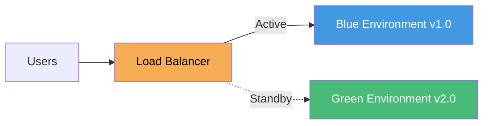
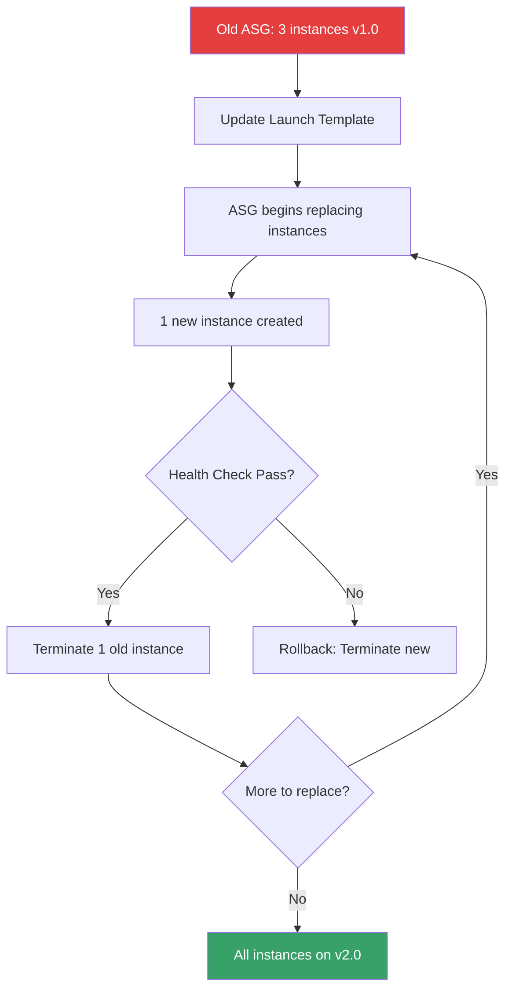
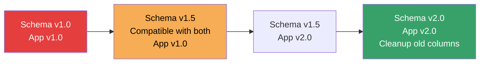

# Zero-Downtime Deployment with Terraform

Achieving zero-downtime deployments with Infrastructure as Code requires careful planning and the right patterns. This guide covers battle-tested strategies for updating infrastructure without impacting users.

---

## Understanding the Challenge

**The Problem**: Traditional infrastructure updates often require destroying resources before creating new ones, causing service interruptions.

**The Solution**: Use Terraform patterns that ensure new resources are fully operational before removing old ones.

---

## Deployment Strategies

### 1. Blue/Green Deployment

Create an entirely new environment (Green) alongside the existing one (Blue), then switch traffic.



**After Validation**: Switch Load Balancer traffic to Green, then destroy Blue.

#### Terraform Implementation

```hcl
resource "aws_lb_target_group" "blue" {
  name     = "app-blue"
  port     = 80
  protocol = "HTTP"
  vpc_id   = aws_vpc.main.id
}

resource "aws_lb_target_group" "green" {
  name     = "app-green"
  port     = 80
  protocol = "HTTP"
  vpc_id   = aws_vpc.main.id
}

resource "aws_lb_listener_rule" "main" {
  listener_arn = aws_lb_listener.front_end.arn

action {
    type             = "forward"
    target_group_arn = var.active_env == "blue" ? aws_lb_target_group.blue.arn : aws_lb_target_group.green.arn
  }

condition {
    path_pattern {
      values = ["/*"]
    }
  }
}
```

---

### 2. Rolling Deployment with Auto Scaling Groups (ASG)

Update instances gradually by changing the Launch Template/Configuration and letting ASG replace instances one at a time.



#### Terraform Configuration

```hcl
resource "aws_launch_template" "app" {
  name_prefix   = "app-"
  image_id      = var.ami_id
  instance_type = "t3.micro"

lifecycle {
    create_before_destroy = true
  }
}

resource "aws_autoscaling_group" "app" {
  name                = "app-asg"
  desired_capacity    = 3
  max_size            = 6
  min_size            = 3
  health_check_type   = "ELB"
  health_check_grace_period = 300

launch_template {
    id      = aws_launch_template.app.id
    version = "$Latest"
  }

# Zero-downtime configuration
  wait_for_capacity_timeout = "10m"
  instance_refresh {
    strategy = "Rolling"
    preferences {
      min_healthy_percentage = 90
      instance_warmup        = 300
    }
  }
}
```

---

### 3. Database Migration Strategy

Databases require special handling to avoid downtime.

#### Three-Phase Deployment



**Phase 1**: Add new columns (keep old ones)  
**Phase 2**: Deploy new application version (reads new columns, writes to both)  
**Phase 3**: Remove old columns after validation

```hcl
# Phase 1: Add new column without removing old
resource "aws_db_instance" "main" {
  apply_immediately = false  # Apply during maintenance window

# Use blue/green deployment for RDS
  blue_green_update {
    enabled = true
  }
}
```

---

### 4. Canary Deployment

Route a small percentage of traffic to the new version first.

```hcl
resource "aws_lb_listener_rule" "canary" {
  listener_arn = aws_lb_listener.front_end.arn
  priority     = 100

action {
    type             = "forward"
    forward {
      target_group {
        arn    = aws_lb_target_group.v1.arn
        weight = 90
      }
      target_group {
        arn    = aws_lb_target_group.v2_canary.arn
        weight = 10  # 10% traffic to new version
      }
    }
  }
}
```

---

## Terraform Lifecycle Meta-Arguments for Zero-Downtime

### create_before_destroy

Forces Terraform to create the replacement resource before destroying the old one.

```hcl
resource "aws_instance" "web" {
  ami           = var.ami_id
  instance_type = "t3.micro"

lifecycle {
    create_before_destroy = true
  }
}
```

**How it works**: When you change the AMI, Terraform will:
1. Create a new instance with the new AMI
2. Wait for it to be healthy
3. Only then destroy the old instance

### prevent_destroy

Prevents accidental deletion of critical resources.

```hcl
resource "aws_db_instance" "production" {
  identifier = "prod-db"

lifecycle {
    prevent_destroy = true
  }
}
```

### ignore_changes

Useful when external systems modify resources (like autoscaling).

```hcl
resource "aws_autoscaling_group" "app" {
  desired_capacity = 3

lifecycle {
    ignore_changes = [desired_capacity]  # Let autoscaling adjust this
  }
}
```

---

## Real-Life Scenarios

### Scenario 1: The AMI Update Disaster

**Problem**: A team updated the AMI in their ASG configuration. Terraform destroyed all 20 instances simultaneously, then started creating new ones. The service was down for 8 minutes.

**Root Cause**: Default Terraform behavior destroys before creating when certain attributes change.

**Solution**: 
```hcl
resource "aws_launch_template" "app" {
  # ... configuration ...

lifecycle {
    create_before_destroy = true
  }
}

resource "aws_autoscaling_group" "app" {
  # ... configuration ...

instance_refresh {
    strategy = "Rolling"
    preferences {
      min_healthy_percentage = 75  # Always keep 75% instances healthy
    }
  }
}
```

---

### Scenario 2: Database Schema Change Without Downtime

**Problem**: Need to rename a database column from `user_name` to `username`. Direct rename causes application errors.

**Solution (Expand-Contract Pattern)**:

**Step 1 - Expand**: Add new column
```sql
ALTER TABLE users ADD COLUMN username VARCHAR(255);
UPDATE users SET username = user_name WHERE username IS NULL;
```

**Step 2 - Deploy v2 Application**: Reads from `username`, writes to both
```python
# Application writes to both columns
user.username = value
user.user_name = value  # Backwards compatibility
```

**Step 3 - After Validation**: Remove old column
```sql
ALTER TABLE users DROP COLUMN user_name;
```

---

### Scenario 3: Load Balancer Target Group Switchover

**Problem**: Need to deploy a new application version behind a load balancer without downtime.

**Solution**: Use target group weights

```hcl
# Deploy new target group alongside old
resource "aws_lb_target_group" "v1" {
  name = "app-v1"
  # ... config ...
}

resource "aws_lb_target_group" "v2" {
  name = "app-v2"
  # ... updated config ...
}

resource "aws_lb_listener_rule" "main" {
  listener_arn = aws_lb_listener.front_end.arn

action {
    type = "forward"
    forward {
      target_group {
        arn    = aws_lb_target_group.v1.arn
        weight = var.traffic_weight_v1  # Start 100, gradually decrease
      }
      target_group {
        arn    = aws_lb_target_group.v2.arn
        weight = var.traffic_weight_v2  # Start 0, gradually increase
      }
    }
  }
}
```

**Deployment Process**:
<b>1. Deploy v2 target group</b>
<details>
<summary>Show Answer</summary>
Answer: weight: 0%
</details>

2. Gradually shift: 90/10, 50/50, 10/90
3. Monitor errors at each step
4. Finally: 0/100
5. Destroy v1 resources

---

## Best Practices

### 1. Always Use Health Checks

```hcl
resource "aws_autoscaling_group" "app" {
  health_check_type         = "ELB"  # Not EC2
  health_check_grace_period = 300
}

resource "aws_lb_target_group" "app" {
  health_check {
    enabled             = true
    healthy_threshold   = 2
    unhealthy_threshold = 2
    timeout             = 5
    interval            = 30
    path                = "/health"
    matcher             = "200"
  }
}
```

### 2. Implement Connection Draining

```hcl
resource "aws_lb_target_group" "app" {
  deregistration_delay = 300  # Wait 5 minutes before terminating
}
```

### 3. Use Terraform Workspaces or Separate State Files

Never share state between Blue and Green environments.

```bash
terraform workspace new green
terraform apply -var="environment=green"
```

### 4. Test in Non-Production First

Always validate zero-downtime patterns in staging before production.

---

## Interview Questions

1. **What is the difference between Blue/Green and Rolling Deployment?**
   - *Answer*: Blue/Green creates an entirely new environment and switches all traffic at once. Rolling deployment gradually replaces instances one-by-one within the same environment.

2. **Why is `create_before_destroy` critical for zero-downtime?**
   - *Answer*: It ensures the new resource is fully operational before the old one is destroyed, preventing service interruption.

3. **How do you handle database schema changes without downtime?**
   - *Answer*: Use the Expand-Contract pattern: Add new columns (Expand), deploy application that writes to both, then remove old columns (Contract) after validation.

4. **What is connection draining and why is it important?**
   - *Answer*: Connection draining allows in-flight requests to complete before terminating an instance. This prevents abrupt connection closures when removing instances.

5. **How do you gradually shift traffic between versions?**
   - *Answer*: Use load balancer target group weights to incrementally move traffic (e.g., 90/10, 50/50, 10/90) while monitoring for errors.

6. **What is a canary deployment?**
   - *Answer*: Routing a small percentage of traffic (5-10%) to a new version first to validate it works before full rollout.

7. **Why should you never share Terraform state between Blue and Green?**
   - *Answer*: Separate state files provide complete isolation, preventing accidental destruction of the active environment when managing the inactive one.

8. **What is the purpose of health check grace period?**
   - *Answer*: It gives newly launched instances time to start up and become healthy before the load balancer starts health checking them.

9. **How do you rollback a failed deployment?**
   - *Answer*: For Blue/Green: switch traffic back to Blue. For Rolling: trigger Auto Scaling Group rollback. For database: restore from backup or redo migrations.

10. **What is the minimum healthy percentage in instance refresh?**
    - *Answer*: The minimum percentage of instances that must remain healthy during a rolling update (e.g., 75% means never go below 75% capacity).

---

## Comprehensive Quiz (25 Questions)

<b>1. What does "zero-downtime deployment" mean?</b>
<details>
<summary>Show Answer</summary>
Answer: B
</details>


<b>2. Which lifecycle argument creates new resources before destroying old ones?</b>
<details>
<summary>Show Answer</summary>
Answer: C
</details>


<b>3. In Blue/Green deployment, when do you destroy the Blue environment?</b>
<details>
<summary>Show Answer</summary>
Answer: C
</details>


<b>4. What is the purpose of connection draining?</b>
<details>
<summary>Show Answer</summary>
Answer: B
</details>


<b>5. Which is NOT a zero-downtime deployment strategy?</b>
<details>
<summary>Show Answer</summary>
Answer: D
</details>


<b>6. What percentage of traffic typically goes to canary deployment initially?</b>
<details>
<summary>Show Answer</summary>
Answer: B
</details>


<b>7. What does deregistration_delay control?</b>
<details>
<summary>Show Answer</summary>
Answer: B
</details>


<b>8. In ASG rolling updates, what does min_healthy_percentage = 90 mean?</b>
<details>
<summary>Show Answer</summary>
Answer: B
</details>


<b>9. What is the Expand-Contract pattern used for?</b>
<details>
<summary>Show Answer</summary>
Answer: B
</details>


<b>10. Which health check type is better for zero-downtime deployments?</b>
<details>
<summary>Show Answer</summary>
Answer: B
</details>


<b>11. What happens if you update an AMI without create_before_destroy?</b>
<details>
<summary>Show Answer</summary>
Answer: C
</details>


<b>12. How do you test a new version with 10% of traffic?</b>
<details>
<summary>Show Answer</summary>
Answer: B
</details>


<b>13. What is health_check_grace_period?</b>
<details>
<summary>Show Answer</summary>
Answer: A
</details>


<b>14. Which should you do FIRST in database schema migration?</b>
<details>
<summary>Show Answer</summary>
Answer: C
</details>


<b>15. What is the risk of shared state between Blue/Green environments?</b>
<details>
<summary>Show Answer</summary>
Answer: B
</details>


<b>16. How long should deregistration_delay typically be?</b>
<details>
<summary>Show Answer</summary>
Answer: B
</details>


<b>17. What does instance_warmup define?</b>
<details>
<summary>Show Answer</summary>
Answer: B
</details>


<b>18. In rolling updates, what happens if health check fails?</b>
<details>
<summary>Show Answer</summary>
Answer: B
</details>


<b>19. What is the benefit of target group weights?</b>
<details>
<summary>Show Answer</summary>
Answer: B
</details>


<b>20. Which is true about prevent_destroy lifecycle?</b>
<details>
<summary>Show Answer</summary>
Answer: B
</details>


<b>21. Why use separate Terraform workspaces for Blue/Green?</b>
<details>
<summary>Show Answer</summary>
Answer: B
</details>


<b>22. What should healthy_threshold be set to?</b>
<details>
<summary>Show Answer</summary>
Answer: B
</details>


<b>23. What does apply_immediately = false do for RDS?</b>
<details>
<summary>Show Answer</summary>
Answer: B
</details>


<b>24. In three-phase database migration, when do you drop old columns?</b>
<details>
<summary>Show Answer</summary>
Answer: C
</details>


<b>25. What is the purpose of wait_for_capacity_timeout in ASG?</b>
<details>
<summary>Show Answer</summary>
Answer: B
</details>


---

## Summary

Zero-downtime deployments require:
- ✅ Proper lifecycle management (`create_before_destroy`)
- ✅ Health checks and grace periods
- ✅ Progressive traffic shifting
- ✅ Connection draining
- ✅ Separate state management
- ✅ Testing in non-production first

**Remember**: "Hope is not a strategy" - always test your zero-downtime patterns before using them in production!