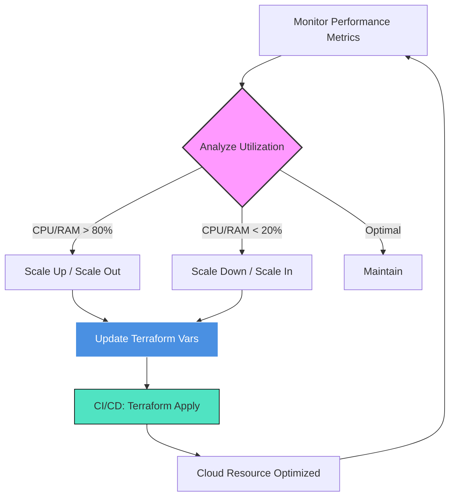

# 📏 Infrastructure Right-Sizing with Terraform

Right-sizing is the process of matching instance types and sizes to your workload performance and capacity requirements at the lowest possible cost. Terraform makes it easy to experiment with, automate, and enforce these sizes across its lifecycle.

## ⚖️ The Right-Sizing Balance
Efficient infrastructure lives at the intersection of performance and economy.



---
## 🛠️ Advanced Techniques for Right-Sizing

### 1. Dynamic Instance Selection using Data Sources
Instead of hardcoding, use data sources to find the most cost-effective architecture in a region.
```hcl
data "aws_ec2_instance_type_offering" "optimized" {
  filter {
    name   = "instance-type"
    values = ["t3.micro", "t3.small", "t2.micro"]
  }
  
  preferred_instance_types = ["t3.micro", "t3.small"]
}

resource "aws_instance" "app" {
  instance_type = data.aws_ec2_instance_type_offering.optimized.instance_type
  # ... other config ...
}
```
### 2. Auto Scaling Groups (<font color="#ff0000">ASG</font>) for Elasticity
Static right-sizing is often insufficient. Terraform allows you to define scaling policies that adjust capacity based on real-time demand.
```hcl
resource "aws_autoscaling_group" "web_asg" {
  max_size         = 10
  min_size         = 2
  desired_capacity = 2
  
  mixed_instances_policy {
    instances_distribution {
      on_demand_base_capacity                  = 0
      on_demand_percentage_above_base_capacity = 20 # Only use 20% On-Demand
      spot_allocation_strategy                 = "capacity-optimized"
    }
    # ... launch template config ...
  }
}
```
---
## 🏗️ Cloud-Specific Right-Sizing Mapping

| Workload Type | AWS Optimized | Azure Equivalent | GCP Equivalent |
| :--- | :--- | :--- | :--- |
| **General Purpose** | `t3`, `m6g` | `B-Series`, `D-Series` | `e2-standard`, `n2` |
| **Compute Heavy** | `c6g`, `c7g` | `F-Series` | `c2-standard` |
| **Memory Heavy** | `r6g`, `r7g` | `E-Series` | `m2-ultramem` |
| **Burstable** | `t3a` (AMD) | `B-Series` | `e2-micro/small` |

---
## � Real-Life Scenario: The "<font color="#ff0000">Night-Shift</font>" Cost Reduction
A retail company noticed their production API servers were running at <font color="#00b050">5</font>% CPU utilization between 12:00 AM and 6:00 AM.
**The Solution:**
They implemented a **Scheduled Action** via Terraform.
1. **At 11:30 PM:** Terraform (orchestrated by Jenkins) updates the `desired_capacity` of the ASG to 2 instances.
2. **At 7:00 AM:** Terraform updates the `desired_capacity` to 10 instances to prepare for the morning rush.
```hcl
resource "aws_autoscaling_schedule" "night_scale_down" {
  scheduled_action_name  = "night-scale-down"
  min_size               = 2
  max_size               = 2
  desired_capacity       = 2
  recurrence             = "0 23 * * *" # 11:00 PM
  autoscaling_group_name = aws_autoscaling_group.web_asg.name
}
```
**Result:** Their compute bill was reduced by **40%** without any impact on user experience during peak hours.

---

## 🛡️ Best Practices for Right-Sizing
- **Use Burstable Instances for Dev:** Using AWS `t3.micro` or Google `e2-micro` for development environments is almost always the right choice.
- **Switch to ARM:** Move to <font color="#00b050">AWS Graviton</font> or <font color="#00b050">GCP Tau T2A</font> processors to get up to 40% better price-performance.
- **Review Regularly:** <font color="#00b050">Set up a monthly Terraform review</font> to check if instance types need to be updated to the latest generation (e.g., `m5` -> `m6`).

---

[Next: Lifecycle Management ➡️](./03-Lifecycle-Management.md)
