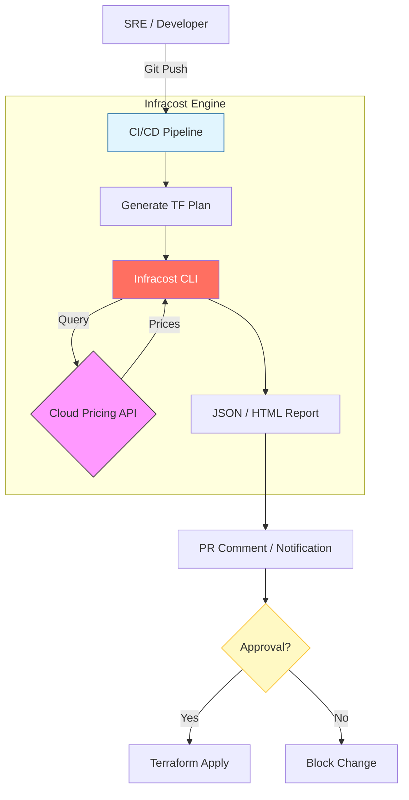

# 🔍 Cost Estimation with Infracost
**Infracost** is an open-source tool that provides real-time cloud cost estimates for Terraform. By integrating Infracost into your workflow, you can "<font color="#ff0000">Shift Left</font>" on cost management—identifying expensive infrastructure changes **before** they reach production.

## 🚀 How Infracost Works
Infracost fits seamlessly into the standard Terraform workflow. It parses either your HCL code or the output of a `terraform plan` and queries its **<font color="#ff0000">Cloud Pricing API</font>** (which contains over 4 million prices) to generate a detailed cost report.



---
## 🛠️ Typical Workflow: The Pull Request Comment
The most powerful implementation of Infracost is the automated **<font color="#ff0000">Pull Request (PR) comment</font>**. This provides immediate feedback to developers on the financial impact of their code.
### 📊 Example Infracost Output in PR:
💰 Infracost estimate: Total Monthly Cost will increase by <font color="#ff0000">+$1,245.20</font> 
```text
Project: terraform-aws-production
+ aws_db_instance.main_db
  +$950.00 (db.t3.medium -> db.m5.xlarge)
+ aws_instance.web_server[0]
  +$145.20 (t3.medium -> t3.large)
+ aws_ebs_volume.data_disk
  +$150.00 (100GB -> 1TB)
```
---
## �️ Guardrails: OPA & Policy as Code
Infracost isn't just for visibility; it's for **<font color="#ff0000">enforcement</font>**. You can use **<font color="#ff0000">Open Policy Agent (OPA)</font>** or Infracost's native policies to set financial guardrails.
### 🛑 Example Guardrail Policy
*Self-service teams can deploy changes < $500/month without review. Anything  $500/month requires a manual approval from the FinOps lead.
```hcl
# Example Sentinel/Rego Logic
deny[msg] {
    total_monthly_cost > 500
    msg = "Monthly cost increase exceeds threshold. Please request approval from Finance."
}
```
---
## 💻 CLI Commands for Local Development
Before pushing to Git, developers can run Infracost locally to verify their changes.
```bash
# 1. Register and get your API Key
infracost register

# 2. Get a quick breakdown of costs
infracost breakdown --path .

# 3. See the difference compared to your production branch
infracost diff --path . --compare-to origin/main
```
---
## 📊 Benefits of Shift-Left Costing

| Feature | Legacy FinOps | Modern Infracost Workflow |
| :--- | :--- | :--- |
| **Feedback Loop** | 30 Days (Monthly Bill) | <font color="#00b050">3 Minutes (CI/CD)</font> |
| **Responsibility** | Finance Department | <font color="#00b050">Engineering Teams</font> |
| **Action** | Reactive (Optimization) | <font color="#00b050">Proactive (Prevention)</font> |
| **Visibility** | High-level Aggregates | <font color="#00b050">Line-item Granularity</font> |

---
## 📈 Real-Life Scenario: The accidental "<font color="#ff0000">i3.metal</font>"
A developer at a scaling SaaS company accidentally typed `i3.metal` instead of `t3.medium` in their Terraform module for a testing cluster. 

**Without Infracost:**
The instance was provisioned automatically. Three days later, the SRE team received a billing alert. The cost for those 72 hours was <font color="#ff0000">$1,400</font>.

**With Infracost:**
The CI/CD pipeline flagged the PR immediately, showing a projected monthly increase of <font color="#ff0000">$12,000</font> for the testing environment. The PR was automatically blocked by the "Max Increase" guardrail, saving the company from an expensive mistake before it even happened.

---

[Next: Budgeting and Alerts ➡️](./05-Budgeting-and-Alerts.md)
