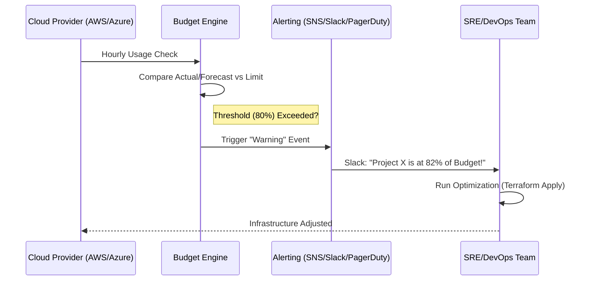

# 🔔 Budgets and Alerts as Code
Provisioning infrastructure without a budget is like driving a car without a fuel gauge. Terraform allows you to provision **<font color="#ff0000">Cloud Budgets</font>** alongside your infrastructure, ensuring you are notified long before your spending exceeds your limits.

## 🚀 Why Automate Budgets?
- **Zero-Day Awareness:** Get notified as soon as you hit <font color="#00b050">50%</font>, <font color="#f5a623">80%</font>, or <font color="#ff0000">100%</font> of your budget.
- **Project Isolation:** Set specific budgets for specific projects, cost centers, or service types (e.g., "Max $100 for S3 Storage").
- **Consistency:** Ensure every new AWS Account or GCP Project has a budget attached by default via a core Terraform module.
- **Automated Actions:** Trigger AWS Budget Actions (e.g., attaching an IAM policy to prevent further resource creation).
---
## 🛠️ Implementing AWS Budgets
The `aws_budgets_budget` resource is the industry standard for AWS cost governance.
```hcl
resource "aws_budgets_budget" "monthly_budget" {
  name              = "monthly-dev-budget"
  budget_type       = "COST"
  limit_amount      = "500"
  limit_unit        = "USD"
  time_period_start = "2023-01-01_00:00"
  time_unit         = "MONTHLY"

  # Alert 1: Actual Spend at 50%
  notification {
    comparison_operator        = "GREATER_THAN"
    threshold                  = 50
    threshold_type             = "PERCENTAGE"
    notification_type          = "ACTUAL"
    subscriber_email_addresses = ["devops@example.com"]
  }

  # Alert 2: Forecasted Spend at 100% (Early Warning)
  notification {
    comparison_operator        = "GREATER_THAN"
    threshold                  = 100
    threshold_type             = "PERCENTAGE"
    notification_type          = "FORECASTED"
    subscriber_email_addresses = ["finance@example.com"]
  }
}
```
---
## 📈 Budget Alert Workflow
Effective alerting is not just about emails; it's about context and speed.



---
## 🛠️ Implementing GCP Budgets
In GCP, budgets are linked to billing accounts or specific projects via `google_billing_budget`.
```hcl
resource "google_billing_budget" "department_budget" {
  billing_account = var.billing_account_id
  display_name    = "Engineering-Dept-Budget"

  budget_filter {
    projects = ["projects/${var.project_id}"]
    credit_types_treatment = "INCLUDE_ALL_CREDITS"
  }

  amount {
    specified_amount {
      currency_code = "USD"
      units         = "2000"
    }
  }

  # Multi-stage thresholds
  threshold_rules {
    threshold_percent = 0.5 # 50% Actual
  }
  threshold_rules {
    threshold_percent = 0.9
    spend_basis       = "FORECASTED_SPEND" # 90% Forecasted
  }
}
```
---
## 📊 Budget Confidence Levels & Actions

| Status | Threshold | Strategy | Action |
| :--- | :--- | :--- | :--- |
| **Normal** | <font color="#00b050">< 50%</font> | Monitor | None. |
| **Warning** | <font color="#f5a623">50% - 80%</font> | Investigate | Identify top-spending resources. |
| **Critical** | <font color="#ff0000">80% - 100%</font> | Intervene | Optimization required (Right-sizing). |
| **Over Budget** | <font color="#7d3c98">> 100%</font> | Mitigation | Scale down non-prod. Stop new deployments. |

---
## 🛡️ Proactive Budget Actions
Advanced Terraform users can link budgets to **<font color="#ff0000">AWS Lambda</font>** or **<font color="#ff0000">Azure Functions</font>** to take automated actions when a limit is hit:
- **Stop Instances:** Automatically shut down <font color="#ff0000">dev</font> instances.
- **Restrict Permissions:** Attach an "<font color="#ff0000">Enforce-Quotas</font>" IAM policy to the account.
- **Webhook Integration:** Post a rich snippet to a Microsoft Teams or Slack channel.
---
## 📈 Real-Life Scenario: The "Bitcoin Miner" Breach
A developer's credentials were compromised, and a hacker launched **50 massive GPU instances** in a secondary region.

**Without Budgets:**
The company only discovers the breach when the monthly bill arrives 25 days later, totaling <font color="#ff0000">$25,000</font>.

**With Terraform-Managed Budgets:** 
1. The budget was set to <font color="#00b050">$1,000</font>.
2. Within **2 hours**, the "80% Actual" alert was triggered via SNS to Slack.
3. Within **12 hours**, the "1,000% Forecasted" alert hit the Finance team's PagerDuty.
4. The SRE team reacted immediately, rotated keys, and killed the instances.
5. **Total Loss:** <font color="#00b050">$520</font> (instead of $25,000).

---

[⬅️ Back to Module Overview](./README.md)
