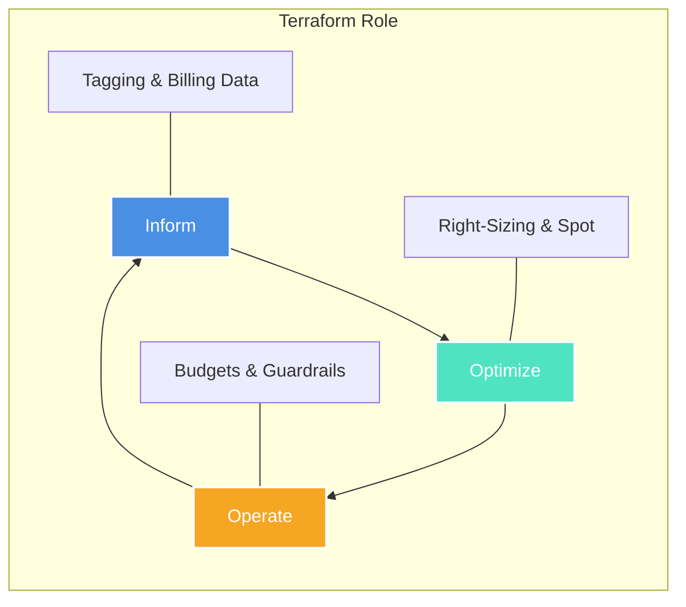

# 💸 Cloud Cost Management with Terraform
Welcome to the **Cost Management** module! Effective Infrastructure as Code (IaC) isn't just about provisioning; it's about doing so efficiently. In this section, we explore how to leverage Terraform to optimize cloud spend, implement FinOps best practices, and automate cost-saving measures across AWS, Azure, and GCP.

## 🎯 Learning Objectives

By the end of this module, you will be able to:
- Implement standardized **Tagging Strategies** for granular cost allocation.
- Use Terraform to perform **Right-Sizing** of cloud resources.
- Automate **Lifecycle Management** to reduce waste (e.g., deleting aged snapshots).
- Integrate **Infracost** into CI/CD pipelines for shift-left cost estimation.
- Provision **Budgets and Alerts** programmatically to prevent "Cloud Bill Shock."

---

## 📂 Module Structure

| Section | Description | Key Focus |
| :--- | :--- | :--- |
| [01-Tagging-Strategies](01-Tagging-Strategies.md) | Standardizing metadata for billing. | `Default Tags`, `Mandatory Tags`, `FinOps Tagging`. |
| [02-Right-Sizing](02-Right-Sizing.md) | Selecting the correct instance types. | `Instance Family`, `Auto-Scaling`, `Spot Instances`. |
| [03-Lifecycle-Management](./03-Lifecycle-Management.md) | Managing resource longevity. | `S3 Lifecycle`, `EBS Cleanup`, `Auto-Stop/Start`. |
| [04-Infracost-Integration](./04-Infracost-Integration.md) | Cost estimation in CI/CD. | `Infracost API`, `Pull Request Comments`. |
| [05-Budgeting-and-Alerts](./05-Budgeting-and-Alerts.md) | Governance and enforcement. | `AWS Budgets`, `GCP Budgets`, `Thresholds`. |
| [06-Pro-Tips-and-Hacks](./06-Pro-Tips-and-Hacks.md) | Advanced engineering tricks. | `AMD Switches`, `Ignore Tags`, `Dev-Zero`. |

---
## 🏗️ The FinOps Lifecycle in Terraform
Managing costs is a continuous cycle. Terraform allows us to automate the **Inform**, **Optimize**, and **Operate** phases of FinOps.

---
## 📈 Why Manage Costs via IaC?
1. **Visibility:** Know exactly what resources are costing you before you apply changes.
2. **Consistency:** Ensure every resource follows the organization's cost-saving policies automatically.
3. **Accountability:** Track costs back to specific teams or projects using mandatory tags.
4. **Agility:** Quickly scale down or rotate resources based on demand or budget constraints.
---
### 💡 Pro Tip
> "The cheapest resource is the one you don't provision." Use Terraform to ensure that sandbox environments are destroyed automatically when not in use.

---

[Next: Tagging Strategies ➡️](01-Tagging-Strategies.md)
