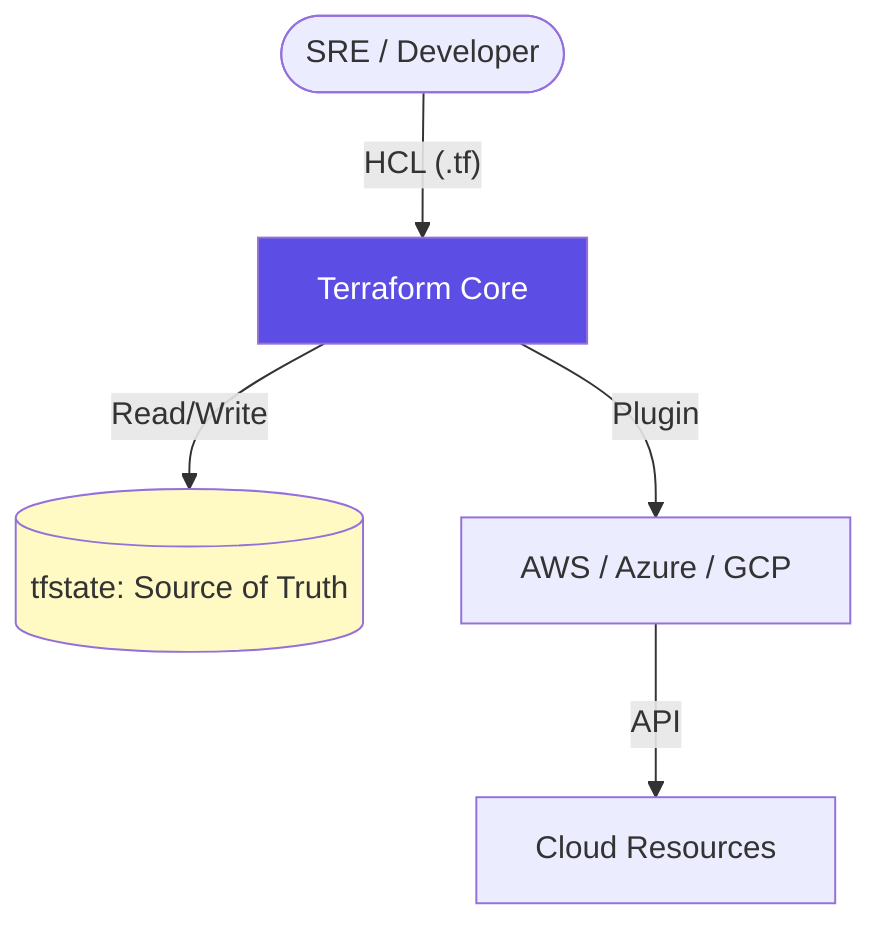

# Terraform: Infrastructure as Code (IaC)

Terraform is the industry-standard tool for building, changing, and versioning infrastructure. It uses a **Declarative** model: you define the "Desired State" and Terraform determines the steps to reach it.

## 🏗️ Module Roadmap

| Stage | Topic | Objective |
| :--- | :--- | :--- |
| **01** | **[Fundamentals](./01-Fundamentals/README.md)** | Providers, Resources, and Lifecycle. |
| **02** | **[HCL Mechanics](./02-HCL-and-IaC/README.md)** | Variables, Locals, Loops, and Functions. |
| **03** | **[State Management](./03-State-Management/README.md)** | Backends, Locking, Import, and Recovery. |
| **04** | **[Modules](./04-Modules/README.md)** | Reusability and Infrastructure Packages. |
| **05** | **[Best Practices](./05-Best-Practices/README.md)** | Security, DR, and Performance. |
| **06** | **[Terraform Cloud](./06-Terraform-Cloud/README.md)** | GitOps and Enterprise Collaboration. |

---

## 🏛️ High-Level Architecture

---

## 📖 Real-Life Scenarios

### Scenario 1: The "Click-Ops" Disaster
**Problem**: An entire environment was created by clicking in the AWS Console. When it crashed, no one knew how to rebuild it.
**Solution**: The team used **Terraform Import** to bring the existing resources under code control.
**Result**: Disaster recovery time dropped from 3 days to 15 minutes.

### Scenario 2: The "Overwritten State"
**Problem**: Two developers ran `terraform apply` at the same time on their local machines.
**Crisis**: The state file was corrupted, and half the production resources were deleted.
**Solution**: Implemented **Remote State (S3)** with **Locking (DynamoDB)**.
**Result**: Conflict resolved. Automated guards now prevent multi-apply errors.

---

## ❓ Interview Prep & Resources
- **[Interview Questions & Quizzes](./07-Interview-Questions-and-Quizzes/README.md)**
- **[Real-Life War Stories](./08-Real-Life-Scenarios/README.md)**
- **[Hands-on Sample Project](../../../../README.md)**

---

[⬅️ Back to Configuration Tools Index](../README.md)