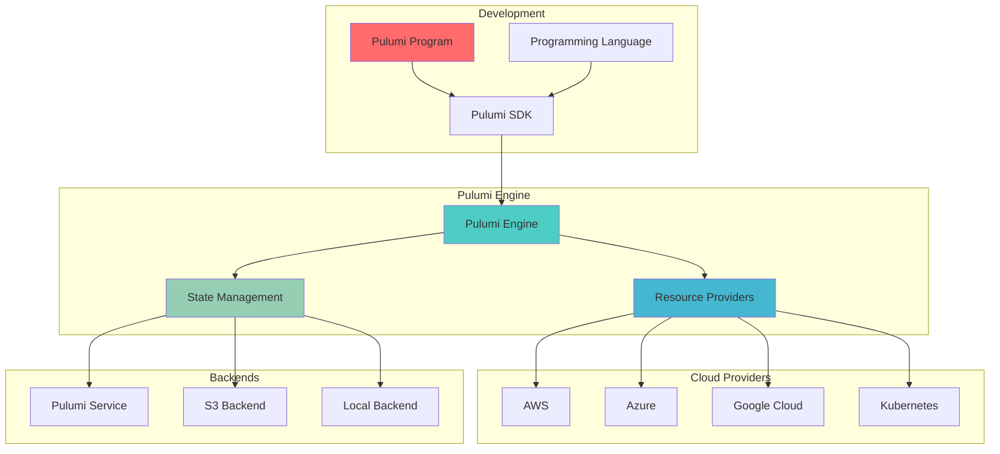

# ⚡ Pulumi: Modern Infrastructure as Code

Pulumi is a modern Infrastructure as Code platform that allows you to use familiar programming languages (TypeScript, Python, Go, C#, Java) to build, deploy, and manage cloud infrastructure.

---

## 🎯 **What is Pulumi?**

Pulumi enables infrastructure as code using real programming languages, providing the full power of software development including loops, functions, classes, and package management for cloud infrastructure.

### **Key Features**
- **Real Programming Languages**: TypeScript, Python, Go, C#, Java, YAML
- **Multi-Cloud**: AWS, Azure, GCP, Kubernetes, and 100+ providers
- **State Management**: Automatic state management with backends
- **Policy as Code**: Compliance and governance automation
- **Secrets Management**: Built-in encryption and secret handling
- **Testing**: Unit and integration testing for infrastructure

---

## 🏗️ **Architecture Overview**



---

## 🛠️ **Learning Modules**

### **Module 1: Pulumi Fundamentals**
- **Installation & Setup**: CLI installation and configuration
- **First Program**: Creating your first Pulumi project
- **Resources & Stacks**: Understanding core concepts
- **State Management**: Backends and state handling

### **Module 2: Programming Concepts**
- **Resource Declaration**: Creating and configuring resources
- **Inputs & Outputs**: Handling resource properties
- **Configuration**: Managing secrets and settings
- **Components**: Building reusable infrastructure components

### **Module 3: Advanced Features**
- **Dynamic Providers**: Custom resource providers
- **Automation API**: Programmatic infrastructure management
- **Policy as Code**: Compliance and governance
- **Testing**: Unit and integration testing strategies

### **Module 4: Enterprise Patterns**
- **Multi-Stack Management**: Environment promotion workflows
- **Team Collaboration**: RBAC and organizational features
- **CI/CD Integration**: Automated deployment pipelines
- **Monitoring & Observability**: Infrastructure monitoring

---

## 📚 **Language Examples**

### **TypeScript/JavaScript**
```typescript
// index.ts
import * as pulumi from "@pulumi/pulumi";
import * as aws from "@pulumi/aws";

// Create a VPC
const vpc = new aws.ec2.Vpc("main-vpc", {
    cidrBlock: "10.0.0.0/16",
    enableDnsHostnames: true,
    enableDnsSupport: true,
    tags: {
        Name: "Main VPC",
        Environment: pulumi.getStack(),
    },
});

// Create subnets
const publicSubnet = new aws.ec2.Subnet("public-subnet", {
    vpcId: vpc.id,
    cidrBlock: "10.0.1.0/24",
    availabilityZone: "us-east-1a",
    mapPublicIpOnLaunch: true,
    tags: {
        Name: "Public Subnet",
        Type: "public",
    },
});

const privateSubnet = new aws.ec2.Subnet("private-subnet", {
    vpcId: vpc.id,
    cidrBlock: "10.0.2.0/24",
    availabilityZone: "us-east-1b",
    tags: {
        Name: "Private Subnet",
        Type: "private",
    },
});

// Create Internet Gateway
const igw = new aws.ec2.InternetGateway("internet-gateway", {
    vpcId: vpc.id,
    tags: {
        Name: "Main IGW",
    },
});

// Create route table
const publicRouteTable = new aws.ec2.RouteTable("public-rt", {
    vpcId: vpc.id,
    routes: [
        {
            cidrBlock: "0.0.0.0/0",
            gatewayId: igw.id,
        },
    ],
    tags: {
        Name: "Public Route Table",
    },
});

// Associate route table with subnet
const publicRouteTableAssociation = new aws.ec2.RouteTableAssociation("public-rta", {
    subnetId: publicSubnet.id,
    routeTableId: publicRouteTable.id,
});

// Create security group
const webSecurityGroup = new aws.ec2.SecurityGroup("web-sg", {
    vpcId: vpc.id,
    description: "Security group for web servers",
    ingress: [
        {
            protocol: "tcp",
            fromPort: 80,
            toPort: 80,
            cidrBlocks: ["0.0.0.0/0"],
        },
        {
            protocol: "tcp",
            fromPort: 443,
            toPort: 443,
            cidrBlocks: ["0.0.0.0/0"],
        },
        {
            protocol: "tcp",
            fromPort: 22,
            toPort: 22,
            cidrBlocks: ["10.0.0.0/16"],
        },
    ],
    egress: [
        {
            protocol: "-1",
            fromPort: 0,
            toPort: 0,
            cidrBlocks: ["0.0.0.0/0"],
        },
    ],
    tags: {
        Name: "Web Security Group",
    },
});

// Export values
export const vpcId = vpc.id;
export const publicSubnetId = publicSubnet.id;
export const privateSubnetId = privateSubnet.id;
export const securityGroupId = webSecurityGroup.id;
```

### **Python**
```python
# __main__.py
import pulumi
import pulumi_aws as aws

# Configuration
config = pulumi.Config()
instance_type = config.get("instanceType") or "t3.micro"
key_name = config.require("keyName")

# Get the latest Amazon Linux AMI
ami = aws.ec2.get_ami(
    most_recent=True,
    owners=["amazon"],
    filters=[
        {"name": "name", "values": ["amzn2-ami-hvm-*"]},
        {"name": "architecture", "values": ["x86_64"]},
    ]
)

# Create security group
security_group = aws.ec2.SecurityGroup(
    "web-server-sg",
    description="Security group for web server",
    ingress=[
        aws.ec2.SecurityGroupIngressArgs(
            protocol="tcp",
            from_port=80,
            to_port=80,
            cidr_blocks=["0.0.0.0/0"],
        ),
        aws.ec2.SecurityGroupIngressArgs(
            protocol="tcp",
            from_port=22,
            to_port=22,
            cidr_blocks=["0.0.0.0/0"],
        ),
    ],
    egress=[
        aws.ec2.SecurityGroupEgressArgs(
            protocol="-1",
            from_port=0,
            to_port=0,
            cidr_blocks=["0.0.0.0/0"],
        ),
    ],
    tags={
        "Name": "Web Server Security Group",
    },
)

# User data script
user_data = """#!/bin/bash
yum update -y
yum install -y httpd
systemctl start httpd
systemctl enable httpd
echo "<h1>Hello from Pulumi!</h1>" > /var/www/html/index.html
"""

# Create EC2 instance
server = aws.ec2.Instance(
    "web-server",
    instance_type=instance_type,
    ami=ami.id,
    key_name=key_name,
    vpc_security_group_ids=[security_group.id],
    user_data=user_data,
    tags={
        "Name": "Web Server",
        "Environment": pulumi.get_stack(),
    },
)

# Export outputs
pulumi.export("instance_id", server.id)
pulumi.export("public_ip", server.public_ip)
pulumi.export("public_dns", server.public_dns)
pulumi.export("security_group_id", security_group.id)
```

### **Go**
```go
// main.go
package main

import (
    "github.com/pulumi/pulumi-aws/sdk/v6/go/aws/ec2"
    "github.com/pulumi/pulumi/sdk/v3/go/pulumi"
    "github.com/pulumi/pulumi/sdk/v3/go/pulumi/config"
)

func main() {
    pulumi.Run(func(ctx *pulumi.Context) error {
        // Configuration
        cfg := config.New(ctx, "")
        instanceType := "t3.micro"
        if param := cfg.Get("instanceType"); param != "" {
            instanceType = param
        }

        // Create VPC
        vpc, err := ec2.NewVpc(ctx, "main-vpc", &ec2.VpcArgs{
            CidrBlock:          pulumi.String("10.0.0.0/16"),
            EnableDnsHostnames: pulumi.Bool(true),
            EnableDnsSupport:   pulumi.Bool(true),
            Tags: pulumi.StringMap{
                "Name": pulumi.String("Main VPC"),
            },
        })
        if err != nil {
            return err
        }

        // Create subnet
        subnet, err := ec2.NewSubnet(ctx, "public-subnet", &ec2.SubnetArgs{
            VpcId:               vpc.ID(),
            CidrBlock:           pulumi.String("10.0.1.0/24"),
            AvailabilityZone:    pulumi.String("us-east-1a"),
            MapPublicIpOnLaunch: pulumi.Bool(true),
            Tags: pulumi.StringMap{
                "Name": pulumi.String("Public Subnet"),
            },
        })
        if err != nil {
            return err
        }

        // Create Internet Gateway
        igw, err := ec2.NewInternetGateway(ctx, "internet-gateway", &ec2.InternetGatewayArgs{
            VpcId: vpc.ID(),
            Tags: pulumi.StringMap{
                "Name": pulumi.String("Main IGW"),
            },
        })
        if err != nil {
            return err
        }

        // Create route table
        routeTable, err := ec2.NewRouteTable(ctx, "public-rt", &ec2.RouteTableArgs{
            VpcId: vpc.ID(),
            Routes: ec2.RouteTableRouteArray{
                &ec2.RouteTableRouteArgs{
                    CidrBlock: pulumi.String("0.0.0.0/0"),
                    GatewayId: igw.ID(),
                },
            },
            Tags: pulumi.StringMap{
                "Name": pulumi.String("Public Route Table"),
            },
        })
        if err != nil {
            return err
        }

        // Associate route table with subnet
        _, err = ec2.NewRouteTableAssociation(ctx, "public-rta", &ec2.RouteTableAssociationArgs{
            SubnetId:     subnet.ID(),
            RouteTableId: routeTable.ID(),
        })
        if err != nil {
            return err
        }

        // Export outputs
        ctx.Export("vpcId", vpc.ID())
        ctx.Export("subnetId", subnet.ID())
        ctx.Export("internetGatewayId", igw.ID())

        return nil
    })
}
```

---

## 🔧 **Advanced Features**

### **Component Resources**
```typescript
// components/webService.ts
import * as pulumi from "@pulumi/pulumi";
import * as aws from "@pulumi/aws";

export interface WebServiceArgs {
    instanceType?: string;
    keyName: string;
    vpcId: pulumi.Input<string>;
    subnetId: pulumi.Input<string>;
}

export class WebService extends pulumi.ComponentResource {
    public readonly instance: aws.ec2.Instance;
    public readonly securityGroup: aws.ec2.SecurityGroup;
    public readonly publicIp: pulumi.Output<string>;

    constructor(name: string, args: WebServiceArgs, opts?: pulumi.ComponentResourceOptions) {
        super("custom:WebService", name, {}, opts);

        // Create security group
        this.securityGroup = new aws.ec2.SecurityGroup(`${name}-sg`, {
            vpcId: args.vpcId,
            description: "Security group for web service",
            ingress: [
                { protocol: "tcp", fromPort: 80, toPort: 80, cidrBlocks: ["0.0.0.0/0"] },
                { protocol: "tcp", fromPort: 443, toPort: 443, cidrBlocks: ["0.0.0.0/0"] },
                { protocol: "tcp", fromPort: 22, toPort: 22, cidrBlocks: ["0.0.0.0/0"] },
            ],
            egress: [
                { protocol: "-1", fromPort: 0, toPort: 0, cidrBlocks: ["0.0.0.0/0"] },
            ],
        }, { parent: this });

        // Get AMI
        const ami = aws.ec2.getAmi({
            mostRecent: true,
            owners: ["amazon"],
            filters: [
                { name: "name", values: ["amzn2-ami-hvm-*"] },
                { name: "architecture", values: ["x86_64"] },
            ],
        });

        // Create instance
        this.instance = new aws.ec2.Instance(`${name}-instance`, {
            instanceType: args.instanceType || "t3.micro",
            ami: ami.then(ami => ami.id),
            keyName: args.keyName,
            subnetId: args.subnetId,
            vpcSecurityGroupIds: [this.securityGroup.id],
            userData: `#!/bin/bash
                yum update -y
                yum install -y httpd
                systemctl start httpd
                systemctl enable httpd
                echo "<h1>Hello from ${name}!</h1>" > /var/www/html/index.html
            `,
            tags: {
                Name: `${name} Web Server`,
            },
        }, { parent: this });

        this.publicIp = this.instance.publicIp;

        this.registerOutputs({
            instance: this.instance,
            securityGroup: this.securityGroup,
            publicIp: this.publicIp,
        });
    }
}
```

### **Automation API**
```typescript
// automation/deploy.ts
import * as pulumi from "@pulumi/pulumi/automation";
import * as aws from "@pulumi/aws";

const program = async () => {
    // Create a simple S3 bucket
    const bucket = new aws.s3.Bucket("my-bucket", {
        website: {
            indexDocument: "index.html",
        },
    });

    return {
        bucketName: bucket.id,
        bucketEndpoint: bucket.websiteEndpoint,
    };
};

async function main() {
    const args = process.argv.slice(2);
    const stackName = args[0] || "dev";

    // Create or select a stack
    const stack = await pulumi.LocalWorkspace.createOrSelectStack({
        stackName,
        projectName: "automation-example",
        program,
    });

    console.info("Successfully initialized stack");

    // Set stack configuration
    await stack.setConfig("aws:region", { value: "us-east-1" });

    console.info("Installing plugins...");
    await stack.workspace.installPlugin("aws", "v6.0.0");

    console.info("Refreshing stack...");
    await stack.refresh({ onOutput: console.info });

    console.info("Updating stack...");
    const upRes = await stack.up({ onOutput: console.info });

    console.log(`Update summary: \n${JSON.stringify(upRes.summary, null, 2)}`);
    console.log(`Outputs: \n${JSON.stringify(upRes.outputs, null, 2)}`);
}

main().catch(console.error);
```

---

## 🔄 **Integration Patterns**

### **With Kubernetes**
```typescript
// k8s-app.ts
import * as pulumi from "@pulumi/pulumi";
import * as k8s from "@pulumi/kubernetes";

// Create namespace
const namespace = new k8s.core.v1.Namespace("app-namespace", {
    metadata: {
        name: "my-app",
    },
});

// Create deployment
const deployment = new k8s.apps.v1.Deployment("app-deployment", {
    metadata: {
        namespace: namespace.metadata.name,
    },
    spec: {
        replicas: 3,
        selector: {
            matchLabels: {
                app: "my-app",
            },
        },
        template: {
            metadata: {
                labels: {
                    app: "my-app",
                },
            },
            spec: {
                containers: [
                    {
                        name: "app",
                        image: "nginx:1.20",
                        ports: [
                            {
                                containerPort: 80,
                            },
                        ],
                        resources: {
                            requests: {
                                memory: "64Mi",
                                cpu: "250m",
                            },
                            limits: {
                                memory: "128Mi",
                                cpu: "500m",
                            },
                        },
                    },
                ],
            },
        },
    },
});

// Create service
const service = new k8s.core.v1.Service("app-service", {
    metadata: {
        namespace: namespace.metadata.name,
    },
    spec: {
        selector: {
            app: "my-app",
        },
        ports: [
            {
                port: 80,
                targetPort: 80,
            },
        ],
        type: "LoadBalancer",
    },
});

export const namespaceName = namespace.metadata.name;
export const serviceEndpoint = service.status.loadBalancer.ingress[0].hostname;
```

### **With CI/CD (GitHub Actions)**
```yaml
# .github/workflows/pulumi.yml
name: Pulumi Infrastructure

on:
  push:
    branches: [main]
  pull_request:
    branches: [main]

jobs:
  preview:
    if: github.event_name == 'pull_request'
    runs-on: ubuntu-latest
    steps:
      - uses: actions/checkout@v3
      
      - name: Setup Node.js
        uses: actions/setup-node@v3
        with:
          node-version: '18'
          
      - name: Install dependencies
        run: npm install
        
      - name: Pulumi Preview
        uses: pulumi/actions@v4
        with:
          command: preview
          stack-name: dev
        env:
          PULUMI_ACCESS_TOKEN: ${{ secrets.PULUMI_ACCESS_TOKEN }}
          AWS_ACCESS_KEY_ID: ${{ secrets.AWS_ACCESS_KEY_ID }}
          AWS_SECRET_ACCESS_KEY: ${{ secrets.AWS_SECRET_ACCESS_KEY }}

  deploy:
    if: github.ref == 'refs/heads/main'
    runs-on: ubuntu-latest
    steps:
      - uses: actions/checkout@v3
      
      - name: Setup Node.js
        uses: actions/setup-node@v3
        with:
          node-version: '18'
          
      - name: Install dependencies
        run: npm install
        
      - name: Pulumi Up
        uses: pulumi/actions@v4
        with:
          command: up
          stack-name: production
        env:
          PULUMI_ACCESS_TOKEN: ${{ secrets.PULUMI_ACCESS_TOKEN }}
          AWS_ACCESS_KEY_ID: ${{ secrets.AWS_ACCESS_KEY_ID }}
          AWS_SECRET_ACCESS_KEY: ${{ secrets.AWS_SECRET_ACCESS_KEY }}
```

---

## 🎯 **Best Practices**

### **1. Project Organization**
- Use consistent project structure
- Separate environments with stacks
- Implement proper configuration management
- Use component resources for reusability

### **2. State Management**
- Use remote backends for team collaboration
- Implement proper backup strategies
- Monitor state file size and performance
- Use stack references for cross-stack dependencies

### **3. Security**
- Use secrets for sensitive configuration
- Implement least privilege access
- Regular security audits and updates
- Use policy as code for compliance

### **4. Testing & Validation**
- Write unit tests for infrastructure code
- Implement integration testing
- Use policy as code for validation
- Continuous testing in CI/CD pipelines

---

## 🔍 **Troubleshooting Guide**

### **Common Issues**
1. **State Conflicts**: Multiple users modifying same resources
2. **Provider Errors**: Authentication or permission issues
3. **Resource Dependencies**: Circular or missing dependencies
4. **Performance Issues**: Large state files or complex resources

### **Debugging Commands**
```bash
# Preview changes
pulumi preview --diff

# Debug mode
pulumi up --debug

# Show configuration
pulumi config

# View stack outputs
pulumi stack output

# Refresh state
pulumi refresh

# Import existing resources
pulumi import aws:s3/bucket:Bucket my-bucket my-existing-bucket
```

---

## 📊 **Comparison Matrix**

| Feature | Pulumi | Terraform | CloudFormation | CDK |
|---------|--------|-----------|----------------|-----|
| **Languages** | Multiple | HCL | JSON/YAML | Multiple |
| **Learning Curve** | Medium | Medium | High | Medium |
| **Testing** | Excellent | Limited | Limited | Good |
| **Multi-Cloud** | Excellent | Excellent | AWS Only | Limited |
| **State Management** | Automatic | Manual | Automatic | Automatic |
| **IDE Support** | Excellent | Good | Limited | Excellent |

---

## 🏆 **Interview Questions**

### **Technical Questions**
1. **What are the advantages of using real programming languages for IaC?**
2. **How does Pulumi handle resource dependencies and ordering?**
3. **Explain Pulumi's component resource model and its benefits.**
4. **Describe how Pulumi's Automation API enables programmatic infrastructure management.**

### **Practical Scenarios**
1. **Implementing multi-environment infrastructure with stack references**
2. **Building reusable infrastructure components**
3. **Integrating infrastructure testing into CI/CD pipelines**
4. **Managing secrets and configuration across environments**

---

## 🚀 **Advanced Topics**

### **Policy as Code**
```typescript
// policy/security-policy.ts
import * as aws from "@pulumi/aws";
import { PolicyPack, validateResourceOfType } from "@pulumi/policy";

new PolicyPack("security-policies", {
    policies: [
        {
            name: "s3-bucket-encryption",
            description: "S3 buckets must have encryption enabled",
            enforcementLevel: "mandatory",
            validateResource: validateResourceOfType(aws.s3.Bucket, (bucket, args, reportViolation) => {
                if (!bucket.serverSideEncryptionConfiguration) {
                    reportViolation("S3 bucket must have encryption enabled");
                }
            }),
        },
        {
            name: "ec2-instance-type",
            description: "EC2 instances must use approved instance types",
            enforcementLevel: "advisory",
            validateResource: validateResourceOfType(aws.ec2.Instance, (instance, args, reportViolation) => {
                const approvedTypes = ["t3.micro", "t3.small", "t3.medium"];
                if (!approvedTypes.includes(instance.instanceType)) {
                    reportViolation(`EC2 instance type ${instance.instanceType} is not approved`);
                }
            }),
        },
    ],
});
```

### **Custom Providers**
```typescript
// providers/custom-provider.ts
import * as pulumi from "@pulumi/pulumi";

interface CustomResourceArgs {
    name: string;
    configuration: any;
}

class CustomResourceProvider implements pulumi.dynamic.ResourceProvider {
    async create(inputs: CustomResourceArgs): Promise<pulumi.dynamic.CreateResult> {
        // Custom resource creation logic
        const id = `custom-${inputs.name}-${Date.now()}`;
        
        // Perform actual resource creation
        // This could be API calls, database operations, etc.
        
        return {
            id: id,
            outs: {
                name: inputs.name,
                configuration: inputs.configuration,
                status: "created",
            },
        };
    }

    async update(id: string, oldInputs: CustomResourceArgs, newInputs: CustomResourceArgs): Promise<pulumi.dynamic.UpdateResult> {
        // Custom resource update logic
        return {
            outs: {
                name: newInputs.name,
                configuration: newInputs.configuration,
                status: "updated",
            },
        };
    }

    async delete(id: string, props: any): Promise<void> {
        // Custom resource deletion logic
        console.log(`Deleting custom resource ${id}`);
    }
}

export class CustomResource extends pulumi.dynamic.Resource {
    public readonly name!: pulumi.Output<string>;
    public readonly status!: pulumi.Output<string>;

    constructor(name: string, args: CustomResourceArgs, opts?: pulumi.CustomResourceOptions) {
        super(new CustomResourceProvider(), name, args, opts);
    }
}
```

---

## 📖 **Resources & References**

### **Official Documentation**
- [Pulumi Documentation](https://www.pulumi.com/docs/)
- [Pulumi Registry](https://www.pulumi.com/registry/)

### **Community Resources**
- [Pulumi GitHub Repository](https://github.com/pulumi/pulumi)
- [Pulumi Examples](https://github.com/pulumi/examples)

### **Training & Certification**
- [Pulumi Learn](https://www.pulumi.com/learn/)
- [Pulumi Workshops](https://www.pulumi.com/resources/#workshops)

---

**Next Steps**: Master Pulumi fundamentals with your preferred programming language, explore component resources, and integrate with CI/CD pipelines for modern infrastructure automation.

*"Infrastructure as code with the full power of programming languages."*