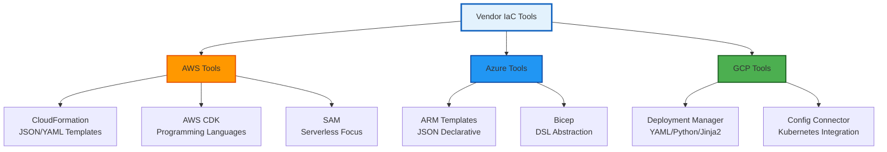

# 🏢 Vendor-Specific Infrastructure as Code Tools

## 📋 Overview

While tools like Terraform and Pulumi offer **multi-cloud abstraction**, cloud providers offer native Infrastructure as Code (IaC) tools that are deeply integrated with their platforms. Understanding these vendor-specific tools is critical for:

- **Deep Platform Integration**: Native tools often support features before third-party tools
- **Cost Optimization**: Some vendor tools are free or included in cloud subscriptions
- **Compliance Requirements**: Certain enterprises mandate native tooling
- **Career Versatility**: Many organizations use a mix of multi-cloud and native tools

---

## ⚠️ Understanding Vendor Lock-In

### What is Vendor Lock-In?

**Vendor lock-in** occurs when your infrastructure code, architecture, or operational processes become tightly coupled to a specific cloud provider's proprietary services and tools, making migration to another provider costly, time-consuming, or technically prohibitive.

### Trade-offs Analysis

| Aspect | Multi-Cloud (Terraform/Pulumi) | Vendor-Specific Tools |
|--------|-------------------------------|----------------------|
| **Portability** | ✅ High - Abstract cloud differences | ❌ Low - Tied to one provider |
| **Feature Coverage** | ⚠️ Delayed - Wait for provider updates | ✅ Immediate - Day-0 support |
| **Learning Curve** | ⚠️ Learn tool + each cloud | ✅ Learn once per cloud |
| **Integration** | ⚠️ Good, but limited | ✅ Deep native integration |
| **Community Support** | ✅ Large, vibrant community | ⚠️ Provider-dependent |
| **Cost** | 💰 Tool cost + cloud | 💰 Usually free |
| **CI/CD Integration** | ✅ Excellent | ✅ Excellent (native pipelines) |

---

## 🗺️ Module Architecture

---

## 📂 Module Structure

### ☁️ AWS Tools

#### 1️⃣ [AWS CloudFormation](./01-AWS-CloudFormation/README.md)
**The Original AWS IaC - Template-Based Infrastructure**

- **Type**: Declarative, Template-based (JSON/YAML)
- **First Released**: 2011
- **Learning Path**: Beginner → Intermediate → Advanced
- **Best For**: AWS-only deployments, StackSets, compliance-focused teams

**Topics Covered**:
- Template anatomy and intrinsic functions
- Stacks, StackSets, and Change Sets
- Nested stacks and cross-stack references
- Custom resources and macros
- Drift detection and remediation

#### 2️⃣ [AWS CDK (Cloud Development Kit)](./02-AWS-CDK/README.md)
**Infrastructure as Real Code - Programming Language Approach**

- **Type**: Imperative, Programming Language-based
- **First Released**: 2019
- **Languages**: TypeScript, Python, Java, C#, Go
- **Learning Path**: Beginner → Intermediate → Advanced
- **Best For**: Developers, complex logic, reusable constructs

**Topics Covered**:
- Constructs (L1, L2, L3)
- CDK apps, stacks, and synthesis
- Context and environment configuration
- Custom constructs and construct libraries
- CDK Pipelines for CI/CD

#### 3️⃣ [AWS SAM (Serverless Application Model)](./03-AWS-SAM/README.md)
**Serverless-First IaC - Lambda & API Gateway Focus**

- **Type**: Declarative, CloudFormation Extension
- **First Released**: 2016
- **Learning Path**: Beginner → Intermediate → Advanced
- **Best For**: Serverless applications, microservices, event-driven architecture

**Topics Covered**:
- SAM template specification
- Local development and testing (sam local)
- Lambda functions, API Gateway, and DynamoDB
- SAM CLI workflow
- Production deployment patterns

---

### 🔷 Azure Tools

#### 4️⃣ [Azure Resource Manager (ARM) Templates](./04-Azure-ARM/README.md)
**Azure's Native Declarative IaC**

- **Type**: Declarative, JSON-based
- **First Released**: 2014
- **Learning Path**: Beginner → Intermediate → Advanced
- **Best For**: Azure-only deployments, policy-driven governance

**Topics Covered**:
- Template structure and expressions
- Resource dependencies and deployment modes
- Linked and nested templates
- Template specs and deployment scripts
- What-if deployments

#### 5️⃣ [Azure Bicep](./05-Azure-Bicep/README.md)
**Domain-Specific Language for Azure - ARM Simplified**

- **Type**: Declarative, DSL (compiles to ARM)
- **First Released**: 2020
- **Learning Path**: Beginner → Intermediate → Advanced
- **Best For**: Modern Azure IaC, cleaner syntax, rapid development

**Topics Covered**:
- Bicep syntax and types
- Modules and parameterization
- Loops, conditions, and resource declarations
- Decompiling ARM to Bicep
- Integration with Azure DevOps and GitHub Actions

---

### 🟢 Google Cloud Platform Tools

#### 6️⃣ [Google Cloud Deployment Manager](./06-GCP-Deployment-Manager/README.md)
**Google's Native Infrastructure Automation**

- **Type**: Declarative, YAML/Python/Jinja2
- **First Released**: 2015
- **Learning Path**: Beginner → Intermediate → Advanced
- **Best For**: GCP-only infrastructure, template-based deployments

**Topics Covered**:
- Configuration files and templates
- Python and Jinja2 templating
- Deployments and manifests
- Composite types and imports
- Runtime configurator integration

#### 7️⃣ [Config Connector](./07-GCP-Config-Connector/README.md)
**Kubernetes-Native GCP Resource Management**

- **Type**: Declarative, Kubernetes CRDs
- **First Released**: 2019
- **Learning Path**: Beginner → Intermediate → Advanced
- **Best For**: Kubernetes-based workflows, GitOps, unified resource management

**Topics Covered**:
- Config Connector architecture
- Custom Resource Definitions (CRDs)
- Resource management via kubectl
- GitOps integration with Config Sync
- Multi-project and organization management

---

## 🎯 Learning Objectives

By the end of this module, you will:

### Beginner Level
- ✅ Understand the purpose and trade-offs of vendor-specific IaC tools
- ✅ Create basic infrastructure templates/code for each platform
- ✅ Deploy simple resources (VMs, storage, networking)
- ✅ Navigate official documentation and CLI tools

### Intermediate Level
- ✅ Design modular, reusable infrastructure components
- ✅ Implement CI/CD pipelines for IaC deployments
- ✅ Manage state, dependencies, and drift detection
- ✅ Use advanced features (macros, custom resources, constructs)

### Advanced Level
- ✅ Architect multi-account/multi-project enterprise deployments
- ✅ Build custom abstractions and internal platforms
- ✅ Implement governance, compliance, and security controls
- ✅ Optimize for performance, cost, and operational excellence

---

## 📊 Tool Comparison Matrix

### AWS Tools Comparison

| Feature | CloudFormation | AWS CDK | SAM |
|---------|---------------|---------|-----|
| **Syntax** | JSON/YAML | TypeScript/Python/etc | YAML (CFN extension) |
| **Abstraction Level** | Low | High | Medium (Serverless) |
| **Learning Curve** | Medium | Medium-High | Low-Medium |
| **Use Case** | General IaC | Complex logic | Serverless apps |
| **Day-0 Features** | ✅ Always | ⚠️ Usually | ⚠️ Serverless-focused |
| **Local Testing** | ❌ Limited | ✅ Good | ✅ Excellent (sam local) |
| **Reusability** | ⚠️ Nested stacks | ✅ Excellent | ⚠️ Moderate |

### Azure Tools Comparison

| Feature | ARM Templates | Bicep |
|---------|--------------|-------|
| **Syntax** | JSON | DSL (Bicep language) |
| **Readability** | ⚠️ Verbose | ✅ Clean |
| **Maturity** | ✅ Mature | ⚠️ Growing |
| **Tooling** | ✅ Excellent | ✅ Excellent |
| **Migration Path** | N/A | ✅ Decompile from ARM |
| **Learning Curve** | Medium-High | Low-Medium |

### GCP Tools Comparison

| Feature | Deployment Manager | Config Connector |
|---------|-------------------|------------------|
| **Syntax** | YAML/Python/Jinja2 | Kubernetes YAML |
| **Deployment Method** | gcloud CLI | kubectl |
| **Integration** | Native GCP | Kubernetes-native |
| **Use Case** | Traditional IaC | K8s-based workflows |
| **GitOps Ready** | ⚠️ Manual setup | ✅ Native |
| **Learning Curve** | Medium | Medium (requires K8s) |

---

## 🏗️ Recommended Learning Path

### Phase 1: Choose Your Cloud (Week 1-2)
Start with the cloud platform your organization uses:

**AWS Track**: CloudFormation → SAM → CDK  
**Azure Track**: ARM Templates → Bicep  
**GCP Track**: Deployment Manager → Config Connector

### Phase 2: Master Fundamentals (Week 3-4)
- Complete beginner-level tutorials for your chosen platform
- Deploy basic infrastructure (VPC, VMs, databases)
- Understand state management and dependencies

### Phase 3: Intermediate Patterns (Week 5-8)
- Modularize your code (nested stacks, modules, constructs)
- Implement CI/CD pipelines
- Practice drift detection and remediation

### Phase 4: Advanced Architecture (Week 9-12)
- Multi-account/multi-project designs
- Custom resources and macros
- Security and compliance automation

### Phase 5: Cross-Platform Awareness (Week 13+)
- Learn at least one tool from a different cloud
- Compare approaches and architectural patterns
- Understand migration strategies

---

## 🔐 Security Best Practices

### All Vendor Tools
1. **Never Hardcode Secrets**: Use parameter stores, secret managers, or HashiCorp Vault
2. **Principle of Least Privilege**: IAM roles should have minimal permissions
3. **Enable Logging**: CloudTrail, Activity Log, Cloud Audit Logs
4. **Code Scanning**: Use tools like Checkov, tfsec, or cloud-native scanners
5. **Peer Review**: All IaC changes should be reviewed before deployment

### Specific Recommendations

**AWS**:
- Use AWS Secrets Manager or Parameter Store for secrets
- Enable CloudFormation termination protection
- Use StackSets for multi-account governance

**Azure**:
- Use Azure Key Vault for secrets and certificates
- Implement Azure Policy for compliance
- Enable What-If deployments before applying changes

**GCP**:
- Use Secret Manager for sensitive data
- Implement Organization Policies
- Use Config Connector's validation webhooks

---

## 🧪 Hands-On Projects

Each tool directory includes:

1. **Beginner Project**: Deploy a simple web application
2. **Intermediate Project**: Multi-tier application with databases
3. **Advanced Project**: Multi-account/region/project enterprise deployment

---

## 📚 Additional Resources

### 📖 Official Documentation
- [AWS CloudFormation Documentation](https://docs.aws.amazon.com/cloudformation/)
- [AWS CDK Documentation](https://docs.aws.amazon.com/cdk/)
- [AWS SAM Documentation](https://docs.aws.amazon.com/serverless-application-model/)
- [Azure ARM Templates](https://docs.microsoft.com/en-us/azure/azure-resource-manager/templates/)
- [Azure Bicep](https://docs.microsoft.com/en-us/azure/azure-resource-manager/bicep/)
- [GCP Deployment Manager](https://cloud.google.com/deployment-manager/docs)
- [GCP Config Connector](https://cloud.google.com/config-connector/docs)

### 🎥 Video Learning
- AWS re:Invent sessions on IaC
- Azure Friday episodes on Bicep
- Google Cloud Next sessions on Config Connector

### 📝 Blogs & Tutorials
- AWS Architecture Blog
- Azure DevOps Blog
- Google Cloud Blog

---

## 🎯 Success Metrics

Upon completion, you should be able to:

- [ ] Deploy production-grade infrastructure using vendor tools
- [ ] Explain vendor lock-in trade-offs to stakeholders
- [ ] Choose the right tool for specific use cases
- [ ] Implement CI/CD for infrastructure deployments
- [ ] Troubleshoot common deployment issues
- [ ] Design secure, compliant infrastructure as code
- [ ] Migrate between tools when necessary

---

## 🔄 Integration with Other Modules

### Prerequisites
- **[01-Terraform](../01-Terraform/README.md)** - Understanding of IaC concepts
- **[CI/CD](../../../../README.md)** - Pipeline fundamentals
- **[Cloud Engineering](../../../../README.md)** - Cloud platform basics

### Related Topics
- **[Ansible](../../01-Automation/05-Ansible)** - Configuration management
- **[Security](../../../3-Advanced/04-Security/)** - IaC security scanning

---

## ❓ Common Questions

**Q: Should I use vendor tools or multi-cloud tools like Terraform?**  
A: It depends on your requirements:
- **Use vendor tools if**: Single cloud, need day-0 features, deep integration required
- **Use multi-cloud tools if**: Multi-cloud strategy, portability needed, standardization desired
- **Best practice**: Many teams use both - Terraform for multi-cloud resources, vendor tools for platform-specific services

**Q: Which AWS IaC tool should I learn first?**  
A: Start with **CloudFormation** (it's the foundation), then **SAM** if doing serverless, then **CDK** for programmatic approaches.

**Q: Is Bicep replacing ARM templates?**  
A: Bicep is the recommended path forward, but ARM templates aren't deprecated. Bicep compiles to ARM JSON.

**Q: Do I need Kubernetes to use Config Connector?**  
A: Yes, Config Connector runs on GKE or any Kubernetes cluster with GCP connectivity.

---

**Return to**: [Configuration Tools](../README.md) | [Intermediate Level](../../../../README.md)

---

*"Vendor tools provide deep integration at the cost of portability. Choose wisely, but don't fear the lock-in—sometimes it's the right trade-off."*

**Next Steps**: Choose your cloud platform and dive into the specific tool documentation!
