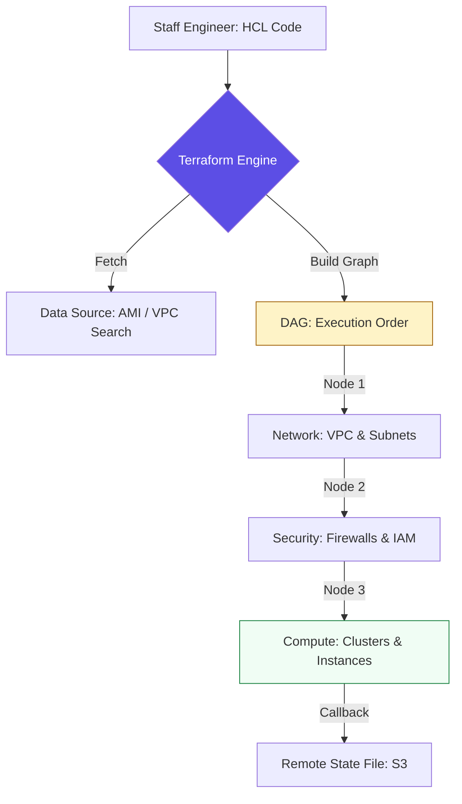

# 🏗️ Infrastructure Provisioning: Layer 1 Foundations

> **"Provisioning is the act of creating the stage before the actors arrive. If your stage isn't level, the performance will fail. Master the lifecycle, and you master the cloud."**

Welcome to the **Infrastructure Provisioning** module. Provisioning is the "Outside-In" management of the environment—the VPCs, Subnets, IAM Roles, and Managed Databases. This module focuses on the **Lifecycle Management** provided by tools like Terraform and Pulumi, emphasizing the shift from manual resource creation to **State-Aware Declarative Engineering.**

---

## 🏗️ The Provisioning Architecture

Provisioning requires **Dependency Mapping**. Tools like Terraform build a "Directed Acyclic Graph" (DAG) to determine the exact order of creation.



---

## 🎭 Real-World DevOps Scenarios

### 🛡️ Scenario: The "Orphaned Resource" Debt
**The Incident:** A project was canceled halfway through deployment. An engineer had been using a script that manually called the `aws ec2 run-instances` CLI.
**The Failure:** The engineer forgot to delete the NAT Gateways and Provisioned IOPS volumes. These "Orphaned" resources sat idle, costing the company **$2,500/month** for a project that didn't exist.
**The Fix:** Transition to **Terraform**. By using `terraform destroy`, the team ensured that every resource created by the code was tracked in the "State" and removed cleanly when no longer needed.
**The Result:** 100% visibility into resource ownership. No more "Ghost" bills.

---

## 💻 DevOps Logic Snippets: "The Modular Blueprint"

Always build reusable modules to ensure consistency across environments.

```hcl
# 🚀 Standard: Modular Network Design
module "production_vpc" {
  source = "./modules/network"
  
  vpc_cidr = "10.0.0.0/16"
  enable_nat_gateway = true
  
  # 🛡️ Guard Clause: Multi-AZ for High Availability
  availability_zones = ["us-east-1a", "us-east-1b", "us-east-1c"]
  
  tags = {
    Environment = "Prod"
    Compliance  = "PCI-DSS"
  }
}
```

---

## 🎙️ Interview Preparation (Provisioning)

1.  **"What is a 'State File' and why is it the most critical part of IaC?"**
    *   *Answer:* The state file is a JSON map that connects your code to real IDs in the cloud. It allows the tool to know what to update, what to leave alone, and what to delete. Without state, the tool has no "memory."
2.  **"How do you handle secrets (like RDS passwords) in Terraform?"**
    *   *Answer:* You should never hardcode secrets. Use a separate **Secret Store** (like AWS Secrets Manager) and use a `data` source to pull the secret at runtime, or pass it via an environment variable (`TF_VAR_db_pass`).
3.  **"What is the difference between Terraform and Pulumi?"**
    *   *Answer:* Terraform uses HCL (a domain-specific declarative language). Pulumi allows you to use general-purpose programming languages like Python, Go, or TypeScript. Pulumi offers more flexibility for complex logic, while Terraform is often easier for dedicated SRE teams to read and audit.
4.  **"Explain 'Remote State Backend' and 'State Locking'."**
    *   *Answer:* A remote backend (like S3) stores the state centrally so multiple engineers can access it. State Locking (using DynamoDB) prevents two people from running `apply` at the same time, which would corrupt the state.
5.  **"What does `terraform plan` actually do under the hood?"**
    *   *Answer:* It performs a three-way comparison between your local code, the current State file, and the real resources in the Cloud API. It then generates a "Diff" showing exactly what needs to change.

---

## 🧠 Knowledge Check

1.  **Which command is used to see the changes BEFORE they happen?**
    *   [ ] `terraform apply`
    *   [x] `terraform plan`
    *   [ ] `terraform init`
2.  **True or False: Using 'State Locking' prevents two people from modifying infrastructure at once.**
    *   [x] True
    *   [ ] False
3.  **Where is the safest place to store a production State file?**
    *   [ ] Local laptop
    *   [ ] Git repository
    *   [x] Remote backend (S3/GCS) with versioning and encryption.
4.  **What is a 'Provider' in Terraform?**
    *   [x] A plugin that translates HCL code into API calls for a specific service (AWS, GCP, etc.).
    *   [ ] The person who pays the cloud bill.
    *   [ ] A server that hosts the code.
5.  **Which keyword is used to reuse infrastructure code across different environments?**
    *   [ ] `resource`
    *   [ ] `variable`
    *   [x] `module`

---

[⬅️ Back to Config Management Index](../README.md) | [Next: Server Configuration](../03-Server-Configuration/README.md) ➡️
