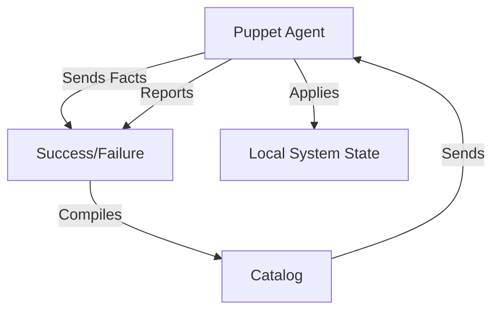

# Puppet: Enterprise Infrastructure Control

Puppet is a declarative, model-driven configuration management tool. It focuses on the "Desired State" and uses a specialized language to describe the configuration of your systems.

## 📚 Module Structure
- **[Boilerplates](./Boilerplates/)**: `init.pp` (Web server class).
- **[CHALLENGES](./CHALLENGES.md)**: User guardianship and module creation.

---

## 🏗️ Architecture: The Catalog Compile

Puppet works by compiling a "Catalog" (a JSON representation of the desired state) on the **Puppet Server** and sending it to the **Puppet Agent**.

---

## 🔑 Key Concepts

| Keyword | Description |
| :--- | :--- |
| **Manifest** | A file ending in `.pp` containing Puppet code. |
| **Class** | A named block of code that groups resources together. |
| **Module** | A bundle of classes, files, and templates for a specific task. |
| **Hiera** | A key-value lookup tool for configuration data (keep code separate from data). |
| **Facter** | The tool that gathers system info (facts) at the start of a run. |

---

## 📖 Real-World Story: The "Self-Healing" Web Server
**Scenario**: A mischievous intern manually stopped the Apache service on a production server.
**Action**: Puppet was set to run every 30 minutes.
**Outcome**: 10 minutes later, the Puppet Agent checked the system, saw `apache2` was not running (violating the desired state), and restarted it automatically.
**Result**: The site was "Healed" without any human intervention.

---

## ❓ Interview Questions

1. **What is a 'Puppet Resource'?**
   - *Answer*: The smallest unit of configuration (e.g., a file, a service, or a package). It has a type (package), a title ('nginx'), and attributes (ensure => installed).
2. **What is 'Hiera' and why is it important?**
   - *Answer*: Hiera is Puppet's key-value configuration data store. It's important because it allows you to keep your Puppet code generic and store environment-specific data (like database passwords or server IPs) in YAML files.
3. **Difference between Puppet and Ansible?**
   - *Answer*: Puppet is agent-based and model-driven (pull-based). Ansible is agentless and task-driven (push-based). Puppet is generally considered better for maintaining a persistent state over a long period.

---

[Next: SaltStack](../../../../../README.md)
